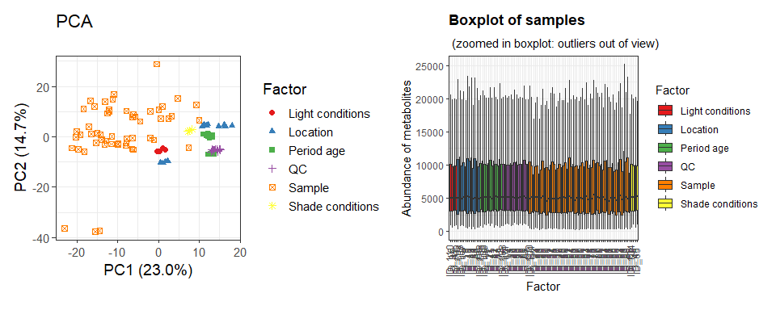
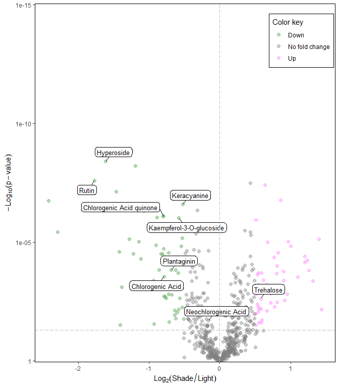
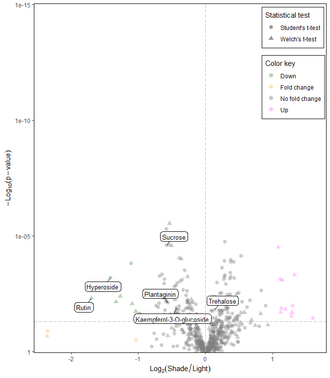
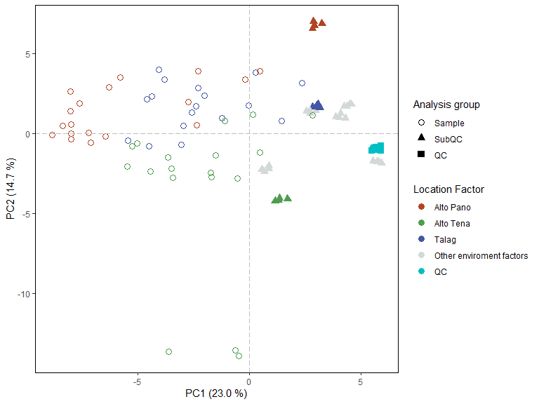
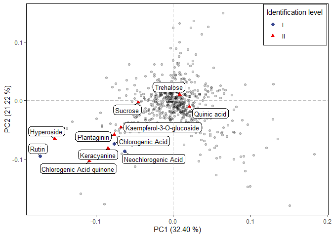
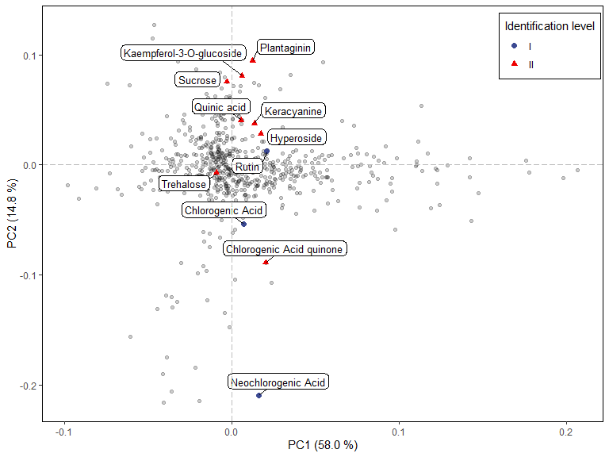
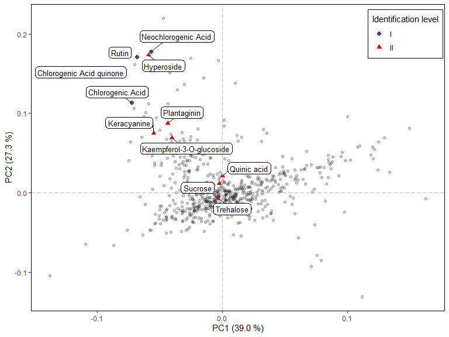
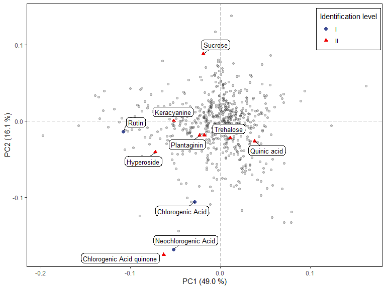
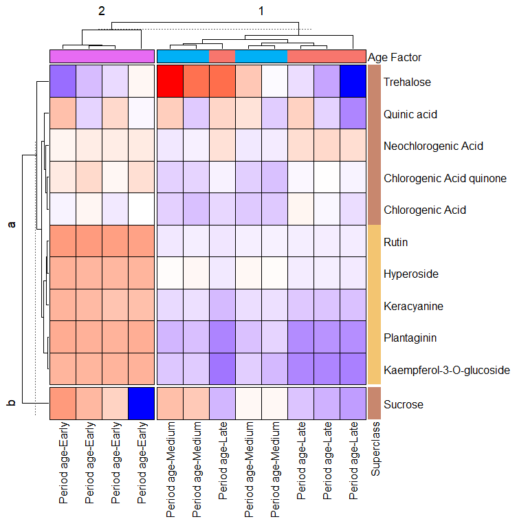

Negative polarity: LC-MS/MS profiling and characterization of
caffeoylquinic acids isomers in *Ilex guayusa* under different
collection sites, plant age, and sunlight exposure
================
Thomas Garzon, Jefferson Pastuña
2025-05-27

- [Introduction](#introduction)
- [Before to start](#before-to-start)
- [Notame workflow](#notame-workflow)
- [Preprocessing](#preprocessing)
- [Univariate statistic](#univariate-statistic)
  - [Volcano Plot](#volcano-plot)
    - [SubQC volcano plot](#subqc-volcano-plot)
    - [Sample volcano plot](#sample-volcano-plot)
- [Tukey test](#tukey-test)
  - [SubQC Tukey test](#subqc-tukey-test)
  - [Sample Tukey test](#sample-tukey-test)
- [Multivariate statistic](#multivariate-statistic)
  - [Principal Component Analysis
    (PCA)](#principal-component-analysis-pca)
    - [Light factor PCA](#light-factor-pca)
    - [Age factor PCA](#age-factor-pca)
    - [Location factor PCA](#location-factor-pca)
    - [Plotting a loading PCA result.](#plotting-a-loading-pca-result)
    - [Alto Pano location PCA](#alto-pano-location-pca)
    - [Alto Tena location PCA](#alto-tena-location-pca)
    - [Talag location PCA](#talag-location-pca)
  - [Heatmap and HCA](#heatmap-and-hca)
    - [Heatmap and HCA of age](#heatmap-and-hca-of-age)
    - [Heatmap and HCA of sample](#heatmap-and-hca-of-sample)

## Introduction

This R Script aims to record the procedure for analyzing for the isomers
of caffeoylquinic acids profile in *Ilex guayusa* leaves under different
age and light conditions. Each step has a brief explanation, as well as
code and graphics.

The data preprocessing workflow used was taken from [“notame”: Workflow
for Non-Targeted LC–MS Metabolic
Profiling](https://doi.org/10.3390/metabo10040135), Which offers a wide
variety of functions for perform metabolomic profile analysis.

## Before to start

The “notame” package accepts as input a feature table that can be
obtained through software such as MZmine, MS-DIAL, among others. In this
case, the feature table was obtained with the help of MZmine. The
(\*.csv) file exported from MZmine was fixed to get the final feature
table input according to the “notame” package format.

Modifications to the raw (\*.csv) file can be summarized by adding and
renaming columns. The added columns “Column” and “Ion Mode” allow for
the analysis of samples with different types of columns and different
ionization modes, respectively. Also, the cells corresponding to mass
and retention time must be renamed so the “notame” package can detect
and process them.

## Notame workflow

The “notame” package and other dependency packages were installed as a
first step for the analysis.

``` r
# Notame package installation
#if (!requireNamespace("devtools", quietly = TRUE)) {
#  install.packages("devtools")
#}
#devtools::install_github("antonvsdata/notame", ref = "v0.3.1")

#Library´s
library(usethis)
library(devtools)
library(shiny)
library(foreach)
library(iterators)
library(parallel)
library(ggplot2)
library(doParallel) 
library(magrittr)  
library(tidyverse) 
library(patchwork) 
library(dplyr)
#install.packages("here")
library(here)
library(gplots)
library(notame)
library(doParallel)
#remotes::install_gitlab("CarlBrunius/batchCorr")
library(batchCorr)
library(ggplot2)
#install.packages("ggrepel")
library(ggrepel)
#install.packages("hexbin")
library(hexbin)
#install.packages("Hmisc")
library(Hmisc)

# Notame library call
library(notame)

# Dependency packages installation
install_dependencies
```

    ## function (preprocessing = TRUE, extra = FALSE, batch_corr = FALSE, 
    ##     misc = FALSE, ...) 
    ## {
    ##     core_cran <- c("BiocManager", "cowplot", "missForest", "openxlsx", 
    ##         "randomForest", "RColorBrewer", "Rtsne")
    ##     core_bioconductor <- "pcaMethods"
    ##     extra_cran <- c("car", "doParallel", "devEMF", "ggbeeswarm", 
    ##         "ggdendro", "ggrepel", "ggtext", "Hmisc", "hexbin", "igraph", 
    ##         "lme4", "lmerTest", "MuMIn", "PERMANOVA", "PK", "rmcorr")
    ##     extra_bioconductor <- c("mixOmics", "supraHex")
    ##     extra_gitlab <- "CarlBrunius/MUVR"
    ##     batch_cran <- "fpc"
    ##     batch_bioconductor <- "RUVSeq"
    ##     batch_github <- NULL
    ##     batch_gitlab <- "CarlBrunius/batchCorr"
    ##     misc_cran <- c("knitr", "rmarkdown", "testthat")
    ##     if (preprocessing) {
    ##         install_helper(cran = core_cran, bioconductor = core_bioconductor, 
    ##             ...)
    ##     }
    ##     if (extra) {
    ##         install_helper(cran = extra_cran, bioconductor = extra_bioconductor, 
    ##             gitlab = extra_gitlab, ...)
    ##     }
    ##     if (batch_corr) {
    ##         install_helper(cran = batch_cran, bioconductor = batch_bioconductor, 
    ##             github = batch_github, gitlab = batch_gitlab, ...)
    ##     }
    ##     if (misc) {
    ##         install_helper(cran = misc_cran, ...)
    ##     }
    ## }
    ## <bytecode: 0x000001de901c2698>
    ## <environment: namespace:notame>

Then, a log system were added to have a record of each process executed.

``` r
# Log system
init_log(log_file = "../Result/notame_results/LCMS-neg_log.txt")
```

    ## INFO [2025-07-10 15:18:30] Starting logging

Next, the MZmine feature list in “notame” format was loaded.

``` r
data <- read_from_excel(file = "../Data/Data_to_notame/MZmine_to_R_notame_neg.xlsx", sheet = 1, 
                        corner_row = 11, corner_column = "I", 
                        split_by = c("Column", "Ion_Mode"))
```

    ## INFO [2025-07-10 15:18:31] Corner detected correctly at row 11, column I
    ## INFO [2025-07-10 15:18:31] 
    ## Extracting sample information from rows 1 to 11 and columns J to DE
    ## INFO [2025-07-10 15:18:31] Replacing spaces in sample information column names with underscores (_)
    ## INFO [2025-07-10 15:18:31] Naming the last column of sample information "Datafile"
    ## INFO [2025-07-10 15:18:31] 
    ## Extracting feature information from rows 12 to 647 and columns A to I
    ## INFO [2025-07-10 15:18:31] Creating Split column from Column, Ion_Mode
    ## INFO [2025-07-10 15:18:31] Feature_ID column not found, creating feature IDs
    ## INFO [2025-07-10 15:18:31] Identified m/z column row_m_z and retention time column row_retention_time
    ## INFO [2025-07-10 15:18:31] Identified m/z column row_m_z and retention time column row_retention_time
    ## INFO [2025-07-10 15:18:31] Creating feature IDs from Split, m/z and retention time
    ## INFO [2025-07-10 15:18:31] Replacing dots (.) in feature information column names with underscores (_)
    ## INFO [2025-07-10 15:18:31] 
    ## Extracting feature abundances from rows 12 to 647 and columns J to DE
    ## INFO [2025-07-10 15:18:31] 
    ## Checking sample information
    ## INFO [2025-07-10 15:18:31] Checking that feature abundances only contain numeric values
    ## INFO [2025-07-10 15:18:31] 
    ## Checking feature information
    ## INFO [2025-07-10 15:18:31] Checking that feature IDs are unique and not stored as numbers
    ## INFO [2025-07-10 15:18:31] Checking that m/z and retention time values are reasonable
    ## INFO [2025-07-10 15:18:31] Identified m/z column row_m_z and retention time column row_retention_time
    ## INFO [2025-07-10 15:18:31] Identified m/z column row_m_z and retention time column row_retention_time

Once the data was loaded, the next step was to create a MetaboSet to
work with R objects from now on.

``` r
modes <- construct_metabosets(exprs = data$exprs, 
                              pheno_data = data$pheno_data, 
                              feature_data = data$feature_data,
                              group_col = "Group")
```

    ## Initializing the object(s) with unflagged features
    ## INFO [2025-07-10 15:18:31] 
    ## Checking feature information
    ## INFO [2025-07-10 15:18:31] Checking that feature IDs are unique and not stored as numbers
    ## INFO [2025-07-10 15:18:31] Checking that feature abundances only contain numeric values
    ## INFO [2025-07-10 15:18:31] Setting row and column names of exprs based on feature and pheno data

Raw data inspection.

``` r
# Data extraction
mode_test <- modes$RP_NEG
# Boxplot of raw data
raw_bp <- plot_sample_boxplots(mode_test,
                               order_by = "Factor",
                               fill_by = "Factor")
# PCA of raw data
raw_pca <- plot_pca(mode_test,
                    center = TRUE,
                    shape = "Factor",
                    color = "Factor")
# Package to plots visualization in a same windows
#if (!requireNamespace("devtools", quietly = TRUE)) {
#  install.packages("devtools")
#}
#devtools::install_github("thomasp85/patchwork")
library(patchwork)
# Plot
raw_pca + raw_bp
```

<!-- -->

## Preprocessing

The first step of the preprocessing is to change the features with a
value equal to 0 to NA.

``` r
# Data extraction
mode <- modes$RP_NEG
# Change 0 value to NA
mode <- mark_nas(mode, value = 0)
```

Then, features with low detection rates are flagged and can be ignored
or removed in subsequent analysis. The “notame” package uses two
criteria to flag these features: the feature presence in a percentage of
QC injections and the feature presence in a percentage within a sample
group or class.

``` r
# Low detection rate
mode <- flag_detection(mode, qc_limit = 12/14, group_limit = 2/3)
```

    ## INFO [2025-07-10 15:18:33] 
    ## 0% of features flagged for low detection rate

``` r
# Some statistics after low detection algorithm
#visualizations(mode,
#               prefix = paste0(ppath,
#                               "Result/notame_results/HS_LC_MS-neg/Figure/",
#                               "Low_Detection")
#               )
```

With these values, features which that were not detected in 1% of the QC
injections will be flagged as low detection rate.

The next step for preprocessing correspond to drift correction. The
drift correction can be applied by smoothed cubic spline regression.

``` r
# Drift correction
corrected <- correct_drift(mode)
```

    ## INFO [2025-07-10 15:18:33] 
    ## Starting drift correction at 2025-07-10 15:18:33.140448

    ## INFO [2025-07-10 15:18:33] Drift correction performed at 2025-07-10 15:18:33.8524
    ## INFO [2025-07-10 15:18:34] Inspecting drift correction results 2025-07-10 15:18:34.205139
    ## INFO [2025-07-10 15:18:34] Drift correction results inspected at 2025-07-10 15:18:34.8253
    ## INFO [2025-07-10 15:18:34] 
    ## Drift correction results inspected, report:
    ## Drift_corrected: 100%

``` r
# Flag low quality features
corrected <- flag_quality(corrected,
                          condition = "RSD_r < 0.15 & D_ratio_r < 0.86")
```

    ## INFO [2025-07-10 15:18:34] 
    ## 0% of features flagged for low quality

``` r
# Exporting data to inspect drift correction
#write_to_excel(corrected,
#               "Result/notame_results/MZmine_drifft_1.xlsx")
```

Then, we can visualize the data after drift correction.

``` r
# Boxplot
corr_bp <- plot_sample_boxplots(corrected,
                                order_by = "Factor",
                                fill_by = "Factor")
# PCA
corr_pca <- plot_pca(corrected,
                     center = TRUE,
                     shape = "Factor",
                     color = "Factor")
# Plot
corr_pca + corr_bp
```

<!-- -->

Contaminant peaks based on the process blank sample will be removed.

``` r
# Removal of contaminants
corrected_blank <- flag_contaminants(corrected,
                                        blank_col = "Group",
                                        blank_label = "Blank",
                                        flag_thresh = 0.80,
                                        flag_label = "Contaminant")
```

    ## INFO [2025-07-10 15:18:35] 
    ## 0% of features flagged as contaminants

``` r
# Removal blank group from dataset
corrected_blank <- corrected_blank[, corrected_blank$Group != "Blank"]
pData(corrected_blank) <- droplevels(pData(corrected_blank))
# Exporting data to clean identified features
#write_to_excel(corrected_blank,
#               "Result/notame_results/MZmine_corrected_no_blank_1.xlsx")
```

We can inspect data after removing the contaminant features.

``` r
# Boxplot
blank_bp <- plot_sample_boxplots(corrected_blank,
                                 order_by = "Factor",
                                 fill_by = "Factor")
# PCA
blank_pca <- plot_pca(corrected_blank,
                      center = TRUE,
                      shape = "Factor",
                      color = "Factor")
# Plot
blank_pca + blank_bp
```

<!-- -->

``` r
#More stadistics
# Some statistics after low detection algorithm
#visualizations(corrected_blank,
#               prefix = paste0(ppath,
#                               "Result/notame_results/LC_MS-driff/Figure",
#                               "Low_Detection")
#)
```

The next step is feature clustering. This step helps us reduce the
number of features of the same molecule that were split due to
ionization behavior (In-source fragmentation for example).

``` r
clustered <- cluster_features(corrected_blank,
                              rt_window = 1/60,
                              corr_thresh = 0.95,
                              d_thresh = 0.8,
                              #plotting = FALSE,
                              #prefix = paste0(ppath, "Result/notame_results/HS_LCMS-neg/Figure","Cluster")
)
```

    ## INFO [2025-07-10 15:18:36] Identified m/z column row_m_z and retention time column row_retention_time
    ## INFO [2025-07-10 15:18:36] 
    ## Starting feature clustering at 2025-07-10 15:18:36.902871
    ## INFO [2025-07-10 15:18:36] Finding connections between features in RP_NEG
    ## [1] 100
    ## [1] 200
    ## [1] 300
    ## [1] 400
    ## [1] 500
    ## [1] 600
    ## INFO [2025-07-10 15:18:42] Found 43 connections in RP_NEG
    ## INFO [2025-07-10 15:18:42] Found 43 connections
    ## 24 components found
    ## 
    ## 13 components found
    ## 
    ## INFO [2025-07-10 15:18:42] Found 26 clusters of 2 or more features, clustering finished at 2025-07-10 15:18:42.702541

``` r
compressed <- compress_clusters(clustered)
```

    ## INFO [2025-07-10 15:18:42] Clusters compressed, left with 608 features

``` r
# Exporting data to inspect cluster features
#write_to_excel(clustered,
#               "Result/notame_results/MZmine_clustered_no_blank_cluster_4.xlsx")

# Exporting data to inspect compressed features
#write_to_excel(compressed,
#               "Result/notame_results/MZmine_compressed_no_blank_cluster_4.xlsx")
```

We can inspect the data using the PCA plot after the clustering
algorithm execution.

``` r
# Boxplot
clust_bp <- plot_sample_boxplots(clustered,
                                 order_by = "Factor",
                                 fill_by = "Factor")
# PCA
clust_pca <- plot_pca(clustered,
                      center = TRUE,
                      shape = "Factor",
                      color = "Factor")
# Plot
clust_pca + clust_bp
```

<!-- -->

For downstream statistical analysis, we used probabilistic quotient
normalization (PQN) with random forest missing value imputation and
generalized logarithm (glog) transformation method, which were taken
from [Non-targeted UHPLC-MS metabolomic data processing methods: a
comparative investigation of normalisation, missing value imputation,
transformation and scaling](https://doi.org/10.1007/s11306-016-1030-9).

The code below imputes the data using a random forest algorithm.

``` r
# Impute missing values using random forest
# To clean data
set.seed(698)
imputed <- impute_rf(clustered)
# To all data
imputed <- impute_rf(imputed, all_features = TRUE)
```

We can inspect the data with the PCA plot after data imputation.

``` r
# Boxplot
imp_bp <- plot_sample_boxplots(imputed,
                               order_by = "Factor",
                               fill_by = "Factor")
# PCA
imp_pca <- plot_pca(imputed,
                    center = TRUE,
                    shape = "Factor",
                    color = "Factor")
# Plot
imp_pca + imp_bp
```

<!-- -->

After data imputation, the data was normalized by probabilistic quotient
normalization (PQN).

``` r
# Probabilistic quotient normalization
pqn_set <- pqn_normalization(imputed,
                             ref = c("qc", "all"),
                             method = c("median", "mean"),
                             all_features = FALSE)
```

    ## INFO [2025-07-10 15:18:52] Starting PQN normalization
    ## INFO [2025-07-10 15:18:52] Using median of qc samples as reference spectrum

We can inspect the data with the PCA plot after data normalization.

``` r
# Boxplot
pqn_bp <- plot_sample_boxplots(pqn_set,
                               order_by = "Factor",
                               fill_by = "Factor")
# PCA
pqn_pca <- plot_pca(pqn_set,
                    center = TRUE,
                    shape = "Factor",
                    color = "Factor")
# Plot
pqn_pca + pqn_bp
```

<!-- -->

``` r
# Exporting data to inspect pqn_set features
#write_to_excel(pqn_set,
#               "Result/notame_results/MZmine_pqn_set_neg.xlsx")
```

The data was transformed by the generalized logarithm (glog) method.

``` r
# Extract clean data
ppm_noflag <- drop_flagged(pqn_set)
# "SummarizedExperiment" package installation
#if (!require("BiocManager", quietly = TRUE))
#    install.packages("BiocManager")
#BiocManager::install("SummarizedExperiment")
library(SummarizedExperiment)
# Convert feature height table to SummarizedExperiment class
pmp_data <- SummarizedExperiment(assays = exprs(ppm_noflag),
                                 colData = ppm_noflag@phenoData@data)
# Package for generalized logarithmic transform
#if (!requireNamespace("BiocManager", quietly = TRUE))
#    install.packages("BiocManager")
#BiocManager::install("pmp")
library(pmp)
# Generalised logarithmic transform
glog_exprs <- glog_transformation(df = pmp_data@assays@data@listData[[1]],
                                  classes = pmp_data$QC,
                                  qc_label = "QC")
# Adding glog transformation to notame MetaboSet
glog_set <- ppm_noflag
exprs(glog_set) <- glog_exprs
```

We save the data.

``` r
save(glog_set, file = "../Result/notame_results/Notame_Lc-MS_out_neg.RData")
```

# Univariate statistic

## Volcano Plot

The volcano plot was implemented to support the multivariate statistic
by analyzing individual features between levels of light factor (light
and shade). The generalized logarithm (glog) transformed data, and the
probabilistic quotient normalization (PQN) data were used for volcano
plot analysis. The glog-transformed data was used for the two-sample
t-test and Welch’s t-test calculation. The two-sample t-test (for
features with equal variances) and Welch’s t-test (for features with
unequal variances) methods were used for the “y” axis of the volcano
plot, and fold change (calculated using PQN normalized data) was used
for the “x” axis. We plotted two volcanoes, one with SubQC data and the
other with individual data.

The first step was data extraction.

### SubQC volcano plot

SubQC data extraction for t-test calculation.

``` r
# Removal of sample group from the dataset
volc_glog <- glog_set[, glog_set$Analysis_group != "Sample"]
pData(volc_glog) <- droplevels(pData(volc_glog))
# Drop QC
volc_glog <- drop_qcs(volc_glog)
# Extracting SubQC light factor
volc_glog <- volc_glog[, volc_glog$Light_Factor != "Other enviroment factors"]
pData(volc_glog) <- droplevels(pData(volc_glog))
```

SubQC data extraction for fold change calculation.

``` r
# Removal of sample group from the dataset
volc_pqn <- ppm_noflag[, ppm_noflag$Analysis_group != "Sample"]
pData(volc_pqn) <- droplevels(pData(volc_pqn))
# Drop QC
volc_pqn <- drop_qcs(volc_pqn)
# Extracting SubQC light factor
volc_pqn <- volc_pqn[, volc_pqn$Light_Factor != "Other enviroment factors"]
pData(volc_pqn) <- droplevels(pData(volc_pqn))
```

Before the t-test calculation, the features homoscedasticity was tested
using Levene’s test. For features with equal variance, the Student’s
t-test was implemented, and for features with unequal variance, Welch’s
t-test was implemented.

``` r
# Performing homoscedasticity test
volc_th <-
  perform_homoscedasticity_tests(volc_glog,
                                 formula_char = "Feature ~ Light_Factor")
```

    ## INFO [2025-07-10 15:18:56] Starting homoscedasticity tests.
    ## INFO [2025-07-10 15:18:58] Homoscedasticity tests performed.

According to Levene’s test, all features showed an equal variance
(p-value \> 0.05). Thus, the t-test and fold change will be calculated.

``` r
# Library to left_join use
library(dplyr)
# Fold change between shade and light levels
volc_fc <- fold_change(volc_pqn, group = "Light_Factor")
```

    ## INFO [2025-07-10 15:18:58] Starting to compute fold changes.
    ## INFO [2025-07-10 15:18:58] Fold changes computed.

``` r
# two-sample t-test performing
volc_t <- perform_t_test(volc_glog,
                         formula_char = "Feature ~ Light_Factor",
                         var.equal = TRUE)
```

    ## INFO [2025-07-10 15:18:58] Starting t-tests for Light & Shade
    ## INFO [2025-07-10 15:18:58] t-tests performed.

``` r
# Adding the fold change to the t-test data
volc_data <- left_join(volc_t, volc_fc)
# Log-transform for visualization
volc_data$logP <- -log10(volc_data$Light_vs_Shade_t_test_P)
volc_data$log2_fc <- log2(volc_data$Shade_vs_Light_FC)
```

Volcano plot of SubQC.

``` r
# Determine point colors based on significance and fold change
volc_data <- volc_data %>%
  mutate(point_color = case_when(
    Light_vs_Shade_t_test_P < 0.05 & log2_fc < -0.5 ~ "Down", # significantly down
    Light_vs_Shade_t_test_P < 0.05 & log2_fc > 0.5 ~ "Up",    # significantly up
    log2_fc < 1 & log2_fc > -1 ~ "No fold change",          # fold change < 2
    Light_vs_Shade_t_test_P > 0.05 & log2_fc < -0.5 | 
      Light_vs_Shade_t_test_P > 0.05 & log2_fc > 0.5 ~ "Fold change")) # fold change > 2
# Extracting feature identified
metab_data <- glog_set[!is.na(glog_set@featureData@data$Metabolite),]
# Extracting metabolite table
meta_table <- metab_data@featureData@data
# Creating a new small table of the annotated compounds
# Keep metabolites with p-value < 0.05
volc_compouds <- subset(volc_data, Light_vs_Shade_t_test_P < 0.05 |
                             point_color == "Fold change")
volc_compouds <- left_join(meta_table, volc_compouds)
# Volcano plot
vc_plot <- ggplot(volc_data, aes(log2_fc, logP, color = point_color)) +
  geom_point(size = 2, alpha = 0.4) +
  scale_colour_manual(values = c("No fold change" = "#808080",
                                 "Down" = "#4F9D4EFF",
                                 "Up" = "#ff80ff",
                                 "Fold change" = "#F5BC5CFF")) +
  theme_classic() +
  #theme(legend.position = "none") +
  #geom_point(data = volc_compouds,
  #           aes(shape = meta_table$Identification_level,
  #               color = meta_table$Identification_level),
  #           size = 2) +
  labs(#shape = 'Identification level',
       color = 'Color key') +
  ggrepel::geom_label_repel(data = volc_compouds,
                            aes(label = meta_table$Metabolite),
                            color = "black",
                            box.padding = 0.37,
                            label.padding = 0.22,
                            label.r = 0.30,
                            cex = 3.5,
                            max.overlaps = 20,
                            min.segment.length = 0,
                            seed = 42,) +
  xlab(bquote(Log[2](Shade/Light))) + ylab(bquote(-Log[10](p-value))) +
  scale_y_continuous(limits = c(0,15), labels = function(i) 10^-i,
                     expand=c(0.003, 0.003)) +
  theme(legend.position = c(0.887, 0.897),
        legend.background = element_rect(fill = "white", color = "black")) +
  theme(panel.grid = element_blank(),
        panel.border = element_rect(fill= "transparent")) +
  #geom_vline(xintercept = 1, linetype = "longdash", colour="gray") +
  #geom_vline(xintercept = -1, linetype = "longdash", colour="gray") +
  geom_vline(xintercept = 0, linetype = "longdash", colour="gray") +
  geom_hline(yintercept = -log10(0.05), linetype = "longdash", colour="gray")
vc_plot
```

<!-- -->

``` r
# Save plot
ggsave('../Result/notame_results/Figuras/Volcano/PDF/figure_2b.pdf',
       width = 8, height = 7, device='pdf', dpi="print")
```

    ## Warning: Removed 2 rows containing missing values or values outside the scale range
    ## (`geom_label_repel()`).

``` r
ggsave('../Result/notame_results/Figuras/Volcano/PNG/figure_2b.png',
       width = 8, height = 7, device='png', dpi="print")
```

    ## Warning: Removed 2 rows containing missing values or values outside the scale range
    ## (`geom_label_repel()`).

### Sample volcano plot

Sample data extraction for t-test calculation.

``` r
# Removal of sample group from the dataset
sp_volc_glog <- glog_set[, glog_set$Analysis_group != "Sub_Quality_Control"]
pData(sp_volc_glog) <- droplevels(pData(sp_volc_glog))
# Drop QC
sp_volc_glog <- drop_qcs(sp_volc_glog)
```

Sample data extraction for fold change calculation.

``` r
# Removal of sample group from the dataset
sp_volc_pqn <- ppm_noflag[, ppm_noflag$Analysis_group != "Sub_Quality_Control"]
pData(sp_volc_pqn) <- droplevels(pData(sp_volc_pqn))
# Drop QC
sp_volc_pqn <- drop_qcs(sp_volc_pqn)
```

Before the t-test calculation, the features homoscedasticity was tested
using Levene’s test. For features with equal variance, the Student’s
t-test was implemented, and for features with unequal variance, Welch’s
t-test was implemented.

``` r
# Performing homoscedasticity test
sp_volc_th <-
  perform_homoscedasticity_tests(sp_volc_glog,
                                 formula_char = "Feature ~ Light_Factor")
```

    ## INFO [2025-07-10 15:19:00] Starting homoscedasticity tests.
    ## INFO [2025-07-10 15:19:01] Homoscedasticity tests performed.

``` r
# Adding homoscedasticity results to notame MetaboSet
sp_volc_glog <- join_fData(sp_volc_glog, sp_volc_th)
# Extracting features with equal variance
sp_volc_ttset <-
  sp_volc_glog[sp_volc_glog@featureData@data$Levene_P > 0.05,]
# Extracting features with unequal variance
sp_volc_wttset <-
  sp_volc_glog[sp_volc_glog@featureData@data$Levene_P < 0.05,]
```

Calculation of t-test, Welch’s t-test and fold change.

``` r
# Fold change between shade and light levels
sp_volc_fc <- fold_change(sp_volc_pqn, group = "Light_Factor")
```

    ## INFO [2025-07-10 15:19:01] Starting to compute fold changes.
    ## INFO [2025-07-10 15:19:01] Fold changes computed.

``` r
# The two-sample t-test performing
sp_volc_tt <- perform_t_test(sp_volc_ttset,
                            formula_char = "Feature ~ Light_Factor",
                            var.equal = TRUE)
```

    ## INFO [2025-07-10 15:19:01] Starting t-tests for Light & Shade
    ## INFO [2025-07-10 15:19:02] t-tests performed.

``` r
# Adding a tag for t-test results
sp_volc_tt <- sp_volc_tt %>%
  mutate(Statistic_test = case_when(
    Feature_ID != 0 ~ "Student's t-test"))
# The Welch's t-test performing
sp_volc_wtt <- perform_t_test(sp_volc_wttset,
                            formula_char = "Feature ~ Light_Factor",
                            var.equal = TRUE)
```

    ## INFO [2025-07-10 15:19:02] Starting t-tests for Light & Shade
    ## INFO [2025-07-10 15:19:02] t-tests performed.

``` r
# Adding a tag for Welch's t-test results
sp_volc_wtt <- sp_volc_wtt %>%
  mutate(Statistic_test = case_when(
    Feature_ID != 0 ~ "Welch's t-test"))
# Merge Welch's t-test and Student's t-test
sp_volc_t <- rbind(sp_volc_tt, sp_volc_wtt)
# Adding the fold change to statistical results
sp_volc_data <- left_join(sp_volc_t, sp_volc_fc)
# Log-transform for visualization
sp_volc_data$logP <- -log10(sp_volc_data$Light_vs_Shade_t_test_P)
sp_volc_data$log2_fc <- log2(sp_volc_data$Shade_vs_Light_FC)
```

Volcano plot of Sample.

``` r
# Determine point colors based on significance and fold change
sp_volc_data <- sp_volc_data %>%
  mutate(point_color = case_when(
    Light_vs_Shade_t_test_P < 0.05 & log2_fc < -1 ~ "Down", # significantly down
    Light_vs_Shade_t_test_P < 0.05 & log2_fc > 1 ~ "Up",    # significantly up
    log2_fc < 1 & log2_fc > -1 ~ "No fold change",          # fold change < 2
    Light_vs_Shade_t_test_P > 0.05 & log2_fc < -1 | 
      Light_vs_Shade_t_test_P > 0.05 & log2_fc > 1 ~ "Fold change")) # fold change > 2
# Creating a new small table of the annotated compounds
# Keep metabolites with p-value < 0.05
sp_volc_compouds <- subset(sp_volc_data, Light_vs_Shade_t_test_P < 0.05 |
                             point_color == "Fold change")
sp_volc_compouds <- left_join(meta_table, sp_volc_compouds)
# Volcano plot
sp_vc_plot <- ggplot(sp_volc_data, aes(log2_fc, logP)) +
  #geom_point(size = 2, alpha = 0.4) +
  scale_colour_manual(values = c("No fold change" = "#808080",
                                 "Down" = "#4F9D4EFF",
                                 "Up" = "#ff80ff",
                                 "Fold change" = "#F5BC5CFF")) +
  theme_classic() +
  #theme(legend.position = "none") +
  geom_point(data = sp_volc_data,
             aes(shape = Statistic_test,
                 color = point_color),
             size = 2.5,
             alpha = 0.4) +
  labs(shape = 'Statistical test',
       color = 'Color key') +
  ggrepel::geom_label_repel(data = sp_volc_compouds,
                            aes(label = meta_table$Metabolite),
                            color = "black",
                            box.padding = 0.37,
                            label.padding = 0.22,
                            label.r = 0.30,
                            cex = 3.5,
                            max.overlaps = 20,
                            min.segment.length = 0,
                            seed = 42) +
  xlab(bquote(Log[2](Shade/Light))) + ylab(bquote(-Log[10](p-value))) +
  scale_y_continuous(limits = c(0,15), labels = function(i) 10^-i,
                     expand=c(0.003, 0.003)) +
  theme(legend.position = c(0.887, 0.83),
        legend.background = element_rect(fill = "white", color = "black")) +
  theme(panel.grid = element_blank(),
        panel.border = element_rect(fill= "transparent")) +
  #geom_vline(xintercept = 1, linetype = "longdash", colour="gray") +
  #geom_vline(xintercept = -1, linetype = "longdash", colour="gray") +
  geom_vline(xintercept = 0, linetype = "longdash", colour="gray") +
  geom_hline(yintercept = -log10(0.05), linetype = "longdash", colour="gray")
sp_vc_plot
```

<!-- -->

``` r
# Save plot
ggsave(filename = "../Result/notame_results/Figuras/Volcano/PDF/Figure_s5.pdf", plot = sp_vc_plot,
       width = 7, height = 8, units = "in", dpi = "print")
```

    ## Warning: Removed 5 rows containing missing values or values outside the scale range
    ## (`geom_label_repel()`).

``` r
ggsave(filename = "../Result/notame_results/Figuras/Volcano/PNG/Figure_s5.png", plot = sp_vc_plot,
       width = 7, height = 8, units = "in", dpi = "print")
```

    ## Warning: Removed 5 rows containing missing values or values outside the scale range
    ## (`geom_label_repel()`).

# Tukey test

The tukey test was implemented to support the multivariate statistic by
analyzing individual identified metabolites between levels of age factor
(early, medium, and late). Only metabolites with data homoscedasticity
were considered for the ANOVA test, and metabolites with significance
(p-value \< 0.05) were used for the Tukey test. The generalized
logarithm (glog) transformed data was used for the Tukey test.

We analyzed two batches of data, one of the SubQC data and the other of
the individual data.

### SubQC Tukey test

SubQC data extraction for Tukey test calculation.

``` r
# Drop QC
tk_no_qc <- drop_qcs(glog_set)
# Drop samples
tk_no_sample <- tk_no_qc[, tk_no_qc$Analysis_group != "Sample"]
pData(tk_no_sample) <- droplevels(pData(tk_no_sample))
# Extracting levels of age factor
tk_age <- tk_no_sample[, tk_no_sample$Age_Factor != "Other factor"]
pData(tk_age) <- droplevels(pData(tk_age))
# Extracting identified metabolites
tk_age_set <- tk_age[!is.na(tk_age@featureData@data$Metabolite),]
```

Preparing data and metadata for Tukey test calculation.

``` r
# Extracting feature height table
tk_height <- exprs(tk_age_set)
# Extracting sample information
tk_pdata <- tk_age_set@phenoData@data
tk_pdata <- data.frame(Sample_ID = tk_pdata$Sample_ID,
                       Age_factor = tk_pdata$Age_Factor)
# Extracting feature information
tk_fdata <- tk_age_set@featureData@data
tk_fdata <- data.frame(Feature_ID = tk_fdata$Feature_ID,
                       Metabolite = tk_fdata$Metabolite)
# Transposing feature height table
tk_height <- t(tk_height)
# Feature height table to dataframe
tk_height <- as.data.frame(tk_height)
# Convert the row names to sample ID
tk_height <- tk_height %>% 
  mutate(Sample_ID = rownames(tk_height))
# Adding age factor as variable
tk_height <- left_join(tk_pdata, tk_height)
```

The data is ready to test the data homoscedasticity. The Levene’s test
was used to inspect the homogeneity of variance.

``` r
# Performing homoscedasticity test
tk_bar_res <-
  perform_homoscedasticity_tests(tk_age_set,
                                 formula_char = "Feature ~ Age_Factor")
```

    ## INFO [2025-07-10 15:19:03] Starting homoscedasticity tests.
    ## INFO [2025-07-10 15:19:03] Homoscedasticity tests performed.

``` r
# Adding a description of the p-value
tk_bar_res <- tk_bar_res %>%
  mutate(bartlett_group = ifelse(Levene_P > 0.05,
                                 "equal variance",
                                 "unequal variance"))
```

Most metabolites showed equality of variances according to the Bartlett
test. The next step will be the ANOVA test.

``` r
# Create two empty vectors to add results
Feature_ID <- c()
anova_pValue <- c()
# Batch analysis
for(i in 3:9) {
  anova_model <- glm(tk_height[, i] ~ tk_height$Age_factor, data = tk_height)
  anova_res <- anova(anova_model, test = "LRT")
  anova_pValue <- c(anova_pValue, anova_res$`Pr(>Chi)`[2])
  Feature_ID <- c(Feature_ID, names(tk_height[i]))
  tk_anova_res <- data.frame(Feature_ID, anova_pValue)
}
# Adding a description of the p-value
tk_anova_res <- tk_anova_res %>%
  mutate(anova_group = ifelse(anova_pValue > 0.05,
                              "Not Significant",
                              "Significant"))
```

Consequently, the features with significance (p-value \< 0.05) according
to ANOVA were used for the Tukey test. Tukey test groups the different
variables (in this case, the levels of age factor: early, medium, and
late) using significance tests.

``` r
# agricolae package installation and library loadding
#install.packages("agricolae", repos = "https://cran.r-project.org")
library(agricolae)
# Create two empty vectors to add results
Feature_ID <- c()
tk_group_early <- c()
tk_group_late <- c()
tk_group_medium <- c()
# Batch analysis
for(i in 3:13) {
  tk_model <- aov(tk_height[, i] ~ tk_height$Age_factor, data = tk_height)
  tk_tes <- HSD.test(tk_model, "tk_height$Age_factor", group = TRUE)
  tk_group_early <- c(tk_group_early, tk_tes[["groups"]]["Early",2])
  tk_group_late <- c(tk_group_late, tk_tes[["groups"]]["Late",2])
  tk_group_medium <- c(tk_group_medium, tk_tes[["groups"]]["Medium",2])
  Feature_ID <- c(Feature_ID, names(tk_height[i]))
  tk_res <- data.frame(Feature_ID, tk_group_early, tk_group_late,
                       tk_group_medium)
  tk_res
}
```

Merge all results and add a flag in the Tukey result column: “-” for
metabolites with unequal variance according to the Bartlett test and
“ns” for metabolites not significant according to the ANOVA test.

``` r
# Merge all results obtained in the Tukey test
tk_result <- left_join(tk_bar_res, tk_anova_res)
```

``` r
tk_result <- left_join(tk_result, tk_res)
```

``` r
# Flag metabolites
for(i in 1:11) {
  # Flag "-" metabolites that has unequal variance
  if (tk_result$bartlett_group[i] == "unequal variance") {
        tk_result$tk_group_early[i] <- "-"
        tk_result$tk_group_medium[i] <- "-"
        tk_result$tk_group_late[i] <- "-"
  }
  # Flag "ns" metabolites not significant
  if (tk_result$anova_group[i] == "Not Significant" &
      tk_result$bartlett_group[i] == "equal variance") {
        tk_result$tk_group_early[i] <- "ns"
        tk_result$tk_group_medium[i] <- "ns"
        tk_result$tk_group_late[i] <- "ns"
}
 tk_result
}
```

Creating a Tukey result table to use in the heatmap.

``` r
# Tukey table to heatmap
hm_tk_table <- data.frame(Feature_ID = tk_result$Feature_ID,
                          Early = tk_result$tk_group_early,
                          Late = tk_result$tk_group_late,
                          Medium = tk_result$tk_group_medium)
```

Print Tukey results in a table.

``` r
# The "gt" package installation
#install.packages("gt")
library(gt)
```

    ## 
    ## Adjuntando el paquete: 'gt'

    ## The following object is masked from 'package:Hmisc':
    ## 
    ##     html

``` r
# Adding metabolite name
tk_table <- left_join(tk_fdata, hm_tk_table)
```

    ## Joining with `by = join_by(Feature_ID)`

``` r
# Deleting the Feature_ID column
tk_table <- subset(tk_table, select = -c(Feature_ID) )
tk_table <- tk_table |>
  gt() |>
  fmt_markdown(
  columns = everything(),
  rows = everything(),
  md_engine = c("markdown", "commonmark")) |>
  tab_spanner(
    label = "Tukey test",
    columns = 2:4) |>
    tab_source_note(source_note = "Note: Different lowercase letter within the 
                  same row indicates significant differences based on Tukey's 
                  multiple comparisons (p-value < 0.05). 'dot' represents 
                  features with unequal variance according to Levene's test. 
                  'ns' are the features that do not have statistical 
                  differences (p-value > 0.05) according to the ANOVA test.") |>
  tab_options(table.width = px(750)) |>
  as_raw_html()
tk_table
```

<div id="jorukawxil" style="padding-left:0px;padding-right:0px;padding-top:10px;padding-bottom:10px;overflow-x:auto;overflow-y:auto;width:auto;height:auto;">
  &#10;  <table class="gt_table" data-quarto-disable-processing="false" data-quarto-bootstrap="false" style="-webkit-font-smoothing: antialiased; -moz-osx-font-smoothing: grayscale; font-family: system-ui, 'Segoe UI', Roboto, Helvetica, Arial, sans-serif, 'Apple Color Emoji', 'Segoe UI Emoji', 'Segoe UI Symbol', 'Noto Color Emoji'; display: table; border-collapse: collapse; line-height: normal; margin-left: auto; margin-right: auto; color: #333333; font-size: 16px; font-weight: normal; font-style: normal; background-color: #FFFFFF; width: 750px; border-top-style: solid; border-top-width: 2px; border-top-color: #A8A8A8; border-right-style: none; border-right-width: 2px; border-right-color: #D3D3D3; border-bottom-style: solid; border-bottom-width: 2px; border-bottom-color: #A8A8A8; border-left-style: none; border-left-width: 2px; border-left-color: #D3D3D3;" width="750" bgcolor="#FFFFFF">
  <thead style="border-style: none;">
    <tr class="gt_col_headings gt_spanner_row" style="border-style: none; border-top-style: solid; border-top-width: 2px; border-top-color: #D3D3D3; border-bottom-width: 2px; border-bottom-color: #D3D3D3; border-left-style: none; border-left-width: 1px; border-left-color: #D3D3D3; border-right-style: none; border-right-width: 1px; border-right-color: #D3D3D3; border-bottom-style: hidden;">
      <th class="gt_col_heading gt_columns_bottom_border gt_left" rowspan="2" colspan="1" scope="col" id="Metabolite" style="border-style: none; color: #333333; background-color: #FFFFFF; font-size: 100%; font-weight: normal; text-transform: inherit; border-left-style: none; border-left-width: 1px; border-left-color: #D3D3D3; border-right-style: none; border-right-width: 1px; border-right-color: #D3D3D3; vertical-align: bottom; padding-top: 5px; padding-bottom: 6px; padding-left: 5px; padding-right: 5px; overflow-x: hidden; text-align: left;" bgcolor="#FFFFFF" valign="bottom" align="left">Metabolite</th>
      <th class="gt_center gt_columns_top_border gt_column_spanner_outer" rowspan="1" colspan="3" scope="colgroup" id="Tukey test" style="border-style: none; color: #333333; background-color: #FFFFFF; font-size: 100%; font-weight: normal; text-transform: inherit; padding-top: 0; padding-bottom: 0; padding-left: 4px; text-align: center; padding-right: 0;" bgcolor="#FFFFFF" align="center">
        <div class="gt_column_spanner" style="border-bottom-style: solid; border-bottom-width: 2px; border-bottom-color: #D3D3D3; vertical-align: bottom; padding-top: 5px; padding-bottom: 5px; overflow-x: hidden; display: inline-block; width: 100%;">Tukey test</div>
      </th>
    </tr>
    <tr class="gt_col_headings" style="border-style: none; border-top-style: solid; border-top-width: 2px; border-top-color: #D3D3D3; border-bottom-style: solid; border-bottom-width: 2px; border-bottom-color: #D3D3D3; border-left-style: none; border-left-width: 1px; border-left-color: #D3D3D3; border-right-style: none; border-right-width: 1px; border-right-color: #D3D3D3;">
      <th class="gt_col_heading gt_columns_bottom_border gt_left" rowspan="1" colspan="1" scope="col" id="Early" style="border-style: none; color: #333333; background-color: #FFFFFF; font-size: 100%; font-weight: normal; text-transform: inherit; border-left-style: none; border-left-width: 1px; border-left-color: #D3D3D3; border-right-style: none; border-right-width: 1px; border-right-color: #D3D3D3; vertical-align: bottom; padding-top: 5px; padding-bottom: 6px; padding-left: 5px; padding-right: 5px; overflow-x: hidden; text-align: left;" bgcolor="#FFFFFF" valign="bottom" align="left">Early</th>
      <th class="gt_col_heading gt_columns_bottom_border gt_left" rowspan="1" colspan="1" scope="col" id="Late" style="border-style: none; color: #333333; background-color: #FFFFFF; font-size: 100%; font-weight: normal; text-transform: inherit; border-left-style: none; border-left-width: 1px; border-left-color: #D3D3D3; border-right-style: none; border-right-width: 1px; border-right-color: #D3D3D3; vertical-align: bottom; padding-top: 5px; padding-bottom: 6px; padding-left: 5px; padding-right: 5px; overflow-x: hidden; text-align: left;" bgcolor="#FFFFFF" valign="bottom" align="left">Late</th>
      <th class="gt_col_heading gt_columns_bottom_border gt_left" rowspan="1" colspan="1" scope="col" id="Medium" style="border-style: none; color: #333333; background-color: #FFFFFF; font-size: 100%; font-weight: normal; text-transform: inherit; border-left-style: none; border-left-width: 1px; border-left-color: #D3D3D3; border-right-style: none; border-right-width: 1px; border-right-color: #D3D3D3; vertical-align: bottom; padding-top: 5px; padding-bottom: 6px; padding-left: 5px; padding-right: 5px; overflow-x: hidden; text-align: left;" bgcolor="#FFFFFF" valign="bottom" align="left">Medium</th>
    </tr>
  </thead>
  <tbody class="gt_table_body" style="border-style: none; border-top-style: solid; border-top-width: 2px; border-top-color: #D3D3D3; border-bottom-style: solid; border-bottom-width: 2px; border-bottom-color: #D3D3D3;">
    <tr style="border-style: none;"><td headers="Metabolite" class="gt_row gt_left" style="border-style: none; padding-top: 8px; padding-bottom: 8px; padding-left: 5px; padding-right: 5px; margin: 10px; border-top-style: solid; border-top-width: 1px; border-top-color: #D3D3D3; border-left-style: none; border-left-width: 1px; border-left-color: #D3D3D3; border-right-style: none; border-right-width: 1px; border-right-color: #D3D3D3; vertical-align: middle; overflow-x: hidden; text-align: left;" valign="middle" align="left"><span class="gt_from_md">Neochlorogenic Acid</span></td>
<td headers="Early" class="gt_row gt_left" style="border-style: none; padding-top: 8px; padding-bottom: 8px; padding-left: 5px; padding-right: 5px; margin: 10px; border-top-style: solid; border-top-width: 1px; border-top-color: #D3D3D3; border-left-style: none; border-left-width: 1px; border-left-color: #D3D3D3; border-right-style: none; border-right-width: 1px; border-right-color: #D3D3D3; vertical-align: middle; overflow-x: hidden; text-align: left;" valign="middle" align="left"><span class="gt_from_md">ns</span></td>
<td headers="Late" class="gt_row gt_left" style="border-style: none; padding-top: 8px; padding-bottom: 8px; padding-left: 5px; padding-right: 5px; margin: 10px; border-top-style: solid; border-top-width: 1px; border-top-color: #D3D3D3; border-left-style: none; border-left-width: 1px; border-left-color: #D3D3D3; border-right-style: none; border-right-width: 1px; border-right-color: #D3D3D3; vertical-align: middle; overflow-x: hidden; text-align: left;" valign="middle" align="left"><span class="gt_from_md">ns</span></td>
<td headers="Medium" class="gt_row gt_left" style="border-style: none; padding-top: 8px; padding-bottom: 8px; padding-left: 5px; padding-right: 5px; margin: 10px; border-top-style: solid; border-top-width: 1px; border-top-color: #D3D3D3; border-left-style: none; border-left-width: 1px; border-left-color: #D3D3D3; border-right-style: none; border-right-width: 1px; border-right-color: #D3D3D3; vertical-align: middle; overflow-x: hidden; text-align: left;" valign="middle" align="left"><span class="gt_from_md">ns</span></td></tr>
    <tr style="border-style: none;"><td headers="Metabolite" class="gt_row gt_left" style="border-style: none; padding-top: 8px; padding-bottom: 8px; padding-left: 5px; padding-right: 5px; margin: 10px; border-top-style: solid; border-top-width: 1px; border-top-color: #D3D3D3; border-left-style: none; border-left-width: 1px; border-left-color: #D3D3D3; border-right-style: none; border-right-width: 1px; border-right-color: #D3D3D3; vertical-align: middle; overflow-x: hidden; text-align: left;" valign="middle" align="left"><span class="gt_from_md">Quinic acid</span></td>
<td headers="Early" class="gt_row gt_left" style="border-style: none; padding-top: 8px; padding-bottom: 8px; padding-left: 5px; padding-right: 5px; margin: 10px; border-top-style: solid; border-top-width: 1px; border-top-color: #D3D3D3; border-left-style: none; border-left-width: 1px; border-left-color: #D3D3D3; border-right-style: none; border-right-width: 1px; border-right-color: #D3D3D3; vertical-align: middle; overflow-x: hidden; text-align: left;" valign="middle" align="left"><span class="gt_from_md">ns</span></td>
<td headers="Late" class="gt_row gt_left" style="border-style: none; padding-top: 8px; padding-bottom: 8px; padding-left: 5px; padding-right: 5px; margin: 10px; border-top-style: solid; border-top-width: 1px; border-top-color: #D3D3D3; border-left-style: none; border-left-width: 1px; border-left-color: #D3D3D3; border-right-style: none; border-right-width: 1px; border-right-color: #D3D3D3; vertical-align: middle; overflow-x: hidden; text-align: left;" valign="middle" align="left"><span class="gt_from_md">ns</span></td>
<td headers="Medium" class="gt_row gt_left" style="border-style: none; padding-top: 8px; padding-bottom: 8px; padding-left: 5px; padding-right: 5px; margin: 10px; border-top-style: solid; border-top-width: 1px; border-top-color: #D3D3D3; border-left-style: none; border-left-width: 1px; border-left-color: #D3D3D3; border-right-style: none; border-right-width: 1px; border-right-color: #D3D3D3; vertical-align: middle; overflow-x: hidden; text-align: left;" valign="middle" align="left"><span class="gt_from_md">ns</span></td></tr>
    <tr style="border-style: none;"><td headers="Metabolite" class="gt_row gt_left" style="border-style: none; padding-top: 8px; padding-bottom: 8px; padding-left: 5px; padding-right: 5px; margin: 10px; border-top-style: solid; border-top-width: 1px; border-top-color: #D3D3D3; border-left-style: none; border-left-width: 1px; border-left-color: #D3D3D3; border-right-style: none; border-right-width: 1px; border-right-color: #D3D3D3; vertical-align: middle; overflow-x: hidden; text-align: left;" valign="middle" align="left"><span class="gt_from_md">Kaempferol-3-O-glucoside</span></td>
<td headers="Early" class="gt_row gt_left" style="border-style: none; padding-top: 8px; padding-bottom: 8px; padding-left: 5px; padding-right: 5px; margin: 10px; border-top-style: solid; border-top-width: 1px; border-top-color: #D3D3D3; border-left-style: none; border-left-width: 1px; border-left-color: #D3D3D3; border-right-style: none; border-right-width: 1px; border-right-color: #D3D3D3; vertical-align: middle; overflow-x: hidden; text-align: left;" valign="middle" align="left"><span class="gt_from_md"><ul style="margin-top: 0; margin-bottom: 0;">
<li></li>
</ul>
</span></td>
<td headers="Late" class="gt_row gt_left" style="border-style: none; padding-top: 8px; padding-bottom: 8px; padding-left: 5px; padding-right: 5px; margin: 10px; border-top-style: solid; border-top-width: 1px; border-top-color: #D3D3D3; border-left-style: none; border-left-width: 1px; border-left-color: #D3D3D3; border-right-style: none; border-right-width: 1px; border-right-color: #D3D3D3; vertical-align: middle; overflow-x: hidden; text-align: left;" valign="middle" align="left"><span class="gt_from_md"><ul style="margin-top: 0; margin-bottom: 0;">
<li></li>
</ul>
</span></td>
<td headers="Medium" class="gt_row gt_left" style="border-style: none; padding-top: 8px; padding-bottom: 8px; padding-left: 5px; padding-right: 5px; margin: 10px; border-top-style: solid; border-top-width: 1px; border-top-color: #D3D3D3; border-left-style: none; border-left-width: 1px; border-left-color: #D3D3D3; border-right-style: none; border-right-width: 1px; border-right-color: #D3D3D3; vertical-align: middle; overflow-x: hidden; text-align: left;" valign="middle" align="left"><span class="gt_from_md"><ul style="margin-top: 0; margin-bottom: 0;">
<li></li>
</ul>
</span></td></tr>
    <tr style="border-style: none;"><td headers="Metabolite" class="gt_row gt_left" style="border-style: none; padding-top: 8px; padding-bottom: 8px; padding-left: 5px; padding-right: 5px; margin: 10px; border-top-style: solid; border-top-width: 1px; border-top-color: #D3D3D3; border-left-style: none; border-left-width: 1px; border-left-color: #D3D3D3; border-right-style: none; border-right-width: 1px; border-right-color: #D3D3D3; vertical-align: middle; overflow-x: hidden; text-align: left;" valign="middle" align="left"><span class="gt_from_md">Hyperoside</span></td>
<td headers="Early" class="gt_row gt_left" style="border-style: none; padding-top: 8px; padding-bottom: 8px; padding-left: 5px; padding-right: 5px; margin: 10px; border-top-style: solid; border-top-width: 1px; border-top-color: #D3D3D3; border-left-style: none; border-left-width: 1px; border-left-color: #D3D3D3; border-right-style: none; border-right-width: 1px; border-right-color: #D3D3D3; vertical-align: middle; overflow-x: hidden; text-align: left;" valign="middle" align="left"><span class="gt_from_md"><ul style="margin-top: 0; margin-bottom: 0;">
<li></li>
</ul>
</span></td>
<td headers="Late" class="gt_row gt_left" style="border-style: none; padding-top: 8px; padding-bottom: 8px; padding-left: 5px; padding-right: 5px; margin: 10px; border-top-style: solid; border-top-width: 1px; border-top-color: #D3D3D3; border-left-style: none; border-left-width: 1px; border-left-color: #D3D3D3; border-right-style: none; border-right-width: 1px; border-right-color: #D3D3D3; vertical-align: middle; overflow-x: hidden; text-align: left;" valign="middle" align="left"><span class="gt_from_md"><ul style="margin-top: 0; margin-bottom: 0;">
<li></li>
</ul>
</span></td>
<td headers="Medium" class="gt_row gt_left" style="border-style: none; padding-top: 8px; padding-bottom: 8px; padding-left: 5px; padding-right: 5px; margin: 10px; border-top-style: solid; border-top-width: 1px; border-top-color: #D3D3D3; border-left-style: none; border-left-width: 1px; border-left-color: #D3D3D3; border-right-style: none; border-right-width: 1px; border-right-color: #D3D3D3; vertical-align: middle; overflow-x: hidden; text-align: left;" valign="middle" align="left"><span class="gt_from_md"><ul style="margin-top: 0; margin-bottom: 0;">
<li></li>
</ul>
</span></td></tr>
    <tr style="border-style: none;"><td headers="Metabolite" class="gt_row gt_left" style="border-style: none; padding-top: 8px; padding-bottom: 8px; padding-left: 5px; padding-right: 5px; margin: 10px; border-top-style: solid; border-top-width: 1px; border-top-color: #D3D3D3; border-left-style: none; border-left-width: 1px; border-left-color: #D3D3D3; border-right-style: none; border-right-width: 1px; border-right-color: #D3D3D3; vertical-align: middle; overflow-x: hidden; text-align: left;" valign="middle" align="left"><span class="gt_from_md">Sucrose</span></td>
<td headers="Early" class="gt_row gt_left" style="border-style: none; padding-top: 8px; padding-bottom: 8px; padding-left: 5px; padding-right: 5px; margin: 10px; border-top-style: solid; border-top-width: 1px; border-top-color: #D3D3D3; border-left-style: none; border-left-width: 1px; border-left-color: #D3D3D3; border-right-style: none; border-right-width: 1px; border-right-color: #D3D3D3; vertical-align: middle; overflow-x: hidden; text-align: left;" valign="middle" align="left"><span class="gt_from_md">ns</span></td>
<td headers="Late" class="gt_row gt_left" style="border-style: none; padding-top: 8px; padding-bottom: 8px; padding-left: 5px; padding-right: 5px; margin: 10px; border-top-style: solid; border-top-width: 1px; border-top-color: #D3D3D3; border-left-style: none; border-left-width: 1px; border-left-color: #D3D3D3; border-right-style: none; border-right-width: 1px; border-right-color: #D3D3D3; vertical-align: middle; overflow-x: hidden; text-align: left;" valign="middle" align="left"><span class="gt_from_md">ns</span></td>
<td headers="Medium" class="gt_row gt_left" style="border-style: none; padding-top: 8px; padding-bottom: 8px; padding-left: 5px; padding-right: 5px; margin: 10px; border-top-style: solid; border-top-width: 1px; border-top-color: #D3D3D3; border-left-style: none; border-left-width: 1px; border-left-color: #D3D3D3; border-right-style: none; border-right-width: 1px; border-right-color: #D3D3D3; vertical-align: middle; overflow-x: hidden; text-align: left;" valign="middle" align="left"><span class="gt_from_md">ns</span></td></tr>
    <tr style="border-style: none;"><td headers="Metabolite" class="gt_row gt_left" style="border-style: none; padding-top: 8px; padding-bottom: 8px; padding-left: 5px; padding-right: 5px; margin: 10px; border-top-style: solid; border-top-width: 1px; border-top-color: #D3D3D3; border-left-style: none; border-left-width: 1px; border-left-color: #D3D3D3; border-right-style: none; border-right-width: 1px; border-right-color: #D3D3D3; vertical-align: middle; overflow-x: hidden; text-align: left;" valign="middle" align="left"><span class="gt_from_md">Chlorogenic Acid quinone</span></td>
<td headers="Early" class="gt_row gt_left" style="border-style: none; padding-top: 8px; padding-bottom: 8px; padding-left: 5px; padding-right: 5px; margin: 10px; border-top-style: solid; border-top-width: 1px; border-top-color: #D3D3D3; border-left-style: none; border-left-width: 1px; border-left-color: #D3D3D3; border-right-style: none; border-right-width: 1px; border-right-color: #D3D3D3; vertical-align: middle; overflow-x: hidden; text-align: left;" valign="middle" align="left"><span class="gt_from_md"><ul style="margin-top: 0; margin-bottom: 0;">
<li></li>
</ul>
</span></td>
<td headers="Late" class="gt_row gt_left" style="border-style: none; padding-top: 8px; padding-bottom: 8px; padding-left: 5px; padding-right: 5px; margin: 10px; border-top-style: solid; border-top-width: 1px; border-top-color: #D3D3D3; border-left-style: none; border-left-width: 1px; border-left-color: #D3D3D3; border-right-style: none; border-right-width: 1px; border-right-color: #D3D3D3; vertical-align: middle; overflow-x: hidden; text-align: left;" valign="middle" align="left"><span class="gt_from_md"><ul style="margin-top: 0; margin-bottom: 0;">
<li></li>
</ul>
</span></td>
<td headers="Medium" class="gt_row gt_left" style="border-style: none; padding-top: 8px; padding-bottom: 8px; padding-left: 5px; padding-right: 5px; margin: 10px; border-top-style: solid; border-top-width: 1px; border-top-color: #D3D3D3; border-left-style: none; border-left-width: 1px; border-left-color: #D3D3D3; border-right-style: none; border-right-width: 1px; border-right-color: #D3D3D3; vertical-align: middle; overflow-x: hidden; text-align: left;" valign="middle" align="left"><span class="gt_from_md"><ul style="margin-top: 0; margin-bottom: 0;">
<li></li>
</ul>
</span></td></tr>
    <tr style="border-style: none;"><td headers="Metabolite" class="gt_row gt_left" style="border-style: none; padding-top: 8px; padding-bottom: 8px; padding-left: 5px; padding-right: 5px; margin: 10px; border-top-style: solid; border-top-width: 1px; border-top-color: #D3D3D3; border-left-style: none; border-left-width: 1px; border-left-color: #D3D3D3; border-right-style: none; border-right-width: 1px; border-right-color: #D3D3D3; vertical-align: middle; overflow-x: hidden; text-align: left;" valign="middle" align="left"><span class="gt_from_md">Trehalose</span></td>
<td headers="Early" class="gt_row gt_left" style="border-style: none; padding-top: 8px; padding-bottom: 8px; padding-left: 5px; padding-right: 5px; margin: 10px; border-top-style: solid; border-top-width: 1px; border-top-color: #D3D3D3; border-left-style: none; border-left-width: 1px; border-left-color: #D3D3D3; border-right-style: none; border-right-width: 1px; border-right-color: #D3D3D3; vertical-align: middle; overflow-x: hidden; text-align: left;" valign="middle" align="left"><span class="gt_from_md">ns</span></td>
<td headers="Late" class="gt_row gt_left" style="border-style: none; padding-top: 8px; padding-bottom: 8px; padding-left: 5px; padding-right: 5px; margin: 10px; border-top-style: solid; border-top-width: 1px; border-top-color: #D3D3D3; border-left-style: none; border-left-width: 1px; border-left-color: #D3D3D3; border-right-style: none; border-right-width: 1px; border-right-color: #D3D3D3; vertical-align: middle; overflow-x: hidden; text-align: left;" valign="middle" align="left"><span class="gt_from_md">ns</span></td>
<td headers="Medium" class="gt_row gt_left" style="border-style: none; padding-top: 8px; padding-bottom: 8px; padding-left: 5px; padding-right: 5px; margin: 10px; border-top-style: solid; border-top-width: 1px; border-top-color: #D3D3D3; border-left-style: none; border-left-width: 1px; border-left-color: #D3D3D3; border-right-style: none; border-right-width: 1px; border-right-color: #D3D3D3; vertical-align: middle; overflow-x: hidden; text-align: left;" valign="middle" align="left"><span class="gt_from_md">ns</span></td></tr>
    <tr style="border-style: none;"><td headers="Metabolite" class="gt_row gt_left" style="border-style: none; padding-top: 8px; padding-bottom: 8px; padding-left: 5px; padding-right: 5px; margin: 10px; border-top-style: solid; border-top-width: 1px; border-top-color: #D3D3D3; border-left-style: none; border-left-width: 1px; border-left-color: #D3D3D3; border-right-style: none; border-right-width: 1px; border-right-color: #D3D3D3; vertical-align: middle; overflow-x: hidden; text-align: left;" valign="middle" align="left"><span class="gt_from_md">Plantaginin</span></td>
<td headers="Early" class="gt_row gt_left" style="border-style: none; padding-top: 8px; padding-bottom: 8px; padding-left: 5px; padding-right: 5px; margin: 10px; border-top-style: solid; border-top-width: 1px; border-top-color: #D3D3D3; border-left-style: none; border-left-width: 1px; border-left-color: #D3D3D3; border-right-style: none; border-right-width: 1px; border-right-color: #D3D3D3; vertical-align: middle; overflow-x: hidden; text-align: left;" valign="middle" align="left"><span class="gt_from_md"><ul style="margin-top: 0; margin-bottom: 0;">
<li></li>
</ul>
</span></td>
<td headers="Late" class="gt_row gt_left" style="border-style: none; padding-top: 8px; padding-bottom: 8px; padding-left: 5px; padding-right: 5px; margin: 10px; border-top-style: solid; border-top-width: 1px; border-top-color: #D3D3D3; border-left-style: none; border-left-width: 1px; border-left-color: #D3D3D3; border-right-style: none; border-right-width: 1px; border-right-color: #D3D3D3; vertical-align: middle; overflow-x: hidden; text-align: left;" valign="middle" align="left"><span class="gt_from_md"><ul style="margin-top: 0; margin-bottom: 0;">
<li></li>
</ul>
</span></td>
<td headers="Medium" class="gt_row gt_left" style="border-style: none; padding-top: 8px; padding-bottom: 8px; padding-left: 5px; padding-right: 5px; margin: 10px; border-top-style: solid; border-top-width: 1px; border-top-color: #D3D3D3; border-left-style: none; border-left-width: 1px; border-left-color: #D3D3D3; border-right-style: none; border-right-width: 1px; border-right-color: #D3D3D3; vertical-align: middle; overflow-x: hidden; text-align: left;" valign="middle" align="left"><span class="gt_from_md"><ul style="margin-top: 0; margin-bottom: 0;">
<li></li>
</ul>
</span></td></tr>
    <tr style="border-style: none;"><td headers="Metabolite" class="gt_row gt_left" style="border-style: none; padding-top: 8px; padding-bottom: 8px; padding-left: 5px; padding-right: 5px; margin: 10px; border-top-style: solid; border-top-width: 1px; border-top-color: #D3D3D3; border-left-style: none; border-left-width: 1px; border-left-color: #D3D3D3; border-right-style: none; border-right-width: 1px; border-right-color: #D3D3D3; vertical-align: middle; overflow-x: hidden; text-align: left;" valign="middle" align="left"><span class="gt_from_md">Keracyanine</span></td>
<td headers="Early" class="gt_row gt_left" style="border-style: none; padding-top: 8px; padding-bottom: 8px; padding-left: 5px; padding-right: 5px; margin: 10px; border-top-style: solid; border-top-width: 1px; border-top-color: #D3D3D3; border-left-style: none; border-left-width: 1px; border-left-color: #D3D3D3; border-right-style: none; border-right-width: 1px; border-right-color: #D3D3D3; vertical-align: middle; overflow-x: hidden; text-align: left;" valign="middle" align="left"><span class="gt_from_md"><ul style="margin-top: 0; margin-bottom: 0;">
<li></li>
</ul>
</span></td>
<td headers="Late" class="gt_row gt_left" style="border-style: none; padding-top: 8px; padding-bottom: 8px; padding-left: 5px; padding-right: 5px; margin: 10px; border-top-style: solid; border-top-width: 1px; border-top-color: #D3D3D3; border-left-style: none; border-left-width: 1px; border-left-color: #D3D3D3; border-right-style: none; border-right-width: 1px; border-right-color: #D3D3D3; vertical-align: middle; overflow-x: hidden; text-align: left;" valign="middle" align="left"><span class="gt_from_md"><ul style="margin-top: 0; margin-bottom: 0;">
<li></li>
</ul>
</span></td>
<td headers="Medium" class="gt_row gt_left" style="border-style: none; padding-top: 8px; padding-bottom: 8px; padding-left: 5px; padding-right: 5px; margin: 10px; border-top-style: solid; border-top-width: 1px; border-top-color: #D3D3D3; border-left-style: none; border-left-width: 1px; border-left-color: #D3D3D3; border-right-style: none; border-right-width: 1px; border-right-color: #D3D3D3; vertical-align: middle; overflow-x: hidden; text-align: left;" valign="middle" align="left"><span class="gt_from_md"><ul style="margin-top: 0; margin-bottom: 0;">
<li></li>
</ul>
</span></td></tr>
    <tr style="border-style: none;"><td headers="Metabolite" class="gt_row gt_left" style="border-style: none; padding-top: 8px; padding-bottom: 8px; padding-left: 5px; padding-right: 5px; margin: 10px; border-top-style: solid; border-top-width: 1px; border-top-color: #D3D3D3; border-left-style: none; border-left-width: 1px; border-left-color: #D3D3D3; border-right-style: none; border-right-width: 1px; border-right-color: #D3D3D3; vertical-align: middle; overflow-x: hidden; text-align: left;" valign="middle" align="left"><span class="gt_from_md">Rutin</span></td>
<td headers="Early" class="gt_row gt_left" style="border-style: none; padding-top: 8px; padding-bottom: 8px; padding-left: 5px; padding-right: 5px; margin: 10px; border-top-style: solid; border-top-width: 1px; border-top-color: #D3D3D3; border-left-style: none; border-left-width: 1px; border-left-color: #D3D3D3; border-right-style: none; border-right-width: 1px; border-right-color: #D3D3D3; vertical-align: middle; overflow-x: hidden; text-align: left;" valign="middle" align="left"><span class="gt_from_md"><ul style="margin-top: 0; margin-bottom: 0;">
<li></li>
</ul>
</span></td>
<td headers="Late" class="gt_row gt_left" style="border-style: none; padding-top: 8px; padding-bottom: 8px; padding-left: 5px; padding-right: 5px; margin: 10px; border-top-style: solid; border-top-width: 1px; border-top-color: #D3D3D3; border-left-style: none; border-left-width: 1px; border-left-color: #D3D3D3; border-right-style: none; border-right-width: 1px; border-right-color: #D3D3D3; vertical-align: middle; overflow-x: hidden; text-align: left;" valign="middle" align="left"><span class="gt_from_md"><ul style="margin-top: 0; margin-bottom: 0;">
<li></li>
</ul>
</span></td>
<td headers="Medium" class="gt_row gt_left" style="border-style: none; padding-top: 8px; padding-bottom: 8px; padding-left: 5px; padding-right: 5px; margin: 10px; border-top-style: solid; border-top-width: 1px; border-top-color: #D3D3D3; border-left-style: none; border-left-width: 1px; border-left-color: #D3D3D3; border-right-style: none; border-right-width: 1px; border-right-color: #D3D3D3; vertical-align: middle; overflow-x: hidden; text-align: left;" valign="middle" align="left"><span class="gt_from_md"><ul style="margin-top: 0; margin-bottom: 0;">
<li></li>
</ul>
</span></td></tr>
    <tr style="border-style: none;"><td headers="Metabolite" class="gt_row gt_left" style="border-style: none; padding-top: 8px; padding-bottom: 8px; padding-left: 5px; padding-right: 5px; margin: 10px; border-top-style: solid; border-top-width: 1px; border-top-color: #D3D3D3; border-left-style: none; border-left-width: 1px; border-left-color: #D3D3D3; border-right-style: none; border-right-width: 1px; border-right-color: #D3D3D3; vertical-align: middle; overflow-x: hidden; text-align: left;" valign="middle" align="left"><span class="gt_from_md">Chlorogenic Acid</span></td>
<td headers="Early" class="gt_row gt_left" style="border-style: none; padding-top: 8px; padding-bottom: 8px; padding-left: 5px; padding-right: 5px; margin: 10px; border-top-style: solid; border-top-width: 1px; border-top-color: #D3D3D3; border-left-style: none; border-left-width: 1px; border-left-color: #D3D3D3; border-right-style: none; border-right-width: 1px; border-right-color: #D3D3D3; vertical-align: middle; overflow-x: hidden; text-align: left;" valign="middle" align="left"><span class="gt_from_md"><ul style="margin-top: 0; margin-bottom: 0;">
<li></li>
</ul>
</span></td>
<td headers="Late" class="gt_row gt_left" style="border-style: none; padding-top: 8px; padding-bottom: 8px; padding-left: 5px; padding-right: 5px; margin: 10px; border-top-style: solid; border-top-width: 1px; border-top-color: #D3D3D3; border-left-style: none; border-left-width: 1px; border-left-color: #D3D3D3; border-right-style: none; border-right-width: 1px; border-right-color: #D3D3D3; vertical-align: middle; overflow-x: hidden; text-align: left;" valign="middle" align="left"><span class="gt_from_md"><ul style="margin-top: 0; margin-bottom: 0;">
<li></li>
</ul>
</span></td>
<td headers="Medium" class="gt_row gt_left" style="border-style: none; padding-top: 8px; padding-bottom: 8px; padding-left: 5px; padding-right: 5px; margin: 10px; border-top-style: solid; border-top-width: 1px; border-top-color: #D3D3D3; border-left-style: none; border-left-width: 1px; border-left-color: #D3D3D3; border-right-style: none; border-right-width: 1px; border-right-color: #D3D3D3; vertical-align: middle; overflow-x: hidden; text-align: left;" valign="middle" align="left"><span class="gt_from_md"><ul style="margin-top: 0; margin-bottom: 0;">
<li></li>
</ul>
</span></td></tr>
  </tbody>
  <tfoot class="gt_sourcenotes" style="border-style: none; color: #333333; background-color: #FFFFFF; border-bottom-style: none; border-bottom-width: 2px; border-bottom-color: #D3D3D3; border-left-style: none; border-left-width: 2px; border-left-color: #D3D3D3; border-right-style: none; border-right-width: 2px; border-right-color: #D3D3D3;" bgcolor="#FFFFFF">
    <tr style="border-style: none;">
      <td class="gt_sourcenote" colspan="4" style="border-style: none; font-size: 90%; padding-top: 4px; padding-bottom: 4px; padding-left: 5px; padding-right: 5px;">Note: Different lowercase letter within the 
                  same row indicates significant differences based on Tukey's 
                  multiple comparisons (p-value &lt; 0.05). 'dot' represents 
                  features with unequal variance according to Levene's test. 
                  'ns' are the features that do not have statistical 
                  differences (p-value &gt; 0.05) according to the ANOVA test.</td>
    </tr>
  </tfoot>
  &#10;</table>
</div>

### Sample Tukey test

Sample data extraction for Tukey test calculation.

``` r
# Drop factor pooled (subQC)
tk_no_subqc <- tk_no_qc[, tk_no_qc$Analysis_group != "Sub_Quality_Control"]
pData(tk_no_subqc) <- droplevels(pData(tk_no_subqc))
# Extracting identified metabolites
tk_no_subqc <- tk_no_subqc[!is.na(tk_no_subqc@featureData@data$Metabolite),]
```

Preparing data and metadata for Tukey test calculation.

``` r
# Extracting feature height table
tk_spl_height <- exprs(tk_no_subqc)
# Extracting sample information
tk_spl_pdata <- tk_no_subqc@phenoData@data
tk_spl_pdata <- data.frame(Sample_ID = tk_spl_pdata$Sample_ID,
                           Age_factor = tk_spl_pdata$Age_Factor)
# Extracting feature information
tk_spl_fdata <- tk_no_subqc@featureData@data
tk_spl_fdata <- data.frame(Feature_ID = tk_spl_fdata$Feature_ID,
                           Metabolite = tk_spl_fdata$Metabolite)
# Transposing feature height table
tk_spl_height <- t(tk_spl_height)
# Feature height table to dataframe
tk_spl_height <- as.data.frame(tk_spl_height)
# Convert the row names to sample ID
tk_spl_height <- tk_spl_height %>% 
  mutate(Sample_ID = rownames(tk_spl_height))
# Adding age factor as variable
tk_spl_height <- left_join(tk_spl_pdata, tk_spl_height)
```

The data is ready to test the data homoscedasticity. The Levene’s test
was used to inspect the homogeneity of variance.

``` r
# Performing homoscedasticity test
tk_spl_bar_res <-
  perform_homoscedasticity_tests(tk_no_subqc,
                                 formula_char = "Feature ~ Age_Factor")
```

    ## INFO [2025-07-10 15:19:04] Starting homoscedasticity tests.
    ## INFO [2025-07-10 15:19:04] Homoscedasticity tests performed.

``` r
# Adding a description of the p-value
tk_spl_bar_res <- tk_spl_bar_res %>%
  mutate(bartlett_group = ifelse(Levene_P > 0.05,
                                 "equal variance",
                                 "unequal variance"))
```

Some metabolites showed equality of variances according to the Bartlett
test. The next step will be the ANOVA test.

``` r
# Create two empty vectors to add results
Feature_ID <- c()
anova_pValue <- c()
# Batch analysis
for(i in 3:12) {
  anova_model <- glm(tk_spl_height[, i] ~ tk_spl_height$Age_factor,
                     data = tk_spl_height)
  anova_res <- anova(anova_model, test = "LRT")
  anova_pValue <- c(anova_pValue, anova_res$`Pr(>Chi)`[2])
  Feature_ID <- c(Feature_ID, names(tk_spl_height[i]))
  tk_spl_anova_res <- data.frame(Feature_ID, anova_pValue)
}
# Adding a description of the p-value
tk_spl_anova_res <- tk_spl_anova_res %>%
  mutate(anova_group = ifelse(anova_pValue > 0.05,
                              "Not Significant",
                              "Significant"))
```

Consequently, the features with significance (p-value \< 0.05) according
to ANOVA were used for the Tukey test. Tukey test groups the different
variables (in this case, the levels of age factor: early, medium, and
late) using significance tests.

``` r
# Create two empty vectors to add results
Feature_ID <- c()
tk_group_early <- c()
tk_group_late <- c()
tk_group_medium <- c()
# Batch analysis
for(i in 3:12) {
  tk_model <- aov(tk_spl_height[, i] ~ tk_spl_height$Age_factor,
                  data = tk_spl_height)
  tk_tes <- HSD.test(tk_model, "tk_spl_height$Age_factor", group = TRUE)
  tk_group_early <- c(tk_group_early, tk_tes[["groups"]]["Early",2])
  tk_group_late <- c(tk_group_late, tk_tes[["groups"]]["Late",2])
  tk_group_medium <- c(tk_group_medium, tk_tes[["groups"]]["Medium",2])
  Feature_ID <- c(Feature_ID, names(tk_spl_height[i]))
  tk_spl_res <- data.frame(Feature_ID, tk_group_early, tk_group_late,
                       tk_group_medium)
  tk_spl_res
}
```

Merge all results and add a flag in the Tukey result column: “-” for
metabolites with unequal variance according to the Bartlett test and
“ns” for metabolites not significant according to the ANOVA test.

``` r
# Merge all results obtained in the Tukey test
tk_spl_result <- left_join(tk_spl_bar_res, tk_spl_anova_res)
```

``` r
tk_spl_result <- left_join(tk_spl_result, tk_spl_res)
```

``` r
# Flag "-" metabolites that has unequal variance
for(i in 1:10) {
  if (tk_spl_result$bartlett_group[i] == "unequal variance") {
        tk_spl_result$tk_group_early[i] <- "-"
        tk_spl_result$tk_group_medium[i] <- "-"
        tk_spl_result$tk_group_late[i] <- "-"
  }
  if (tk_spl_result$anova_group[i] == "Not Significant" &
      tk_spl_result$bartlett_group[i] == "equal variance") {
        tk_spl_result$tk_group_early[i] <- "ns"
        tk_spl_result$tk_group_medium[i] <- "ns"
        tk_spl_result$tk_group_late[i] <- "ns"
}
 tk_spl_result
}
```

Creating a Tukey result table to use in the heatmap.

``` r
# Tukey table to heatmap
hm_tk_table_spl <- data.frame(Feature_ID = tk_spl_result$Feature_ID,
                          Early = tk_spl_result$tk_group_early,
                          Late = tk_spl_result$tk_group_late,
                          Medium = tk_spl_result$tk_group_medium)
```

Print Tukey results in a table.

``` r
# Adding metabolite name
tk_table_spl <- left_join(tk_fdata, hm_tk_table_spl)
```

    ## Joining with `by = join_by(Feature_ID)`

``` r
# Deleting the Feature_ID column
tk_table_spl <- subset(tk_table_spl, select = -c(Feature_ID) )
tk_table_spl <- tk_table_spl |>
  gt() |>
  tab_spanner(
    label = "Tukey test",
    columns = 2:4) |>
    tab_source_note(source_note = "Note: Different lowercase letter within the 
                  same row indicates significant differences based on Tukey's 
                  multiple comparisons (p-value < 0.05). '-' represents 
                  features with unequal variance according to Levene's test. 
                  'ns' are the features that do not have statistical 
                  differences (p-value > 0.05) according to the ANOVA test, 'NA' 
                  means there was no difference") |>
  tab_options(table.width = px(750)) |>
  as_raw_html()
tk_table_spl
```

<div id="hegysgfytf" style="padding-left:0px;padding-right:0px;padding-top:10px;padding-bottom:10px;overflow-x:auto;overflow-y:auto;width:auto;height:auto;">
  &#10;  <table class="gt_table" data-quarto-disable-processing="false" data-quarto-bootstrap="false" style="-webkit-font-smoothing: antialiased; -moz-osx-font-smoothing: grayscale; font-family: system-ui, 'Segoe UI', Roboto, Helvetica, Arial, sans-serif, 'Apple Color Emoji', 'Segoe UI Emoji', 'Segoe UI Symbol', 'Noto Color Emoji'; display: table; border-collapse: collapse; line-height: normal; margin-left: auto; margin-right: auto; color: #333333; font-size: 16px; font-weight: normal; font-style: normal; background-color: #FFFFFF; width: 750px; border-top-style: solid; border-top-width: 2px; border-top-color: #A8A8A8; border-right-style: none; border-right-width: 2px; border-right-color: #D3D3D3; border-bottom-style: solid; border-bottom-width: 2px; border-bottom-color: #A8A8A8; border-left-style: none; border-left-width: 2px; border-left-color: #D3D3D3;" width="750" bgcolor="#FFFFFF">
  <thead style="border-style: none;">
    <tr class="gt_col_headings gt_spanner_row" style="border-style: none; border-top-style: solid; border-top-width: 2px; border-top-color: #D3D3D3; border-bottom-width: 2px; border-bottom-color: #D3D3D3; border-left-style: none; border-left-width: 1px; border-left-color: #D3D3D3; border-right-style: none; border-right-width: 1px; border-right-color: #D3D3D3; border-bottom-style: hidden;">
      <th class="gt_col_heading gt_columns_bottom_border gt_left" rowspan="2" colspan="1" scope="col" id="Metabolite" style="border-style: none; color: #333333; background-color: #FFFFFF; font-size: 100%; font-weight: normal; text-transform: inherit; border-left-style: none; border-left-width: 1px; border-left-color: #D3D3D3; border-right-style: none; border-right-width: 1px; border-right-color: #D3D3D3; vertical-align: bottom; padding-top: 5px; padding-bottom: 6px; padding-left: 5px; padding-right: 5px; overflow-x: hidden; text-align: left;" bgcolor="#FFFFFF" valign="bottom" align="left">Metabolite</th>
      <th class="gt_center gt_columns_top_border gt_column_spanner_outer" rowspan="1" colspan="3" scope="colgroup" id="Tukey test" style="border-style: none; color: #333333; background-color: #FFFFFF; font-size: 100%; font-weight: normal; text-transform: inherit; padding-top: 0; padding-bottom: 0; padding-left: 4px; text-align: center; padding-right: 0;" bgcolor="#FFFFFF" align="center">
        <div class="gt_column_spanner" style="border-bottom-style: solid; border-bottom-width: 2px; border-bottom-color: #D3D3D3; vertical-align: bottom; padding-top: 5px; padding-bottom: 5px; overflow-x: hidden; display: inline-block; width: 100%;">Tukey test</div>
      </th>
    </tr>
    <tr class="gt_col_headings" style="border-style: none; border-top-style: solid; border-top-width: 2px; border-top-color: #D3D3D3; border-bottom-style: solid; border-bottom-width: 2px; border-bottom-color: #D3D3D3; border-left-style: none; border-left-width: 1px; border-left-color: #D3D3D3; border-right-style: none; border-right-width: 1px; border-right-color: #D3D3D3;">
      <th class="gt_col_heading gt_columns_bottom_border gt_left" rowspan="1" colspan="1" scope="col" id="Early" style="border-style: none; color: #333333; background-color: #FFFFFF; font-size: 100%; font-weight: normal; text-transform: inherit; border-left-style: none; border-left-width: 1px; border-left-color: #D3D3D3; border-right-style: none; border-right-width: 1px; border-right-color: #D3D3D3; vertical-align: bottom; padding-top: 5px; padding-bottom: 6px; padding-left: 5px; padding-right: 5px; overflow-x: hidden; text-align: left;" bgcolor="#FFFFFF" valign="bottom" align="left">Early</th>
      <th class="gt_col_heading gt_columns_bottom_border gt_left" rowspan="1" colspan="1" scope="col" id="Late" style="border-style: none; color: #333333; background-color: #FFFFFF; font-size: 100%; font-weight: normal; text-transform: inherit; border-left-style: none; border-left-width: 1px; border-left-color: #D3D3D3; border-right-style: none; border-right-width: 1px; border-right-color: #D3D3D3; vertical-align: bottom; padding-top: 5px; padding-bottom: 6px; padding-left: 5px; padding-right: 5px; overflow-x: hidden; text-align: left;" bgcolor="#FFFFFF" valign="bottom" align="left">Late</th>
      <th class="gt_col_heading gt_columns_bottom_border gt_left" rowspan="1" colspan="1" scope="col" id="Medium" style="border-style: none; color: #333333; background-color: #FFFFFF; font-size: 100%; font-weight: normal; text-transform: inherit; border-left-style: none; border-left-width: 1px; border-left-color: #D3D3D3; border-right-style: none; border-right-width: 1px; border-right-color: #D3D3D3; vertical-align: bottom; padding-top: 5px; padding-bottom: 6px; padding-left: 5px; padding-right: 5px; overflow-x: hidden; text-align: left;" bgcolor="#FFFFFF" valign="bottom" align="left">Medium</th>
    </tr>
  </thead>
  <tbody class="gt_table_body" style="border-style: none; border-top-style: solid; border-top-width: 2px; border-top-color: #D3D3D3; border-bottom-style: solid; border-bottom-width: 2px; border-bottom-color: #D3D3D3;">
    <tr style="border-style: none;"><td headers="Metabolite" class="gt_row gt_left" style="border-style: none; padding-top: 8px; padding-bottom: 8px; padding-left: 5px; padding-right: 5px; margin: 10px; border-top-style: solid; border-top-width: 1px; border-top-color: #D3D3D3; border-left-style: none; border-left-width: 1px; border-left-color: #D3D3D3; border-right-style: none; border-right-width: 1px; border-right-color: #D3D3D3; vertical-align: middle; overflow-x: hidden; text-align: left;" valign="middle" align="left">Neochlorogenic Acid</td>
<td headers="Early" class="gt_row gt_left" style="border-style: none; padding-top: 8px; padding-bottom: 8px; padding-left: 5px; padding-right: 5px; margin: 10px; border-top-style: solid; border-top-width: 1px; border-top-color: #D3D3D3; border-left-style: none; border-left-width: 1px; border-left-color: #D3D3D3; border-right-style: none; border-right-width: 1px; border-right-color: #D3D3D3; vertical-align: middle; overflow-x: hidden; text-align: left;" valign="middle" align="left">-</td>
<td headers="Late" class="gt_row gt_left" style="border-style: none; padding-top: 8px; padding-bottom: 8px; padding-left: 5px; padding-right: 5px; margin: 10px; border-top-style: solid; border-top-width: 1px; border-top-color: #D3D3D3; border-left-style: none; border-left-width: 1px; border-left-color: #D3D3D3; border-right-style: none; border-right-width: 1px; border-right-color: #D3D3D3; vertical-align: middle; overflow-x: hidden; text-align: left;" valign="middle" align="left">-</td>
<td headers="Medium" class="gt_row gt_left" style="border-style: none; padding-top: 8px; padding-bottom: 8px; padding-left: 5px; padding-right: 5px; margin: 10px; border-top-style: solid; border-top-width: 1px; border-top-color: #D3D3D3; border-left-style: none; border-left-width: 1px; border-left-color: #D3D3D3; border-right-style: none; border-right-width: 1px; border-right-color: #D3D3D3; vertical-align: middle; overflow-x: hidden; text-align: left;" valign="middle" align="left">-</td></tr>
    <tr style="border-style: none;"><td headers="Metabolite" class="gt_row gt_left" style="border-style: none; padding-top: 8px; padding-bottom: 8px; padding-left: 5px; padding-right: 5px; margin: 10px; border-top-style: solid; border-top-width: 1px; border-top-color: #D3D3D3; border-left-style: none; border-left-width: 1px; border-left-color: #D3D3D3; border-right-style: none; border-right-width: 1px; border-right-color: #D3D3D3; vertical-align: middle; overflow-x: hidden; text-align: left;" valign="middle" align="left">Quinic acid</td>
<td headers="Early" class="gt_row gt_left" style="border-style: none; padding-top: 8px; padding-bottom: 8px; padding-left: 5px; padding-right: 5px; margin: 10px; border-top-style: solid; border-top-width: 1px; border-top-color: #D3D3D3; border-left-style: none; border-left-width: 1px; border-left-color: #D3D3D3; border-right-style: none; border-right-width: 1px; border-right-color: #D3D3D3; vertical-align: middle; overflow-x: hidden; text-align: left;" valign="middle" align="left">a</td>
<td headers="Late" class="gt_row gt_left" style="border-style: none; padding-top: 8px; padding-bottom: 8px; padding-left: 5px; padding-right: 5px; margin: 10px; border-top-style: solid; border-top-width: 1px; border-top-color: #D3D3D3; border-left-style: none; border-left-width: 1px; border-left-color: #D3D3D3; border-right-style: none; border-right-width: 1px; border-right-color: #D3D3D3; vertical-align: middle; overflow-x: hidden; text-align: left;" valign="middle" align="left">b</td>
<td headers="Medium" class="gt_row gt_left" style="border-style: none; padding-top: 8px; padding-bottom: 8px; padding-left: 5px; padding-right: 5px; margin: 10px; border-top-style: solid; border-top-width: 1px; border-top-color: #D3D3D3; border-left-style: none; border-left-width: 1px; border-left-color: #D3D3D3; border-right-style: none; border-right-width: 1px; border-right-color: #D3D3D3; vertical-align: middle; overflow-x: hidden; text-align: left;" valign="middle" align="left">ab</td></tr>
    <tr style="border-style: none;"><td headers="Metabolite" class="gt_row gt_left" style="border-style: none; padding-top: 8px; padding-bottom: 8px; padding-left: 5px; padding-right: 5px; margin: 10px; border-top-style: solid; border-top-width: 1px; border-top-color: #D3D3D3; border-left-style: none; border-left-width: 1px; border-left-color: #D3D3D3; border-right-style: none; border-right-width: 1px; border-right-color: #D3D3D3; vertical-align: middle; overflow-x: hidden; text-align: left;" valign="middle" align="left">Kaempferol-3-O-glucoside</td>
<td headers="Early" class="gt_row gt_left" style="border-style: none; padding-top: 8px; padding-bottom: 8px; padding-left: 5px; padding-right: 5px; margin: 10px; border-top-style: solid; border-top-width: 1px; border-top-color: #D3D3D3; border-left-style: none; border-left-width: 1px; border-left-color: #D3D3D3; border-right-style: none; border-right-width: 1px; border-right-color: #D3D3D3; vertical-align: middle; overflow-x: hidden; text-align: left;" valign="middle" align="left">a</td>
<td headers="Late" class="gt_row gt_left" style="border-style: none; padding-top: 8px; padding-bottom: 8px; padding-left: 5px; padding-right: 5px; margin: 10px; border-top-style: solid; border-top-width: 1px; border-top-color: #D3D3D3; border-left-style: none; border-left-width: 1px; border-left-color: #D3D3D3; border-right-style: none; border-right-width: 1px; border-right-color: #D3D3D3; vertical-align: middle; overflow-x: hidden; text-align: left;" valign="middle" align="left">b</td>
<td headers="Medium" class="gt_row gt_left" style="border-style: none; padding-top: 8px; padding-bottom: 8px; padding-left: 5px; padding-right: 5px; margin: 10px; border-top-style: solid; border-top-width: 1px; border-top-color: #D3D3D3; border-left-style: none; border-left-width: 1px; border-left-color: #D3D3D3; border-right-style: none; border-right-width: 1px; border-right-color: #D3D3D3; vertical-align: middle; overflow-x: hidden; text-align: left;" valign="middle" align="left">b</td></tr>
    <tr style="border-style: none;"><td headers="Metabolite" class="gt_row gt_left" style="border-style: none; padding-top: 8px; padding-bottom: 8px; padding-left: 5px; padding-right: 5px; margin: 10px; border-top-style: solid; border-top-width: 1px; border-top-color: #D3D3D3; border-left-style: none; border-left-width: 1px; border-left-color: #D3D3D3; border-right-style: none; border-right-width: 1px; border-right-color: #D3D3D3; vertical-align: middle; overflow-x: hidden; text-align: left;" valign="middle" align="left">Hyperoside</td>
<td headers="Early" class="gt_row gt_left" style="border-style: none; padding-top: 8px; padding-bottom: 8px; padding-left: 5px; padding-right: 5px; margin: 10px; border-top-style: solid; border-top-width: 1px; border-top-color: #D3D3D3; border-left-style: none; border-left-width: 1px; border-left-color: #D3D3D3; border-right-style: none; border-right-width: 1px; border-right-color: #D3D3D3; vertical-align: middle; overflow-x: hidden; text-align: left;" valign="middle" align="left">a</td>
<td headers="Late" class="gt_row gt_left" style="border-style: none; padding-top: 8px; padding-bottom: 8px; padding-left: 5px; padding-right: 5px; margin: 10px; border-top-style: solid; border-top-width: 1px; border-top-color: #D3D3D3; border-left-style: none; border-left-width: 1px; border-left-color: #D3D3D3; border-right-style: none; border-right-width: 1px; border-right-color: #D3D3D3; vertical-align: middle; overflow-x: hidden; text-align: left;" valign="middle" align="left">b</td>
<td headers="Medium" class="gt_row gt_left" style="border-style: none; padding-top: 8px; padding-bottom: 8px; padding-left: 5px; padding-right: 5px; margin: 10px; border-top-style: solid; border-top-width: 1px; border-top-color: #D3D3D3; border-left-style: none; border-left-width: 1px; border-left-color: #D3D3D3; border-right-style: none; border-right-width: 1px; border-right-color: #D3D3D3; vertical-align: middle; overflow-x: hidden; text-align: left;" valign="middle" align="left">b</td></tr>
    <tr style="border-style: none;"><td headers="Metabolite" class="gt_row gt_left" style="border-style: none; padding-top: 8px; padding-bottom: 8px; padding-left: 5px; padding-right: 5px; margin: 10px; border-top-style: solid; border-top-width: 1px; border-top-color: #D3D3D3; border-left-style: none; border-left-width: 1px; border-left-color: #D3D3D3; border-right-style: none; border-right-width: 1px; border-right-color: #D3D3D3; vertical-align: middle; overflow-x: hidden; text-align: left;" valign="middle" align="left">Sucrose</td>
<td headers="Early" class="gt_row gt_left" style="border-style: none; padding-top: 8px; padding-bottom: 8px; padding-left: 5px; padding-right: 5px; margin: 10px; border-top-style: solid; border-top-width: 1px; border-top-color: #D3D3D3; border-left-style: none; border-left-width: 1px; border-left-color: #D3D3D3; border-right-style: none; border-right-width: 1px; border-right-color: #D3D3D3; vertical-align: middle; overflow-x: hidden; text-align: left;" valign="middle" align="left">ab</td>
<td headers="Late" class="gt_row gt_left" style="border-style: none; padding-top: 8px; padding-bottom: 8px; padding-left: 5px; padding-right: 5px; margin: 10px; border-top-style: solid; border-top-width: 1px; border-top-color: #D3D3D3; border-left-style: none; border-left-width: 1px; border-left-color: #D3D3D3; border-right-style: none; border-right-width: 1px; border-right-color: #D3D3D3; vertical-align: middle; overflow-x: hidden; text-align: left;" valign="middle" align="left">b</td>
<td headers="Medium" class="gt_row gt_left" style="border-style: none; padding-top: 8px; padding-bottom: 8px; padding-left: 5px; padding-right: 5px; margin: 10px; border-top-style: solid; border-top-width: 1px; border-top-color: #D3D3D3; border-left-style: none; border-left-width: 1px; border-left-color: #D3D3D3; border-right-style: none; border-right-width: 1px; border-right-color: #D3D3D3; vertical-align: middle; overflow-x: hidden; text-align: left;" valign="middle" align="left">a</td></tr>
    <tr style="border-style: none;"><td headers="Metabolite" class="gt_row gt_left" style="border-style: none; padding-top: 8px; padding-bottom: 8px; padding-left: 5px; padding-right: 5px; margin: 10px; border-top-style: solid; border-top-width: 1px; border-top-color: #D3D3D3; border-left-style: none; border-left-width: 1px; border-left-color: #D3D3D3; border-right-style: none; border-right-width: 1px; border-right-color: #D3D3D3; vertical-align: middle; overflow-x: hidden; text-align: left;" valign="middle" align="left">Chlorogenic Acid quinone</td>
<td headers="Early" class="gt_row gt_left" style="border-style: none; padding-top: 8px; padding-bottom: 8px; padding-left: 5px; padding-right: 5px; margin: 10px; border-top-style: solid; border-top-width: 1px; border-top-color: #D3D3D3; border-left-style: none; border-left-width: 1px; border-left-color: #D3D3D3; border-right-style: none; border-right-width: 1px; border-right-color: #D3D3D3; vertical-align: middle; overflow-x: hidden; text-align: left;" valign="middle" align="left">-</td>
<td headers="Late" class="gt_row gt_left" style="border-style: none; padding-top: 8px; padding-bottom: 8px; padding-left: 5px; padding-right: 5px; margin: 10px; border-top-style: solid; border-top-width: 1px; border-top-color: #D3D3D3; border-left-style: none; border-left-width: 1px; border-left-color: #D3D3D3; border-right-style: none; border-right-width: 1px; border-right-color: #D3D3D3; vertical-align: middle; overflow-x: hidden; text-align: left;" valign="middle" align="left">-</td>
<td headers="Medium" class="gt_row gt_left" style="border-style: none; padding-top: 8px; padding-bottom: 8px; padding-left: 5px; padding-right: 5px; margin: 10px; border-top-style: solid; border-top-width: 1px; border-top-color: #D3D3D3; border-left-style: none; border-left-width: 1px; border-left-color: #D3D3D3; border-right-style: none; border-right-width: 1px; border-right-color: #D3D3D3; vertical-align: middle; overflow-x: hidden; text-align: left;" valign="middle" align="left">-</td></tr>
    <tr style="border-style: none;"><td headers="Metabolite" class="gt_row gt_left" style="border-style: none; padding-top: 8px; padding-bottom: 8px; padding-left: 5px; padding-right: 5px; margin: 10px; border-top-style: solid; border-top-width: 1px; border-top-color: #D3D3D3; border-left-style: none; border-left-width: 1px; border-left-color: #D3D3D3; border-right-style: none; border-right-width: 1px; border-right-color: #D3D3D3; vertical-align: middle; overflow-x: hidden; text-align: left;" valign="middle" align="left">Trehalose</td>
<td headers="Early" class="gt_row gt_left" style="border-style: none; padding-top: 8px; padding-bottom: 8px; padding-left: 5px; padding-right: 5px; margin: 10px; border-top-style: solid; border-top-width: 1px; border-top-color: #D3D3D3; border-left-style: none; border-left-width: 1px; border-left-color: #D3D3D3; border-right-style: none; border-right-width: 1px; border-right-color: #D3D3D3; vertical-align: middle; overflow-x: hidden; text-align: left;" valign="middle" align="left">ns</td>
<td headers="Late" class="gt_row gt_left" style="border-style: none; padding-top: 8px; padding-bottom: 8px; padding-left: 5px; padding-right: 5px; margin: 10px; border-top-style: solid; border-top-width: 1px; border-top-color: #D3D3D3; border-left-style: none; border-left-width: 1px; border-left-color: #D3D3D3; border-right-style: none; border-right-width: 1px; border-right-color: #D3D3D3; vertical-align: middle; overflow-x: hidden; text-align: left;" valign="middle" align="left">ns</td>
<td headers="Medium" class="gt_row gt_left" style="border-style: none; padding-top: 8px; padding-bottom: 8px; padding-left: 5px; padding-right: 5px; margin: 10px; border-top-style: solid; border-top-width: 1px; border-top-color: #D3D3D3; border-left-style: none; border-left-width: 1px; border-left-color: #D3D3D3; border-right-style: none; border-right-width: 1px; border-right-color: #D3D3D3; vertical-align: middle; overflow-x: hidden; text-align: left;" valign="middle" align="left">ns</td></tr>
    <tr style="border-style: none;"><td headers="Metabolite" class="gt_row gt_left" style="border-style: none; padding-top: 8px; padding-bottom: 8px; padding-left: 5px; padding-right: 5px; margin: 10px; border-top-style: solid; border-top-width: 1px; border-top-color: #D3D3D3; border-left-style: none; border-left-width: 1px; border-left-color: #D3D3D3; border-right-style: none; border-right-width: 1px; border-right-color: #D3D3D3; vertical-align: middle; overflow-x: hidden; text-align: left;" valign="middle" align="left">Plantaginin</td>
<td headers="Early" class="gt_row gt_left" style="border-style: none; padding-top: 8px; padding-bottom: 8px; padding-left: 5px; padding-right: 5px; margin: 10px; border-top-style: solid; border-top-width: 1px; border-top-color: #D3D3D3; border-left-style: none; border-left-width: 1px; border-left-color: #D3D3D3; border-right-style: none; border-right-width: 1px; border-right-color: #D3D3D3; vertical-align: middle; overflow-x: hidden; text-align: left;" valign="middle" align="left">a</td>
<td headers="Late" class="gt_row gt_left" style="border-style: none; padding-top: 8px; padding-bottom: 8px; padding-left: 5px; padding-right: 5px; margin: 10px; border-top-style: solid; border-top-width: 1px; border-top-color: #D3D3D3; border-left-style: none; border-left-width: 1px; border-left-color: #D3D3D3; border-right-style: none; border-right-width: 1px; border-right-color: #D3D3D3; vertical-align: middle; overflow-x: hidden; text-align: left;" valign="middle" align="left">b</td>
<td headers="Medium" class="gt_row gt_left" style="border-style: none; padding-top: 8px; padding-bottom: 8px; padding-left: 5px; padding-right: 5px; margin: 10px; border-top-style: solid; border-top-width: 1px; border-top-color: #D3D3D3; border-left-style: none; border-left-width: 1px; border-left-color: #D3D3D3; border-right-style: none; border-right-width: 1px; border-right-color: #D3D3D3; vertical-align: middle; overflow-x: hidden; text-align: left;" valign="middle" align="left">b</td></tr>
    <tr style="border-style: none;"><td headers="Metabolite" class="gt_row gt_left" style="border-style: none; padding-top: 8px; padding-bottom: 8px; padding-left: 5px; padding-right: 5px; margin: 10px; border-top-style: solid; border-top-width: 1px; border-top-color: #D3D3D3; border-left-style: none; border-left-width: 1px; border-left-color: #D3D3D3; border-right-style: none; border-right-width: 1px; border-right-color: #D3D3D3; vertical-align: middle; overflow-x: hidden; text-align: left;" valign="middle" align="left">Keracyanine</td>
<td headers="Early" class="gt_row gt_left" style="border-style: none; padding-top: 8px; padding-bottom: 8px; padding-left: 5px; padding-right: 5px; margin: 10px; border-top-style: solid; border-top-width: 1px; border-top-color: #D3D3D3; border-left-style: none; border-left-width: 1px; border-left-color: #D3D3D3; border-right-style: none; border-right-width: 1px; border-right-color: #D3D3D3; vertical-align: middle; overflow-x: hidden; text-align: left;" valign="middle" align="left">-</td>
<td headers="Late" class="gt_row gt_left" style="border-style: none; padding-top: 8px; padding-bottom: 8px; padding-left: 5px; padding-right: 5px; margin: 10px; border-top-style: solid; border-top-width: 1px; border-top-color: #D3D3D3; border-left-style: none; border-left-width: 1px; border-left-color: #D3D3D3; border-right-style: none; border-right-width: 1px; border-right-color: #D3D3D3; vertical-align: middle; overflow-x: hidden; text-align: left;" valign="middle" align="left">-</td>
<td headers="Medium" class="gt_row gt_left" style="border-style: none; padding-top: 8px; padding-bottom: 8px; padding-left: 5px; padding-right: 5px; margin: 10px; border-top-style: solid; border-top-width: 1px; border-top-color: #D3D3D3; border-left-style: none; border-left-width: 1px; border-left-color: #D3D3D3; border-right-style: none; border-right-width: 1px; border-right-color: #D3D3D3; vertical-align: middle; overflow-x: hidden; text-align: left;" valign="middle" align="left">-</td></tr>
    <tr style="border-style: none;"><td headers="Metabolite" class="gt_row gt_left" style="border-style: none; padding-top: 8px; padding-bottom: 8px; padding-left: 5px; padding-right: 5px; margin: 10px; border-top-style: solid; border-top-width: 1px; border-top-color: #D3D3D3; border-left-style: none; border-left-width: 1px; border-left-color: #D3D3D3; border-right-style: none; border-right-width: 1px; border-right-color: #D3D3D3; vertical-align: middle; overflow-x: hidden; text-align: left;" valign="middle" align="left">Rutin</td>
<td headers="Early" class="gt_row gt_left" style="border-style: none; padding-top: 8px; padding-bottom: 8px; padding-left: 5px; padding-right: 5px; margin: 10px; border-top-style: solid; border-top-width: 1px; border-top-color: #D3D3D3; border-left-style: none; border-left-width: 1px; border-left-color: #D3D3D3; border-right-style: none; border-right-width: 1px; border-right-color: #D3D3D3; vertical-align: middle; overflow-x: hidden; text-align: left;" valign="middle" align="left">a</td>
<td headers="Late" class="gt_row gt_left" style="border-style: none; padding-top: 8px; padding-bottom: 8px; padding-left: 5px; padding-right: 5px; margin: 10px; border-top-style: solid; border-top-width: 1px; border-top-color: #D3D3D3; border-left-style: none; border-left-width: 1px; border-left-color: #D3D3D3; border-right-style: none; border-right-width: 1px; border-right-color: #D3D3D3; vertical-align: middle; overflow-x: hidden; text-align: left;" valign="middle" align="left">a</td>
<td headers="Medium" class="gt_row gt_left" style="border-style: none; padding-top: 8px; padding-bottom: 8px; padding-left: 5px; padding-right: 5px; margin: 10px; border-top-style: solid; border-top-width: 1px; border-top-color: #D3D3D3; border-left-style: none; border-left-width: 1px; border-left-color: #D3D3D3; border-right-style: none; border-right-width: 1px; border-right-color: #D3D3D3; vertical-align: middle; overflow-x: hidden; text-align: left;" valign="middle" align="left">a</td></tr>
    <tr style="border-style: none;"><td headers="Metabolite" class="gt_row gt_left" style="border-style: none; padding-top: 8px; padding-bottom: 8px; padding-left: 5px; padding-right: 5px; margin: 10px; border-top-style: solid; border-top-width: 1px; border-top-color: #D3D3D3; border-left-style: none; border-left-width: 1px; border-left-color: #D3D3D3; border-right-style: none; border-right-width: 1px; border-right-color: #D3D3D3; vertical-align: middle; overflow-x: hidden; text-align: left;" valign="middle" align="left">Chlorogenic Acid</td>
<td headers="Early" class="gt_row gt_left" style="border-style: none; padding-top: 8px; padding-bottom: 8px; padding-left: 5px; padding-right: 5px; margin: 10px; border-top-style: solid; border-top-width: 1px; border-top-color: #D3D3D3; border-left-style: none; border-left-width: 1px; border-left-color: #D3D3D3; border-right-style: none; border-right-width: 1px; border-right-color: #D3D3D3; vertical-align: middle; overflow-x: hidden; text-align: left;" valign="middle" align="left">NA</td>
<td headers="Late" class="gt_row gt_left" style="border-style: none; padding-top: 8px; padding-bottom: 8px; padding-left: 5px; padding-right: 5px; margin: 10px; border-top-style: solid; border-top-width: 1px; border-top-color: #D3D3D3; border-left-style: none; border-left-width: 1px; border-left-color: #D3D3D3; border-right-style: none; border-right-width: 1px; border-right-color: #D3D3D3; vertical-align: middle; overflow-x: hidden; text-align: left;" valign="middle" align="left">NA</td>
<td headers="Medium" class="gt_row gt_left" style="border-style: none; padding-top: 8px; padding-bottom: 8px; padding-left: 5px; padding-right: 5px; margin: 10px; border-top-style: solid; border-top-width: 1px; border-top-color: #D3D3D3; border-left-style: none; border-left-width: 1px; border-left-color: #D3D3D3; border-right-style: none; border-right-width: 1px; border-right-color: #D3D3D3; vertical-align: middle; overflow-x: hidden; text-align: left;" valign="middle" align="left">NA</td></tr>
  </tbody>
  <tfoot class="gt_sourcenotes" style="border-style: none; color: #333333; background-color: #FFFFFF; border-bottom-style: none; border-bottom-width: 2px; border-bottom-color: #D3D3D3; border-left-style: none; border-left-width: 2px; border-left-color: #D3D3D3; border-right-style: none; border-right-width: 2px; border-right-color: #D3D3D3;" bgcolor="#FFFFFF">
    <tr style="border-style: none;">
      <td class="gt_sourcenote" colspan="4" style="border-style: none; font-size: 90%; padding-top: 4px; padding-bottom: 4px; padding-left: 5px; padding-right: 5px;">Note: Different lowercase letter within the 
                  same row indicates significant differences based on Tukey's 
                  multiple comparisons (p-value &lt; 0.05). '-' represents 
                  features with unequal variance according to Levene's test. 
                  'ns' are the features that do not have statistical 
                  differences (p-value &gt; 0.05) according to the ANOVA test, 'NA' 
                  means there was no difference</td>
    </tr>
  </tfoot>
  &#10;</table>
</div>

# Multivariate statistic

## Principal Component Analysis (PCA)

Extracting the data and metadata of notame MetaboSet for principal
component analysis (PCA) plot.

``` r
# Extracting feature height table
pca_peakheight <- exprs(glog_set)
# Extracting Phenotipic data
pca_phenodata <- glog_set@phenoData@data
```

Transposing feature table and preparing the PCA data.

``` r
# Transposing feature height table
transp_table  <- t(pca_peakheight)
# Centering features
ei_pca <- prcomp(transp_table, center = TRUE, scale. = FALSE)
```

``` r
# Extract clean data
no_flag <- drop_flagged(pqn_set)
# Extracting feature height table
peak_height <- exprs(no_flag)
# Extracting Phenotipic data
pheno_data <- no_flag@phenoData@data

# Library to left_join use
library(dplyr)
# PCA scores
scores <- ei_pca$x %>%                   # Get PC coordinates
  data.frame %>%                         # Convert to data frames
  mutate(Sample_ID = rownames(.)) %>%    # Create a new column with the sample names
  left_join(pheno_data )                 # Adding metadata
```

    ## Joining with `by = join_by(Sample_ID)`

``` r
#Colors

custom_colors <- c(
  "Light conditions-Light" = "#F5BC5CFF",
  "Location-Alto Pano" = "#B24422FF",
  "Location-Alto Tena" = "#4F9D4EFF",
  "Location-Talag" = "#4457A5FF",
  "Period age-Early" = "#E76BF3",
  "Period age-Late" = "#F8766D",
  "Period age-Medium" = "#00B0F6",
  "QC" = "#00BFC4",
  "Sample" = "#D3D9D9FF",
  "Shade conditions-Shade" = "#32373AFF"
)

custom_shapes <- c(
  "Light conditions" = 16, # Círculo lleno
  "Location" = 17,         # Triángulo lleno
  "Period age" = 15,       # Cuadrado lleno
  "QC" = 3,                # Cruz
  "Sample" = 1,            # Círculo vacio
  "Shade conditions" = 16   # Círculo lleno
)

# PCA plot
ggplot(scores,
       aes(PC1, PC2, shape = `Factor`, color = `Group`)) +
  geom_point(size = 3) +
  guides(x=guide_axis(title = "PC1 (23 %)"),
         y=guide_axis(title = "PC2 (14.7 %)")) +
#  geom_text(label=pheno_data$Sample_ID,
#            nudge_x = 1,
#            nudge_y = 1,
#            show.legend = FALSE) +
  theme_classic() +
#  theme(legend.text = element_text(face="italic")) +
#  theme(legend.position = c(0.07, 0.1),
#        legend.background = element_rect(fill = "white", color = "black")) +
#  theme(panel.grid = element_blank(), 
#        panel.border = element_rect(fill= "transparent")) +
  geom_vline(xintercept = 0, linetype = "longdash", colour="gray") +
  geom_hline(yintercept = 0, linetype = "longdash", colour="gray") +
  scale_color_manual(values = custom_colors) +
  scale_shape_manual(values = custom_shapes)
```

<!-- -->

``` r
# Save plot
ggsave("../Result/notame_results/Figuras/PCA/PDF/PCA_general.pdf", width = 8, height = 6, units = "in", dpi = "print")
ggsave("../Result/notame_results/Figuras/PCA/PNG/PCA_general.png", width = 8, height = 6, units = "in", dpi = "print")
```

### Light factor PCA

Sunlight exposures of the plant PCA plot.

``` r
# PCA scores
scores <- ei_pca$x %>%                   # Get PC coordinates
  data.frame %>%                         # Convert to data frames
  mutate(Sample_ID = rownames(.)) %>%    # Create a new column with the sample names
  left_join(pca_phenodata)               # Adding metadata
```

    ## Joining with `by = join_by(Sample_ID)`

``` r
# Change the order of legend column of DataFrame
scores$Light_Factor <- factor(scores$Light_Factor,
                              levels = c("Light",
                                         "Shade",
                                         "Other enviroment factors",
                                         "QC"))
scores$Analysis_group <- factor(scores$Analysis_group,
                                levels = c("Sample",
                                           "Sub_Quality_Control",
                                           "QC"),
                                labels=c("Sample",
                                         "SubQC",
                                         "QC"))
# PCA plot
figure_1a <- ggplot(scores,
                     aes(PC1, PC2, shape = Analysis_group,
                         color = Light_Factor)) +
  scale_color_manual(values=c("#F5BC5CFF",
                              "#32373AFF",
                              "#D3D9D9FF",
                              "#00BFC4")) +
  scale_shape_manual(values=c(1, 17, 15)) +
  geom_point(size = 3) +
  guides(x=guide_axis(title = "PC1 (23.0 %)"),
         y=guide_axis(title = "PC2 (14.7 %)"),
         shape = guide_legend(order = 2),
         color = guide_legend(order = 1)) +
  labs(shape = 'Analysis group', color= 'Light factor') +
  theme_classic() +
#  theme(legend.position = c(0.88, 0.80),
#        legend.background = element_rect(fill = "white", color = "black")) +
  theme(panel.grid = element_blank(),
        panel.border = element_rect(fill= "transparent")) +
  geom_vline(xintercept = 0, linetype = "longdash", colour="gray") +
  geom_hline(yintercept = 0, linetype = "longdash", colour="gray")
figure_1a
```

<!-- -->

``` r
# Save plot
ggsave("../Result/notame_results//Figuras/PCA/PDF/figure_1a.pdf", width = 8, height = 6, units = "in", dpi = "print")
ggsave("../Result/notame_results/Figuras/PCA/PNG/figure_1a.png", width = 8, height = 6, units = "in", dpi = "print")
```

### Age factor PCA

Plant ages PCA plot.

``` r
# PCA scores
scores <- ei_pca$x %>%                   # Get PC coordinates
  data.frame %>%                         # Convert to data frames
  mutate(Sample_ID = rownames(.)) %>%    # Create a new column with the sample names
  left_join(pca_phenodata)               # Adding metadata
```

    ## Joining with `by = join_by(Sample_ID)`

``` r
# Change the order of legend column of DataFrame
scores$Age_Factor <- factor(scores$Age_Factor,
                 levels = c("Early",
                            "Medium",
                            "Late",
                            "Other enviroment factors",
                            "QC"))
scores$Analysis_group <- factor(scores$Analysis_group,
                 levels = c("Sample",
                            "Sub_Quality_Control",
                            "QC"),
                 labels=c("Sample",
                          "SubQC",
                          "QC"))
# PCA plot
figure_1b <- ggplot(scores,
                     aes(PC1, PC2, shape = Analysis_group,
                         color = Age_Factor)) +
  scale_color_manual(values=c("#E76BF3",
                              "#00B0F6",
                              "#F8766D",
                              "#D3D9D9FF",
                              "#00BFC4")) +
  scale_shape_manual(values=c(1, 17, 15)) + 
  geom_point(size = 3) +
  guides(x=guide_axis(title = "PC1 (23.0 %)"),
         y=guide_axis(title = "PC2 (14.7 %)"),
         shape = guide_legend(order = 2),
         color = guide_legend(order = 1)) +
  labs(shape = 'Analysis group', color= 'Age Factor') +
  theme_classic() +
#  theme(legend.position = c(0.88, 0.77),
#        legend.background = element_rect(fill = "white", color = "black")) +
  theme(panel.grid = element_blank(),
        panel.border = element_rect(fill= "transparent")) +
  geom_vline(xintercept = 0, linetype = "longdash", colour="gray") +
  geom_hline(yintercept = 0, linetype = "longdash", colour="gray")
figure_1b
```

<!-- -->

``` r
# Save Plot
ggsave("../Result/notame_results/Figuras/PCA/PDF/figure_1b.pdf", width = 8, height = 6, units = "in", dpi = "print")
ggsave("../Result/notame_results/Figuras/PCA/PNG/figure_1b.png", width = 8, height = 6, units = "in", dpi = "print")
```

### Location factor PCA

Sample collected location PCA plot.

``` r
# PCA scores
scores <- ei_pca$x %>%                   # Get PC coordinates
  data.frame %>%                         # Convert to data frames
  mutate(Sample_ID = rownames(.)) %>%    # Create a new column with the sample names
  left_join(pca_phenodata)               # Adding metadata
```

    ## Joining with `by = join_by(Sample_ID)`

``` r
# Change the order of legend column of DataFrame
scores$Location_Factor <- factor(scores$Location_Factor,
                 levels = c("Alto Pano",
                            "Alto Tena",
                            "Talag",
                            "Other enviroment factors",
                            "QC"))
scores$Analysis_group <- factor(scores$Analysis_group,
                 levels = c("Sample",
                            "Sub_Quality_Control",
                            "QC"),
                 labels=c("Sample",
                          "SubQC",
                          "QC"))
# PCA plot
figure_1c <- ggplot(scores,
                     aes(PC1, PC2, shape = Analysis_group,
                         color = Location_Factor)) +
  scale_color_manual(values = c("#B24422FF",
                                "#4F9D4EFF",
                                "#4457A5FF",
                                "#D3D9D9FF",
                                "#00BFC4"),
                     guide = guide_legend(order = 1)) +
  scale_shape_manual(values = c(1, 17, 15),
                     guide = guide_legend(order = 2)) + 
  geom_point(size = 3) +
  guides(x=guide_axis(title = "PC1 (23.0 %)"),
         y=guide_axis(title = "PC2 (14.7 %)")) +
  labs(shape = 'Analysis group', color= 'Location Factor') +
  theme_classic() +
#  theme(legend.position = c(0.88, 0.77),
#        legend.background = element_rect(fill = "white", color = "black")) +
  theme(panel.grid = element_blank(),
        panel.border = element_rect(fill= "transparent")) +
  geom_vline(xintercept = 0, linetype = "longdash", colour="gray") +
  geom_hline(yintercept = 0, linetype = "longdash", colour="gray")
figure_1c
```

<!-- -->

``` r
# Save Plot
ggsave("../Result/notame_results/Figuras/PCA/PDF/figure_1c.pdf", width = 8, height = 6, units = "in", dpi = "print")
ggsave("../Result/notame_results/Figuras/PCA/PNG/figure_1c.png", width = 8, height = 6, units = "in", dpi = "print")
```

### Plotting a loading PCA result.

``` r
loadings <- ei_pca$rotation %>%           # Extract loadings
  data.frame(Feature_ID = rownames(.))    # New column with feat name
```

Creating an artificial table with feature names and a compound column
(with identified metabolites).

``` r
# Creating a new small table with the annotated compounds
ei_compouds <- left_join(meta_table, loadings)
# Plotting results
figure_1d <- ggplot(loadings, aes(PC1, PC2)) +
  geom_point(alpha = 0.2) +
  theme_classic() + 
  geom_point(data = ei_compouds,
             aes(shape = meta_table$Identification_level,
                 color = meta_table$Identification_level),
             size = 2) +
  labs(shape = 'Identification level',
       color = 'Identification level') +
  ggrepel::geom_label_repel(data = ei_compouds,
                            aes(label = meta_table$Metabolite),
                            box.padding = 0.22,
                            label.padding = 0.22,
                            label.r = 0.3,
                            cex = 3.5,
                            max.overlaps = 7,
                            min.segment.length = 0) +
  guides(x=guide_axis(title = "PC1 (23.0 %)"),
         y=guide_axis(title = "PC2 (14.7 %)")) +
  theme(legend.position = c(0.905, 0.903),
        legend.background = element_rect(fill = "white", color = "black")) +
  theme(panel.grid = element_blank(), 
        panel.border = element_rect(fill= "transparent")) +
  geom_vline(xintercept = 0, linetype = "longdash", colour="gray") +
  geom_hline(yintercept = 0, linetype = "longdash", colour="gray") +
  ggsci::scale_color_aaas()
figure_1d
```

<!-- -->

``` r
# Save plot
ggsave("../Result/notame_results/Figuras/Loads/PDF/figure_1d.pdf", width = 8, height = 6, units = "in", dpi = "print")
ggsave("../Result/notame_results/Figuras/Loads/PNG/figure_1d.png", width = 8, height = 6, units = "in", dpi = "print")
```

### Alto Pano location PCA

Extracting the Alto Pano location data.

``` r
# Drop factor pooled (subQC)
no_subqc <- glog_set[, glog_set$Analysis_group != "Sub_Quality_Control"]
pData(no_subqc) <- droplevels(pData(no_subqc))
# Extracting "Alto Pano" (B) data
b_data <- no_subqc[, no_subqc$Location_Factor != "Alto Tena"]
pData(b_data) <- droplevels(pData(b_data))
b_data <- b_data[, b_data$Location_Factor != "Talag"]
pData(b_data) <- droplevels(pData(b_data))
# Extracting feature height table
b_peakheight <- exprs(b_data)
# Extracting Phenotipic data
b_phenodata <- b_data@phenoData@data
```

Transposing feature table and preparing the PCA data.

``` r
# Transposing feature height table
b_transp_table  <- t(b_peakheight)
# Centering and Scaling features
b_pca <- prcomp(b_transp_table, center = TRUE, scale. = FALSE)
```

Plotting the Alto Pano PCA result.

``` r
# PCA scores
b_scores <- b_pca$x %>%                  # Get PC coordinates
  data.frame %>%                         # Convert to data frames
  mutate(Sample_ID = rownames(.)) %>%    # Create a new column with the sample names
  left_join(b_phenodata)                 # Adding metadata
# Change the order of legend column of DataFrame
b_scores$Age_Factor <- factor(b_scores$Age_Factor,
                              levels = c("Early",
                                         "Medium",
                                         "Late",
                                         "QC"))
b_scores$Light_Factor <- factor(b_scores$Light_Factor,
                                levels = c("Light",
                                           "Shade",
                                           "QC"))
# PCA plot
figure_s1a <- ggplot(b_scores,
                     aes(PC1, PC2, shape = Age_Factor,
                         color = Light_Factor)) +
  geom_point(size = 3) +
  guides(x=guide_axis(title = "PC1 (58.0 %)"),
         y=guide_axis(title = "PC2 (14.8 %)")) +
  scale_color_manual(values=c("#F5BC5CFF",
                              "#32373AFF",
                              "#00BFC4")) +
  scale_shape_manual(values=c(16, 17, 15, 8)) + 
  labs(shape = 'Age Factor',
       color='Light Factor') +
  theme_classic() +
#  theme(legend.position = c(0.90, 0.65),
#        legend.background = element_rect(fill = "white", color = "black")) +
  theme(panel.grid = element_blank(), 
        panel.border = element_rect(fill= "transparent")) +
  geom_vline(xintercept = 0, linetype = "longdash", colour="gray") +
  geom_hline(yintercept = 0, linetype = "longdash", colour="gray")
figure_s1a
```

<!-- -->

``` r
# Save plot
ggsave("../Result/notame_results/Figuras/PCA/PDF/figure_s1a.pdf", width = 8, height = 6, units = "in", dpi = "print")
ggsave("../Result/notame_results/Figuras/PCA/PNG/figure_s1a.png", width = 8, height = 6, units = "in", dpi = "print")
```

Plotting the Alto Pano loading PCA result.

``` r
b_loadings <- b_pca$rotation %>%          # Extract loadings
  data.frame(Feature_ID = rownames(.))    # New column with feat name
```

Creating an artificial table with feature names and a compound column
(with identified metabolites).

``` r
# Creating a new small table with the annotated compounds
b_compouds <- left_join(meta_table, b_loadings)
# Plotting results
figure_s1d <- ggplot(b_loadings, aes(PC1, PC2)) +
  geom_point(alpha = 0.2) +
  theme_classic() + 
  geom_point(data = b_compouds,
             aes(shape = meta_table$Identification_level,
                 color = meta_table$Identification_level),
             size = 2) +
  labs(shape = 'Identification level',
       color = 'Identification level') +
  ggrepel::geom_label_repel(data = b_compouds,
                            aes(label = meta_table$Metabolite),
                            box.padding = 0.37,
                            label.padding = 0.22,
                            label.r = 0.30,
                            cex = 3.5,
                            max.overlaps = 7) +
  guides(x=guide_axis(title = "PC1 (58.0 %)"),
         y=guide_axis(title = "PC2 (14.8 %)")) +
  theme(legend.position = c(0.905, 0.903),
        legend.background = element_rect(fill = "white", color = "black")) +
  theme(panel.grid = element_blank(), 
        panel.border = element_rect(fill= "transparent")) +
  geom_vline(xintercept = 0, linetype = "longdash", colour="gray") +
  geom_hline(yintercept = 0, linetype = "longdash", colour="gray") +
  ggsci::scale_color_aaas()
figure_s1d
```

<!-- -->

``` r
# Save plot
ggsave("../Result/notame_results/Figuras/Loads/PDF/figure_s1d.pdf", width = 8, height = 6, units = "in", dpi = "print")
ggsave("../Result/notame_results/Figuras/Loads/PNG/figure_s1d.png", width = 8, height = 6, units = "in", dpi = "print")
```

### Alto Tena location PCA

Extracting the Alto Tena location data.

``` r
# Extracting "Alto Tena" (C) data
c_data <- no_subqc[, no_subqc$Location_Factor != "Alto Pano"]
pData(c_data) <- droplevels(pData(c_data))
c_data <- c_data[, c_data$Location_Factor != "Talag"]
pData(c_data) <- droplevels(pData(c_data))
# Extracting feature height table
c_peakheight <- exprs(c_data )
# Extracting Phenotipic data
c_phenodata <- c_data@phenoData@data
```

Transposing feature table and preparing the PCA data.

``` r
# Transposing feature height table
c_transptable  <- t(c_peakheight)
# Centering and Scaling features
c_pca <- prcomp(c_transptable, center = TRUE, scale. = FALSE)
```

Plotting the Alto Tena PCA result.

``` r
# PCA scores
c_scores <- c_pca$x %>%                  # Get PC coordinates
  data.frame %>%                         # Convert to data frames
  mutate(Sample_ID = rownames(.)) %>%    # Create a new column with the sample names
  left_join(c_phenodata)                 # Adding metadata
# Change the order of legend column of DataFrame
c_scores$Age_Factor <- factor(c_scores$Age_Factor,
                              levels = c("Early",
                                         "Medium",
                                         "Late",
                                         "QC"))
c_scores$Light_Factor <- factor(c_scores$Light_Factor,
                                levels = c("Light",
                                           "Shade",
                                           "QC"))
# PCA plot
figure_s1b <- ggplot(c_scores,
                    aes(PC1, PC2, shape = Age_Factor,
                        color = Light_Factor)) +
  geom_point(size = 3) +
  guides(x=guide_axis(title = "PC1 (39.0 %)"),
         y=guide_axis(title = "PC2 (27.3 %)")) +
  scale_color_manual(values=c("#F5BC5CFF",
                              "#32373AFF",
                              "#00BFC4")) +
  scale_shape_manual(values=c(16, 17, 15, 8)) + 
  labs(shape = 'Age Factor',
       color = 'Light Factor') +
  theme_classic() +
#  theme(legend.position = c(0.08, 0.65),
#        legend.background = element_rect(fill = "white", color = "black")) +
  theme(panel.grid = element_blank(), 
        panel.border = element_rect(fill= "transparent")) +
  geom_vline(xintercept = 0, linetype = "longdash", colour="gray") +
  geom_hline(yintercept = 0, linetype = "longdash", colour="gray")
figure_s1b
```

<!-- -->

``` r
# Save plot
ggsave("../Result/notame_results/Figuras/PCA/PDF/figure_s1b.pdf", width = 8, height = 6, units = "in", dpi = "print")
ggsave("../Result/notame_results/Figuras/PCA/PNG/figure_s1b.png", width = 8, height = 6, units = "in", dpi = "print")
```

Plotting the Alto Tena loading PCA result.

``` r
c_loadings <- c_pca$rotation %>%          # Extract loadings
  data.frame(Feature_ID = rownames(.))    # New column with feat name
```

Creating an artificial table with feature names and a compound column
(with identified metabolites).

``` r
# Creating a new small table of the annotated compounds
c_compouds <- left_join(meta_table, c_loadings)
# Plotting results
figure_s1e <- ggplot(c_loadings, aes(PC1, PC2)) +
  geom_point(alpha = 0.2) +
  theme_classic() + 
  geom_point(data = c_compouds,
             aes(shape = meta_table$Identification_level,
                 color = meta_table$Identification_level),
             size = 2) +
  labs(shape = 'Identification level',
       color = 'Identification level') +
  ggrepel::geom_label_repel(data = c_compouds,
                            aes(label = meta_table$Metabolite),
                            box.padding = 0.37,
                            label.padding = 0.22,
                            label.r = 0.30,
                            cex = 3.5,
                            max.overlaps = 7) +
  guides(x=guide_axis(title = "PC1 (39.0 %)"),
         y=guide_axis(title = "PC2 (27.3 %)")) +
  theme(legend.position = c(0.905, 0.903),
        legend.background = element_rect(fill = "white", color = "black")) +
  theme(panel.grid = element_blank(), 
        panel.border = element_rect(fill= "transparent")) +
  geom_vline(xintercept = 0, linetype = "longdash", colour="gray") +
  geom_hline(yintercept = 0, linetype = "longdash", colour="gray") +
  ggsci::scale_color_aaas()
figure_s1e
```

<!-- -->

``` r
# Save plot
ggsave("../Result/notame_results/Figuras/Loads/PDF/figure_s1e.pdf", width = 8, height = 6, units = "in", dpi = "print")
ggsave("../Result/notame_results/Figuras/Loads/PNG/figure_s1e.png", width = 8, height = 6, units = "in", dpi = "print")
```

### Talag location PCA

Extracting the Talag location data.

``` r
# Extracting "Talag" (A) data
a_data <- no_subqc[, no_subqc$Location_Factor != "Alto Pano"]
pData(a_data) <- droplevels(pData(a_data))
a_data <- a_data[, a_data$Location_Factor != "Alto Tena"]
pData(a_data) <- droplevels(pData(a_data))
# Extracting feature height table
a_peakheight <- exprs(a_data )
# Extracting Phenotipic data
a_phenodata <- a_data@phenoData@data
```

Transposing feature table and preparing the PCA data.

``` r
# Transposing feature height table
a_transptable  <- t(a_peakheight)
# Centering and Scaling features
a_pca <- prcomp(a_transptable, center = TRUE, scale. = FALSE)
```

Plotting the Talag PCA result.

``` r
# PCA scores
a_scores <- a_pca$x %>%                 # Get PC coordinates
  data.frame %>%                        # Convert to data frames
  mutate(Sample_ID = rownames(.)) %>%   # Create a new column with the sample names
  left_join(a_phenodata)                # Adding metadata
# Change the order of legend column of DataFrame
a_scores$Age_Factor <- factor(a_scores$Age_Factor,
                              levels = c("Early",
                                         "Medium",
                                         "Late",
                                         "QC"))
a_scores$Light_Factor <- factor(a_scores$Light_Factor,
                               levels = c("Light",
                                          "Shade",
                                          "QC"))
# PCA plot
figure_s1c <- ggplot(a_scores,
                    aes(PC1, PC2, shape = Age_Factor,
                        color = Light_Factor)) +
  geom_point(size = 3) +
  guides(x=guide_axis(title = "PC1 (49.0 %)"),
         y=guide_axis(title = "PC2 (16.1 %)")) +
  scale_color_manual(values=c("#F5BC5CFF",
                              "#32373AFF",
                              "#00BFC4")) +
  scale_shape_manual(values=c(16, 17, 15, 8)) + 
  labs(shape = 'Age Factor',
       color = 'Light Factor') +
  theme_classic() +
#  theme(legend.position = c(1.08, 0.65),
#        legend.background = element_rect(fill = "white", color = "black")) +
  theme(panel.grid = element_blank(), 
        panel.border = element_rect(fill= "transparent")) +
  geom_vline(xintercept = 0, linetype = "longdash", colour="gray") +
  geom_hline(yintercept = 0, linetype = "longdash", colour="gray")
figure_s1c
```

<!-- -->

``` r
# Save plot
ggsave("../Result/notame_results/Figuras/PCA/PDF/figure_s1c.pdf", width = 8, height = 6, units = "in", dpi = "print")
ggsave("../Result/notame_results/Figuras/PCA/PNG/figure_s1c.png", width = 8, height = 6, units = "in", dpi = "print")
```

Plotting the Talag loading PCA result.

``` r
a_loadings <- a_pca$rotation %>%          # Extract loadings
  data.frame(Feature_ID = rownames(.))    # New column with feat name
```

Creating an artificial table with feature names and a compound column
(with identified metabolites).

``` r
# Creating a new small table of the annotated compounds
a_compouds <- left_join(meta_table, a_loadings)
# Plotting results
figure_s1f <- ggplot(a_loadings, aes(PC1, PC2)) +
  geom_point(alpha = 0.2) +
  theme_classic() + 
  geom_point(data = a_compouds,
             aes(shape = meta_table$Identification_level,
                 color = meta_table$Identification_level),
             size = 2) +
  labs(shape = 'Identification level',
       color = 'Identification level') +
  ggrepel::geom_label_repel(data = a_compouds,
                            aes(label = meta_table$Metabolite),
                            box.padding = 0.37,
                            label.padding = 0.22,
                            label.r = 0.30,
                            cex = 3.5,
                            max.overlaps = 7) +
  guides(x=guide_axis(title = "PC1 (49.0 %)"),
         y=guide_axis(title = "PC2 (16.1 %)")) +
  theme(legend.position = c(0.905, 0.903),
        legend.background = element_rect(fill = "white", color = "black")) +
  theme(panel.grid = element_blank(), 
        panel.border = element_rect(fill= "transparent")) +
  geom_vline(xintercept = 0, linetype = "longdash", colour="gray") +
  geom_hline(yintercept = 0, linetype = "longdash", colour="gray") +
  ggsci::scale_color_aaas()
figure_s1f
```

<!-- -->

``` r
# Save plot
ggsave("../Result/notame_results/Figuras/Loads/PDF/figure_s1f.pdf", width = 8, height = 6, units = "in", dpi = "print")
ggsave("../Result/notame_results/Figuras/Loads/PNG/figure_s1f.png", width = 8, height = 6, units = "in", dpi = "print")
```

## Heatmap and HCA

Only the annotated features were used in the heatmap and the
hierarchical cluster analysis (HCA). Also, the PCA result showed more
clear separation of the levels in the SubQC than individual samples; for
this reason, the SubQC data was used in the heatmap analysis. For better
heatmap plot visualization, we scaled (by autoscaling method) the
glog-transformed data. The ComplexHeatmap package will be used for the
heatmap and the hierarchical cluster analysis (HCA).

ComplexHeatmap package and other dependency package installation.

``` r
# ComplexHeatmap package installation
#if (!requireNamespace("BiocManager", quietly=TRUE))
#    install.packages("BiocManager")
#BiocManager::install("ComplexHeatmap")
library(ComplexHeatmap)

# ColorRamp2 package installation
#if (!requireNamespace("devtools", quietly = TRUE)) {
#  install.packages("devtools")
#}
#devtools::install_github("jokergoo/colorRamp2")
library(colorRamp2)

# Cowplot package installation
#install.packages("cowplot")
library(cowplot)

#"notame" output to find and filter height of identified metabolites
```

### Heatmap and HCA of age

Scaling glog data by auto-Scaling method and age factor data extraction.

``` r
# Scaling by autoscaling method
# Scaling by autoscaling method
hm_scl <- scale(t(glog_exprs), center = TRUE, scale = TRUE)
hm_scl <- t(hm_scl)
# Adding autoscaling data to notame MetaboSet
hm_scl_set <- ppm_noflag
exprs(hm_scl_set) <- hm_scl
# Drop QC
hm_no_qc <- drop_qcs(hm_scl_set)
# Drop samples
hm_no_sample <- hm_no_qc[, hm_no_qc$Analysis_group != "Sample"]
pData(hm_no_sample) <- droplevels(pData(hm_no_sample))
# Extracting levels of age factor
hm_age <- hm_no_sample[, hm_no_sample$Age_Factor != "Other enviroment factors"]
pData(hm_age) <- droplevels(pData(hm_age))
# Extracting identified metabolites
hm_age_set <- hm_age[!is.na(hm_age@featureData@data$Metabolite),]
```

We improve heatmap visualization by adding the Tukey test as row
annotation. The Tukey test calculation code is available in this
notebook’s Univariate statistic section.

``` r
# Adding tukey test result
hm_age_set <- join_fData(hm_age_set, hm_tk_table)
```

Row and top heatmap annotation.

``` r
set.seed(2571)
# Extracting feature height table
hm_height <- exprs(hm_age_set)
# Extracting sample information
hm_pdata <- hm_age_set@phenoData@data
# Extracting feature information
hm_fdata <- hm_age_set@featureData@data
# Adding row and column name
rownames(hm_height) <- hm_fdata$Metabolite
colnames(hm_height) <- hm_pdata$Group
# Metabolite superclass color
cols_metclass <- c("Organic oxygen compounds" = "#C8876EFF",
                   "Phenylpropanoids and polyketides" = "#F3C571FF")
# Add row anotation to HeatMap
hm_row_ann <- rowAnnotation(`Superclass` = hm_fdata$Superclass,
                            #`Tukey test 2` = anno_text(hm_fdata$Late,
                                                       #location = 0.5,
                                                       #just = "center",
                                                       #gp = gpar(fill = "#F8766D",
                                                          #       col = "#666666"),
                                                       #show_name = TRUE),
                            #`Tukey test 1` = anno_text(hm_fdata$Medium,
                                                       #location = 0.5,
                                                       #just = "center",
                                                       #gp = gpar(fill = "#00B0F6",
                                                          #       col = "#666666"),
                                                       #show_name = TRUE),
                            #`Tukey test 0` = anno_text(hm_fdata$Early,
                                                       #location = 0.5,
                                                       #just = "center",
                                                       #gp = gpar(fill = "#E76BF3",
                                                        #         col = "#666666"),
                                                       #show_name = TRUE),
                            col = list(`Superclass` = cols_metclass),
                            show_annotation_name = T,
                            show_legend = F)
# Factor levels color
cols_levels <- c("Shade conditions-Shade" = "#32373AFF",
                 "Period age-Early" = "#E76BF3",
                 "Light conditions-Light" = "#F5BC5CFF",
                 "Period age-Late" = "#F8766D",
                 "Location-Talag" = "#4457A5FF",
                 "Period age-Medium" = "#00B0F6",
                 "Location-Alto Tena" = "#4F9D4EFF",
                 "Location-Alto Pano" = "#B24422FF")
cols_light <- c("Light" = "#F5BC5CFF",
                "Shade" = "#32373AFF")
cols_age <- c("Early" = "#E76BF3",
              "Medium" = "#00B0F6",
              "Late" = "#F8766D")
cols_location <- c("Alto Pano" = "#B24422FF",
                   "Alto Tena" = "#4F9D4EFF",
                   "Talag" = "#4457A5FF")
# Add top anotation to HeatMap
top_info_ann <- HeatmapAnnotation(`Age Factor` = hm_pdata$Group,
                                  col = list(`Age Factor` = cols_levels),
                                  show_annotation_name = T,
                                  show_legend=F, 
                                  border = TRUE)
# Color scale
mycol <- colorRamp2(c(-2, 0, 2),
                    c("blue", "white", "red"))
# Heatmap matrix plotting
hm_plot <- Heatmap(hm_height,
                   col = mycol,
                   border_gp = grid::gpar(col = "black", lty = 0.05),
                   rect_gp = grid::gpar(col = "black", lwd = 0.75),
                   clustering_distance_columns = "euclidean",
                   clustering_method_columns = "complete",
                   top_annotation = top_info_ann,
                   right_annotation = hm_row_ann,
                   row_names_max_width = unit(10, "cm"),
                   show_heatmap_legend = FALSE,
                   row_km = 2, column_km = 2,
                   row_title = c("a", "b"))
hm_plot
```

<!-- -->

Adding legends to heatmap.

``` r
# Color scale legend
lgd1 <- Legend(col_fun = mycol,
               title = "glog abundance",
               direction = "horizontal" )
# Factor levels legend
lgd2 <- Legend(labels = c("Light (Pos)",
                          "Shade (Neg)"),
               legend_gp = gpar(fill = cols_light),
               title = "Light factor", ncol = 1)
lgd3 <- Legend(labels = c("Early (0)",
                          "Medium (1)",
                          "Late (2)"),
               legend_gp = gpar(fill = cols_age),
               title = "Age factor", ncol = 1)
lgd4 <- Legend(labels = c("Alto Pano (B)",
                          "Alto Tena (C)",
                          "Talag (A)"),
               legend_gp = gpar(fill = cols_location),
               title = "Location factor", ncol = 1)
# Metabolite class Legend
lgd5 <- Legend(labels = c(unique(hm_fdata$Superclass)),
               legend_gp = gpar(fill = cols_metclass),
               title = "Metabolite superclass", ncol = 3)
```

Heatmap plot.

``` r
set.seed(2571)
# Converting to ggplot
gg_heatmap <- grid.grabExpr(draw(hm_plot))
gg_heatmap <- ggpubr::as_ggplot(gg_heatmap)
# Legends
all_legends <- packLegend(lgd1,
                          #lgd2,
                          lgd3,
                          #lgd4,
                          lgd5,
                          direction = "horizontal")
gg_legend <- grid.grabExpr(draw(all_legends))
gg_legend_fn <- ggpubr::as_ggplot(gg_legend)
# Heatmap plot
gcms_hm <- plot_grid(gg_legend_fn,
                     gg_heatmap, ncol = 1,
                     rel_heights = c(0.15, 0.880))
gcms_hm
```

<!-- -->

``` r
# Save plot
ggsave("../Result/notame_results/Figuras/HCA/PDF/figure_s1f.pdf", width = 8, height = 8, units = "in", dpi = "print")
ggsave("../Result/notame_results/Figuras/HCA/PNG/figure_s1f.png", width = 8, height = 8, units = "in", dpi = "print")
```

### Heatmap and HCA of sample

Using the scaled data of the age heatmap, we extract sample data of
identified metabolites.

``` r
# Drop subQC
hm_no_subqc <- hm_no_qc[, hm_no_qc$Analysis_group != "Sub_Quality_Control"]
pData(hm_no_subqc) <- droplevels(pData(hm_no_subqc))
# Extracting identified metabolites
hm_age_spl <- hm_no_subqc[!is.na(hm_no_subqc@featureData@data$Metabolite),]
```

We improve heatmap visualization by adding the Tukey test as row
annotation. The Tukey test calculation code is available in this
notebook’s Univariate statistic section.

``` r
# Adding tukey test result
hm_age_spl <- join_fData(hm_age_spl, hm_tk_table_spl)
```

Row and top heatmap annotation.

``` r
set.seed(2571)
# Extracting feature height table
hm_height_spl <- exprs(hm_age_spl)
# Extracting sample information
hm_pdata_spl <- hm_age_spl@phenoData@data
# Extracting feature information
hm_fdata_spl <- hm_age_spl@featureData@data
# Adding row and column name
rownames(hm_height_spl) <- hm_fdata_spl$Metabolite
colnames(hm_height_spl) <- hm_pdata_spl$Group
# Add row anotation to HeatMap
hm_row_ann <- rowAnnotation(`Superclass` = hm_fdata_spl$Superclass,
                            `Tukey test 2` = anno_text(hm_fdata_spl$Late,
                                                       location = 0.5,
                                                       just = "center",
                                                       gp = gpar(fill = "#F8766D",
                                                                 col = "#666666"),
                                                       show_name = TRUE),
                            `Tukey test 1` = anno_text(hm_fdata_spl$Medium,
                                                       location = 0.5,
                                                       just = "center",
                                                       gp = gpar(fill = "#00B0F6",
                                                                 col = "#666666"),
                                                       show_name = TRUE),
                            `Tukey test 0` = anno_text(hm_fdata_spl$Early,
                                                       location = 0.5,
                                                       just = "center",
                                                       gp = gpar(fill = "#E76BF3",
                                                                 col = "#666666"),
                                                       show_name = TRUE),
                            col = list(`Superclass` = cols_metclass),
                            show_annotation_name = T,
                            show_legend = F)
# Factor levels color
cols_levels <- c("Shade conditions-Shade" = "#32373AFF",
                 "Period age-Early" = "#E76BF3",
                 "Light conditions-Light" = "#F5BC5CFF",
                 "Period age-Late" = "#F8766D",
                 "Location-Talag" = "#4457A5FF",
                 "Period age-Medium" = "#00B0F6",
                 "Location-Alto Tena" = "#4F9D4EFF",
                 "Location-Alto Pano" = "#B24422FF")
cols_light <- c("Light" = "#F5BC5CFF",
                "Shade" = "#32373AFF")
cols_age <- c("Early" = "#E76BF3",
              "Medium" = "#00B0F6",
              "Late" = "#F8766D")
cols_location <- c("Alto Pano" = "#B24422FF",
                   "Alto Tena" = "#4F9D4EFF",
                   "Talag" = "#4457A5FF")
# Add top anotation to HeatMap
top_info_ann <- HeatmapAnnotation(`Light Factor` = hm_pdata_spl$Light_Factor,
                                  `Age Factor` = hm_pdata_spl$Age_Factor,
                                  `Location Factor` = hm_pdata_spl$Location_Factor,
                                  col = list(`Light Factor` = cols_light,
                                             `Age Factor` = cols_age,
                                             `Location Factor` = cols_location),
                                  show_annotation_name = T,
                                  show_legend=F, 
                                  border = TRUE)
# Color scale
mycol_spl <- colorRamp2(c(-4, 0, 4),
                    c("blue", "white", "red"))
# Heatmap matrix plotting
hm_plot_spl <- Heatmap(hm_height_spl,
                       col = mycol,
                       border_gp = grid::gpar(col = "black", lty = 0.05),
                       rect_gp = grid::gpar(col = "black", lwd = 0.75),
                       clustering_distance_columns = "euclidean",
                       clustering_method_columns = "complete",
                       top_annotation = top_info_ann,
                       right_annotation = hm_row_ann,
                       row_names_max_width = unit(10, "cm"),
                       show_heatmap_legend = FALSE,
                       row_km = 2, column_km = 2,
                       row_title = c("a", "b"))
hm_plot_spl
```

<!-- -->

Adding legends to heatmap.

``` r
# Color scale legend
lgd_hm_spl <- Legend(col_fun = mycol_spl,
                     title = "glog abundance",
                     direction = "horizontal" )
```

Heatmap plot.

``` r
set.seed(2571)
# Converting to ggplot
gg_heatmap_spl <- grid.grabExpr(draw(hm_plot_spl))
gg_heatmap_spl <- ggpubr::as_ggplot(gg_heatmap_spl)
# Legends
all_legends_spl <- packLegend(lgd_hm_spl,
                           lgd2,
                           lgd3, 
                           lgd4, 
                           lgd5,
                           direction = "horizontal")
gg_legend_spl <- grid.grabExpr(draw(all_legends_spl))
gg_legend_fn_spl <- ggpubr::as_ggplot(gg_legend_spl)
# Heatmap plot
gcms_hm_spl <- plot_grid(gg_legend_fn_spl,
                     gg_heatmap_spl, ncol = 1,
                     rel_heights = c(0.15, 0.880))
gcms_hm_spl
```

<!-- -->

``` r
# Save plot
ggsave("../Result/notame_results/Figuras/HCA/PDF/HCA_samples.pdf", width = 10, height = 8, units = "in", dpi = "print")
ggsave("../Result/notame_results/Figuras/HCA/PNG/HCA_samples.png", width = 10, height = 8, units = "in", dpi = "print")
```

Finish a record.

``` r
finish_log()
```

    ## INFO [2025-07-10 15:19:14] Finished analysis. Thu Jul 10 15:19:14 2025
    ## Session info:
    ## 
    ## INFO [2025-07-10 15:19:14] R version 4.5.1 (2025-06-13 ucrt)
    ## INFO [2025-07-10 15:19:14] Platform: x86_64-w64-mingw32/x64
    ## INFO [2025-07-10 15:19:14] Running under: Windows 11 x64 (build 26100)
    ## INFO [2025-07-10 15:19:14] 
    ## INFO [2025-07-10 15:19:14] Matrix products: default
    ## INFO [2025-07-10 15:19:14]   LAPACK version 3.12.1
    ## INFO [2025-07-10 15:19:14] 
    ## INFO [2025-07-10 15:19:14] locale:
    ## INFO [2025-07-10 15:19:14] [1] LC_COLLATE=Spanish_Ecuador.utf8  LC_CTYPE=Spanish_Ecuador.utf8   
    ## INFO [2025-07-10 15:19:14] [3] LC_MONETARY=Spanish_Ecuador.utf8 LC_NUMERIC=C                    
    ## INFO [2025-07-10 15:19:14] [5] LC_TIME=Spanish_Ecuador.utf8    
    ## INFO [2025-07-10 15:19:14] 
    ## INFO [2025-07-10 15:19:14] time zone: America/Guayaquil
    ## INFO [2025-07-10 15:19:14] tzcode source: internal
    ## INFO [2025-07-10 15:19:14] 
    ## INFO [2025-07-10 15:19:14] attached base packages:
    ## INFO [2025-07-10 15:19:14]  [1] grid      stats4    parallel  stats     graphics  grDevices utils    
    ## INFO [2025-07-10 15:19:14]  [8] datasets  methods   base     
    ## INFO [2025-07-10 15:19:14] 
    ## INFO [2025-07-10 15:19:14] other attached packages:
    ## INFO [2025-07-10 15:19:14]  [1] cowplot_1.1.3               colorRamp2_0.0.1           
    ## INFO [2025-07-10 15:19:14]  [3] ComplexHeatmap_2.24.0       gt_1.0.0                   
    ## INFO [2025-07-10 15:19:14]  [5] agricolae_1.3-7             pmp_1.20.0                 
    ## INFO [2025-07-10 15:19:14]  [7] SummarizedExperiment_1.38.1 GenomicRanges_1.60.0       
    ## INFO [2025-07-10 15:19:14]  [9] GenomeInfoDb_1.44.0         IRanges_2.42.0             
    ## INFO [2025-07-10 15:19:14] [11] S4Vectors_0.46.0            MatrixGenerics_1.20.0      
    ## INFO [2025-07-10 15:19:14] [13] matrixStats_1.5.0           Hmisc_5.2-3                
    ## INFO [2025-07-10 15:19:14] [15] hexbin_1.28.5               ggrepel_0.9.6              
    ## INFO [2025-07-10 15:19:14] [17] batchCorr_0.2.5             notame_0.3.1               
    ## INFO [2025-07-10 15:19:14] [19] futile.logger_1.4.3         Biobase_2.68.0             
    ## INFO [2025-07-10 15:19:14] [21] BiocGenerics_0.54.0         generics_0.1.4             
    ## INFO [2025-07-10 15:19:14] [23] gplots_3.2.0                here_1.0.1                 
    ## INFO [2025-07-10 15:19:14] [25] patchwork_1.3.1             lubridate_1.9.4            
    ## INFO [2025-07-10 15:19:14] [27] forcats_1.0.0               stringr_1.5.1              
    ## INFO [2025-07-10 15:19:14] [29] dplyr_1.1.4                 purrr_1.0.4                
    ## INFO [2025-07-10 15:19:14] [31] readr_2.1.5                 tidyr_1.3.1                
    ## INFO [2025-07-10 15:19:14] [33] tibble_3.3.0                tidyverse_2.0.0            
    ## INFO [2025-07-10 15:19:14] [35] magrittr_2.0.3              doParallel_1.0.17          
    ## INFO [2025-07-10 15:19:14] [37] ggplot2_3.5.2               iterators_1.0.14           
    ## INFO [2025-07-10 15:19:14] [39] foreach_1.5.2               shiny_1.11.0               
    ## INFO [2025-07-10 15:19:14] [41] devtools_2.4.5              usethis_3.1.0              
    ## INFO [2025-07-10 15:19:14] 
    ## INFO [2025-07-10 15:19:14] loaded via a namespace (and not attached):
    ## INFO [2025-07-10 15:19:14]   [1] later_1.4.2             bitops_1.0-9            rpart_4.1.24           
    ## INFO [2025-07-10 15:19:14]   [4] lifecycle_1.0.4         rstatix_0.7.2           gert_2.1.5             
    ## INFO [2025-07-10 15:19:14]   [7] rprojroot_2.0.4         lattice_0.22-7          MASS_7.3-65            
    ## INFO [2025-07-10 15:19:14]  [10] credentials_2.0.2       backports_1.5.0         openxlsx_4.2.8         
    ## INFO [2025-07-10 15:19:14]  [13] sass_0.4.10             rmarkdown_2.29          yaml_2.3.10            
    ## INFO [2025-07-10 15:19:14]  [16] remotes_2.5.0           httpuv_1.6.16           doRNG_1.8.6.2          
    ## INFO [2025-07-10 15:19:14]  [19] zip_2.3.3               askpass_1.2.1           sessioninfo_1.2.3      
    ## INFO [2025-07-10 15:19:14]  [22] pkgbuild_1.4.8          RColorBrewer_1.1-3      juicyjuice_0.1.0       
    ## INFO [2025-07-10 15:19:14]  [25] abind_1.4-8             pkgload_1.4.0           itertools_0.1-3        
    ## INFO [2025-07-10 15:19:14]  [28] nnet_7.3-20             circlize_0.4.16         GenomeInfoDbData_1.2.14
    ## INFO [2025-07-10 15:19:14]  [31] missForest_1.5          commonmark_1.9.5        codetools_0.2-20       
    ## INFO [2025-07-10 15:19:14]  [34] DelayedArray_0.34.1     xml2_1.3.8              shape_1.4.6.1          
    ## INFO [2025-07-10 15:19:14]  [37] tidyselect_1.2.1        UCSC.utils_1.4.0        farver_2.1.2           
    ## INFO [2025-07-10 15:19:14]  [40] base64enc_0.1-3         jsonlite_2.0.0          GetoptLong_1.0.5       
    ## INFO [2025-07-10 15:19:14]  [43] ellipsis_0.3.2          Formula_1.2-5           systemfonts_1.2.3      
    ## INFO [2025-07-10 15:19:14]  [46] tools_4.5.1             ragg_1.4.0              Rcpp_1.0.14            
    ## INFO [2025-07-10 15:19:14]  [49] glue_1.8.0              gridExtra_2.3           SparseArray_1.8.0      
    ## INFO [2025-07-10 15:19:14]  [52] xfun_0.52               withr_3.0.2             formatR_1.14           
    ## INFO [2025-07-10 15:19:14]  [55] fastmap_1.2.0           AlgDesign_1.2.1.2       openssl_2.3.3          
    ## INFO [2025-07-10 15:19:14]  [58] litedown_0.7            caTools_1.18.3          digest_0.6.37          
    ## INFO [2025-07-10 15:19:14]  [61] timechange_0.3.0        R6_2.6.1                mime_0.13              
    ## INFO [2025-07-10 15:19:14]  [64] textshaping_1.0.1       colorspace_2.1-1        gtools_3.9.5           
    ## INFO [2025-07-10 15:19:14]  [67] markdown_2.0            ggsci_3.2.0             data.table_1.17.6      
    ## INFO [2025-07-10 15:19:14]  [70] httr_1.4.7              htmlwidgets_1.6.4       S4Arrays_1.8.1         
    ## INFO [2025-07-10 15:19:14]  [73] pkgconfig_2.0.3         gtable_0.3.6            impute_1.82.0          
    ## INFO [2025-07-10 15:19:14]  [76] XVector_0.48.0          htmltools_0.5.8.1       carData_3.0-5          
    ## INFO [2025-07-10 15:19:14]  [79] profvis_0.4.0           clue_0.3-66             scales_1.4.0           
    ## INFO [2025-07-10 15:19:14]  [82] png_0.1-8               knitr_1.50              lambda.r_1.2.4         
    ## INFO [2025-07-10 15:19:14]  [85] rstudioapi_0.17.1       rjson_0.2.23            tzdb_0.5.0             
    ## INFO [2025-07-10 15:19:14]  [88] reshape2_1.4.4          curl_6.4.0              checkmate_2.3.2        
    ## INFO [2025-07-10 15:19:14]  [91] nlme_3.1-168            GlobalOptions_0.1.2     cachem_1.1.0           
    ## INFO [2025-07-10 15:19:14]  [94] KernSmooth_2.23-26      miniUI_0.1.2            foreign_0.8-90         
    ## INFO [2025-07-10 15:19:14]  [97] pillar_1.10.2           vctrs_0.6.5             pcaMethods_2.0.0       
    ## INFO [2025-07-10 15:19:14] [100] ggpubr_0.6.0            urlchecker_1.0.1        promises_1.3.3         
    ## INFO [2025-07-10 15:19:14] [103] randomForest_4.7-1.2    car_3.1-3               xtable_1.8-4           
    ## INFO [2025-07-10 15:19:14] [106] cluster_2.1.8.1         htmlTable_2.4.3         evaluate_1.0.4         
    ## INFO [2025-07-10 15:19:14] [109] cli_3.6.5               compiler_4.5.1          futile.options_1.0.1   
    ## INFO [2025-07-10 15:19:14] [112] rlang_1.1.6             crayon_1.5.3            rngtools_1.5.2         
    ## INFO [2025-07-10 15:19:14] [115] ggsignif_0.6.4          labeling_0.4.3          plyr_1.8.9             
    ## INFO [2025-07-10 15:19:14] [118] fs_1.6.6                stringi_1.8.7           viridisLite_0.4.2      
    ## INFO [2025-07-10 15:19:14] [121] V8_6.0.4                Matrix_1.7-3            hms_1.1.3              
    ## INFO [2025-07-10 15:19:14] [124] broom_1.0.8             igraph_2.1.4            memoise_2.0.1
