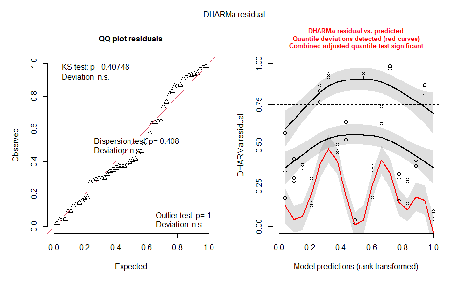
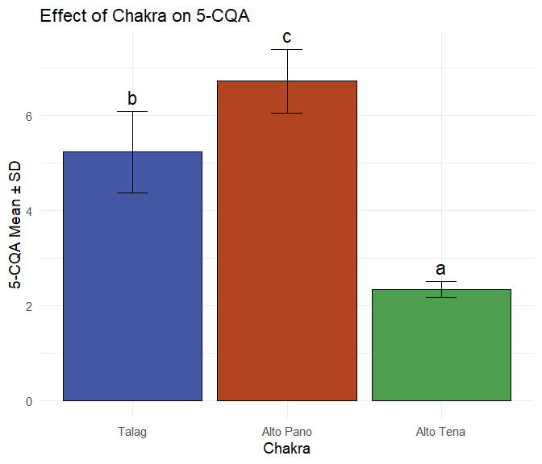
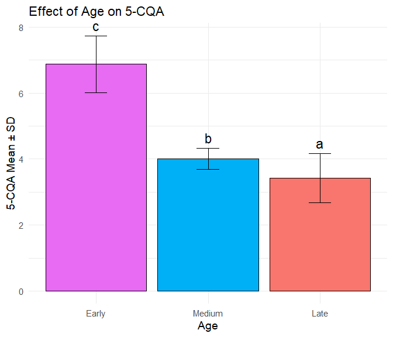
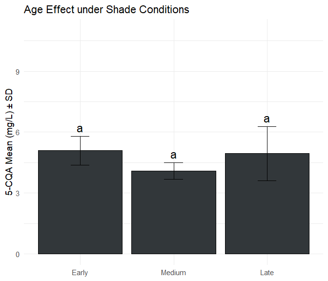
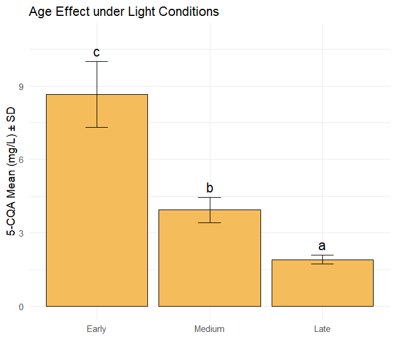
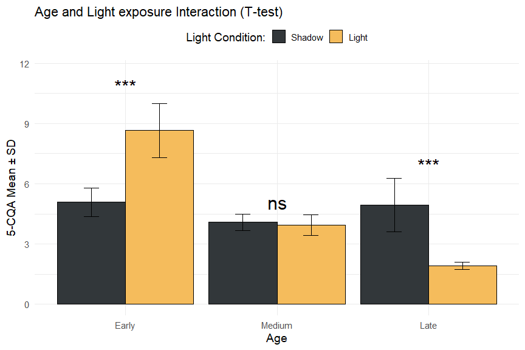

Statistical Factory desing: LC-MS/MS profiling and characterization of
caffeoylquinic acids isomers in *Ilex guayusa* under different
collection sites, plant age, and sunlight exposure
================
Thomas G.
2025-05-27

- [Introduction](#introduction)
- [Before to start](#before-to-start)
- [Workflow](#workflow)
- [Load libraries](#load-libraries)
- [Data loading and preparation](#data-loading-and-preparation)
- [Statistical modeling (GLM)](#statistical-modeling-glm)
  - [Validation of assumptions](#validation-of-assumptions)
- [Post-hoc analysis](#post-hoc-analysis)
- [Viewing results](#viewing-results)
  - [Chakra chart](#chakra-chart)
  - [Age chart](#age-chart)
- [Light interaction graph: age](#light-interaction-graph-age)
- [Light:Age - T-test](#lightage---t-test)
- [SUMMARY TABLE](#summary-table)
- [Optional final cleaning](#optional-final-cleaning)

## Introduction

This R Script aims to record the procedure for analyzing for the isomers
of caffeoylquinic acids profile in *Ilex guayusa* leaves under different
age and light conditions. Each step has a brief explanation, as well as
code and graphics.

The data preprocessing .

## Before to start

The statistical analysis was carried out based on the experimental
design presented in the paper of this research, the book “[Non-R
ecological analysis](https://analises-ecologicas.com/cap1)” was taken as
a basis, which helps us to follow a flow methodology for the factorial
analysis of the data collected in the quantification of 5-CQA in the
HPLC equipment with UV-vis detector, the data were compiled in a data
file (.xlsx) for the analysis.

## Workflow

The package and other dependency packages were installed as a first step
for the analysis.

## Load libraries

``` r
# --- INITIAL SETUP ---
# This chunk performs initial setup: cleans up the environment, loads packages, and sets options

# Clean up the environment (optional but recommended for starting from scratch)
#rm(list = ls())

# Load libraries with controlled conflicts
library(readr) # Efficient data reading
library(ggplot2) # Advanced visualizations
library(emmeans) # Marginal means and post-hoc comparisons
library(multcomp) # Significance scores
library(multcompView) # Visualizing multiple comparisons
library(knitr) # Reproducible reports and formatted tables
library(tibble) # Enhanced data frames
library(car) # Analysis of variance and assumptions
library(DHARMa) # Mixed model diagnostics
library(dplyr) # Data manipulation (load last to avoid conflicts)
```

## Data loading and preparation

``` r
# --- 1. DATA LOADING AND PREPARATION ---
# This chunk loads the raw data and performs the initial transformation

hplc <- readr::read_csv("../Data/Data_to_cuantification/Factorial_simple_2.csv")

# Initial data processing
hplc <- hplc %>%
  mutate(
    Chakra = factor(Chakra),
    Age = factor(Edades, levels = c("T0", "T1", "T2")), # Ordered factor
    Light = factor(Condiciones_luz),
    logCGA = log(CGA)  # Logarithmic transformation
  ) %>%
  dplyr::select(Chakra, Age, Light, CGA, logCGA)

# Inspección inicial de datos
#print(head(hplc))
#print(str(hplc))
#print(summary(hplc))
```

## Statistical modeling (GLM)

``` r
# --- 2. FITTING THE GENERALIZED LINEAR MODEL (GLM) --->
# Final model chosen based on previous analysis: Gamma with log link for logCGA
modelo_final_glm <- glm(logCGA ~ Chakra + Age * Light,
                        family = Gamma(link = "log"),
                        data = hplc)

# Summary of the fitted model
 print(summary(modelo_final_glm))
```

    ## 
    ## Call:
    ## glm(formula = logCGA ~ Chakra + Age * Light, family = Gamma(link = "log"), 
    ##     data = hplc)
    ## 
    ## Coefficients:
    ##              Estimate Std. Error t value Pr(>|t|)    
    ## (Intercept)   0.47087    0.06935   6.790 1.89e-08 ***
    ## ChakraB       0.27529    0.06006   4.584 3.50e-05 ***
    ## ChakraC      -0.57663    0.06006  -9.601 1.46e-12 ***
    ## AgeT1        -0.06505    0.08494  -0.766 0.447703    
    ## AgeT2        -0.19548    0.08494  -2.302 0.025942 *  
    ## Light+        0.30371    0.08494   3.576 0.000835 ***
    ## AgeT1:Light+ -0.43341    0.12012  -3.608 0.000757 ***
    ## AgeT2:Light+ -1.05124    0.12012  -8.752 2.37e-11 ***
    ## ---
    ## Signif. codes:  0 '***' 0.001 '**' 0.01 '*' 0.05 '.' 0.1 ' ' 1
    ## 
    ## (Dispersion parameter for Gamma family taken to be 0.03246434)
    ## 
    ##     Null deviance: 14.0706  on 53  degrees of freedom
    ## Residual deviance:  1.4713  on 46  degrees of freedom
    ## AIC: -4.2309
    ## 
    ## Number of Fisher Scoring iterations: 6

``` r
# Get ANOVA table from GLM (Type III)
 anova_results_glm <- car::Anova(modelo_final_glm, type = "III") # Especificar paquete car::
 print(anova_results_glm)
```

    ## Analysis of Deviance Table (Type III tests)
    ## 
    ## Response: logCGA
    ##           LR Chisq Df Pr(>Chisq)    
    ## Chakra     195.187  2  < 2.2e-16 ***
    ## Age          5.383  2  0.0677700 .  
    ## Light       12.726  1  0.0003606 ***
    ## Age:Light   76.479  2  < 2.2e-16 ***
    ## ---
    ## Signif. codes:  0 '***' 0.001 '**' 0.01 '*' 0.05 '.' 0.1 ' ' 1

### Validation of assumptions

``` r
# --- 3. EVALUATION OF FINAL MODEL ASSUMPTIONS ---

# Simulate quantile-scaled residuals
# Use tryCatch to handle possible errors in the simulation itself
simulationOutput <- tryCatch({
  DHARMa::simulateResiduals(fittedModel = modelo_final_glm, plot = FALSE) # Usar DHARMa:: explícitamente
}, error = function(e) {
  message("Error al simular residuos DHARMa: ", e$message)
  return(NULL)
})

# --- 3.1. Summary Table of Assumptions ---
# Initialize variables as character to avoid type errors
ks_stat_chr <- ks_pval_chr <- disp_stat_chr <- disp_pval_chr <- out_stat_chr <- out_pval_chr <- r2_chr <- "N/A"
ks_interp <- disp_interp <- out_interp <- r2_interp <- "N/A" # Initialize interpretation for R2 as well

# Proceed only if the DHARMa simulation was successful
if (!is.null(simulationOutput)) {
  # Perform specific tests using DHARMa:: explicitly
  test_ks <- DHARMa::testUniformity(simulationOutput, plot = FALSE)
  test_disp <- DHARMa::testDispersion(simulationOutput, plot = FALSE)
  test_out <- DHARMa::testOutliers(simulationOutput, plot = FALSE)

  # Extract numeric values ​​first
  ks_stat_val <- ifelse(is.numeric(test_ks$statistic), round(test_ks$statistic, 3), NA_real_)
  ks_pval_val <- ifelse(is.numeric(test_ks$p.value), round(test_ks$p.value, 3), NA_real_)
  disp_stat_raw <- test_disp$statistic # Puede no ser un único número
  disp_pval_val <- ifelse(is.numeric(test_disp$p.value), round(test_disp$p.value, 3), NA_real_)
  out_stat_raw <- test_out$statistic # Puede no ser un único número
  out_pval_val <- ifelse(is.numeric(test_out$p.value), round(test_out$p.value, 3), NA_real_)

  # Convert to character for table, handling NA and possible vectors
  ks_stat_chr <- ifelse(is.na(ks_stat_val), "NA", as.character(ks_stat_val))
  ks_pval_chr <- ifelse(is.na(ks_pval_val), "NA", as.character(ks_pval_val))
  disp_stat_chr <- ifelse(is.numeric(disp_stat_raw),
                          ifelse(is.na(disp_stat_raw), "NA", as.character(round(disp_stat_raw, 3))),
                          paste(disp_stat_raw, collapse=";")) # Handle if not numeric
  disp_pval_chr <- ifelse(is.na(disp_pval_val), "NA", as.character(disp_pval_val))
  out_stat_chr <- ifelse(is.numeric(out_stat_raw),
                         ifelse(is.na(out_stat_raw), "NA", as.character(round(out_stat_raw, 3))),
                         paste(out_stat_raw, collapse=";")) # Handle if not numeric
  out_pval_chr <- ifelse(is.na(out_pval_val), "NA", as.character(out_pval_val))

  # Interpretations based on numeric values before converting to character
  ks_interp <- ifelse(is.na(ks_pval_val), "Error in KS test", ifelse(ks_pval_val < 0.05, "Significant deviation", "OK"))
  disp_interp <- ifelse(is.na(disp_pval_val), "Error in Dispersion test", ifelse(disp_pval_val < 0.05, "Non-constant/incorrect dispersion", "OK"))
  out_interp <- ifelse(is.na(out_pval_val), "Error in Outliers test", ifelse(out_pval_val < 0.05, "Presence of Outliers", "OK"))

} else {
   # Ensure character type if simulation failed
   ks_stat_chr <- ks_pval_chr <- disp_stat_chr <- disp_pval_chr <- out_stat_chr <- out_pval_chr <- "Error Sim."
   # Also set interpretations to error state
   ks_interp <- disp_interp <- out_interp <- "Error in DHARMa simulation"
}

# --- Calculate Pseudo R-squared ---
pseudo_r2_results <- tryCatch({
    r2_perf <- performance::r2(modelo_final_glm)
    # Choose an R2, for example Nagelkerke or Tjur if available
    if ("R2_Nagelkerke" %in% names(r2_perf)) {
        val <- round(r2_perf$R2_Nagelkerke, 3)
        method <- "Nagelkerke"
    } else if ("R2_Tjur" %in% names(r2_perf)) {
        val <- round(r2_perf$R2_Tjur, 3)
        method <- "Tjur"
    } else {
         # Fallback to the first available R2 if the preferred ones are not available
         val <- round(r2_perf[[1]], 3)
         method <- names(r2_perf)[1]
    }
    # Make sure val is numeric before converting
    val_chr <- ifelse(is.na(val), "NA", as.character(val))
    list(value = val_chr, method = method, interp = "OK")
}, error = function(e) {
    message("Error calculating Pseudo R2: ", e$message)
    list(value = "Error Calc.", method = "performance::r2", interp = "Error")
})
r2_chr <- pseudo_r2_results$value
r2_method <- pseudo_r2_results$method
r2_interp <- pseudo_r2_results$interp
r2_pval_chr <- "NA" # R2 has no p-value


# --- Calculate VIF ---
# Note: VIF is calculated on an additive model to assess collinearity between main predictors
vif_values <- tryCatch({
  # Use a main effects-only model for VIF
  model_additive_for_vif <- update(modelo_final_glm, . ~ Chakra + Age + Light)
  vif_raw <- car::vif(model_additive_for_vif) # Especificar paquete car::
 # Ensure vif_raw is a named vector or matrix
  if (is.matrix(vif_raw)) { # If there are multiple VIF columns (e.g., gvif)
     vif_text <- paste(rownames(vif_raw), apply(round(vif_raw, 2), 1, paste, collapse=":"), sep=": ", collapse="; ")
  } else if (is.vector(vif_raw) && !is.null(names(vif_raw))) { # standard named sector
     vif_text <- paste(names(vif_raw), round(vif_raw, 2), sep=": ", collapse="; ")
  } else {
     vif_text <- "Unexpected VIF format"
  }
  vif_text
}, error = function(e) {
  message("Error calculating VIF: ", e$message)
  "Error calculating VIF"
})
vif_interp <- ifelse(grepl("Error|unexpected", vif_values), "Error/Not calculated", "Low VIFs (<5) indicate low collinearity")
vif_pval_chr <- "NA" # VIF has no p-value


# --- Create the assumptions table ---
assumption_summary <- tibble::tribble(
  ~Supuesto, ~Método, ~`Estadístico/Valor`, ~`p-valor`, ~Interpretación,
  # --- DHARMa tests ---
  "Waste Distribution", "DHARMa KS test", ks_stat_chr, ks_pval_chr, ks_interp, # Ya es KS test
  "Homoscedasticity/Dispersion", "DHARMa testDispersion", disp_stat_chr, disp_pval_chr, disp_interp,
  "Outliers", "DHARMa testOutliers", out_stat_chr, out_pval_chr, out_interp,
  # --- Multicollinearity ---
  "Multicollinearity (additive VIF)", "car::vif", vif_values, vif_pval_chr, vif_interp,
  # --- Goodness of Fit (approximate) ---
  "Pseudo R-squared", paste0("performance::r2 (", r2_method, ")"), r2_chr, r2_pval_chr, r2_interp
)

# Show assumptions table

# Use kable to format the table
print(knitr::kable(assumption_summary, caption = "Final GLM Model Assumptions Table (logCGA ~ Chakra + Age * Light, Gamma(log))"))
```

    ## 
    ## 
    ## Table: Final GLM Model Assumptions Table (logCGA ~ Chakra + Age * Light, Gamma(log))
    ## 
    ## |Supuesto                         |Método                       |Estadístico/Valor                       |p-valor |Interpretación                          |
    ## |:--------------------------------|:----------------------------|:---------------------------------------|:-------|:---------------------------------------|
    ## |Waste Distribution               |DHARMa KS test               |0.121                                   |0.407   |OK                                      |
    ## |Homoscedasticity/Dispersion      |DHARMa testDispersion        |1.215                                   |0.408   |OK                                      |
    ## |Outliers                         |DHARMa testOutliers          |0                                       |1       |OK                                      |
    ## |Multicollinearity (additive VIF) |car::vif                     |Chakra: 1:2:1; Age: 1:2:1; Light: 1:1:1 |NA      |Low VIFs (<5) indicate low collinearity |
    ## |Pseudo R-squared                 |performance::r2 (Nagelkerke) |0.907                                   |NA      |OK                                      |

``` r
# --- 3.2. DHARMa Diagnostic Charts ---
# It is essential to review these charts visually in addition to the table
# Proceed only if the simulation was successful
if (!is.null(simulationOutput)) {
    plot(simulationOutput) # This generates the QQ-plot and the Residuals vs Predicted plot
} else {
    message("DHARMa graphics cannot be generated due to a simulation error..")
}
```

<!-- -->

## Post-hoc analysis

``` r
# --- 4. POST-HOC ANALYSIS ---
# Use Emmeans on the final model to obtain means and comparisons
# Note: Comparisons are made on the predictor scale (log-link in this case)

# --- 4.1. Main Effect: Chakra --->
emm_chakra <- emmeans::emmeans(modelo_final_glm, ~ Chakra) # Usar emmeans::
pairs_chakra <- pairs(emm_chakra, adjust = "tukey") # Ajuste Tukey para comparaciones
cld_chakra <- multcomp::cld(emm_chakra, Letters = letters, alpha = 0.05, adjust = "tukey") # Usar multcomp::
 print("Comparisons for Chakra:")
```

    ## [1] "Comparisons for Chakra:"

``` r
 print(pairs_chakra)
```

    ##  contrast estimate     SE df t.ratio p.value
    ##  A - B      -0.275 0.0601 46  -4.584  0.0001
    ##  A - C       0.577 0.0601 46   9.601  <.0001
    ##  B - C       0.852 0.0601 46  14.185  <.0001
    ## 
    ## Results are averaged over the levels of: Age, Light 
    ## Results are given on the log (not the response) scale. 
    ## P value adjustment: tukey method for comparing a family of 3 estimates

``` r
 print(cld_chakra)
```

    ##  Chakra emmean     SE df lower.CL upper.CL .group
    ##  C      -0.288 0.0425 46   -0.393   -0.183  a    
    ##  A       0.288 0.0425 46    0.183    0.394   b   
    ##  B       0.564 0.0425 46    0.459    0.669    c  
    ## 
    ## Results are averaged over the levels of: Age, Light 
    ## Results are given on the log (not the response) scale. 
    ## Confidence level used: 0.95 
    ## Conf-level adjustment: sidak method for 3 estimates 
    ## P value adjustment: tukey method for comparing a family of 3 estimates 
    ## significance level used: alpha = 0.05 
    ## NOTE: If two or more means share the same grouping symbol,
    ##       then we cannot show them to be different.
    ##       But we also did not show them to be the same.

``` r
# --- 4.2. Main Effect: Age --->
# Warning: Interpret with caution due to significant interaction
emm_age <- emmeans::emmeans(modelo_final_glm, ~ Age)
pairs_age <- pairs(emm_age, adjust = "tukey")
cld_age <- multcomp::cld(emm_age, Letters = letters, alpha = 0.05, adjust = "tukey")
 print("Comparisons for Age (averaged over Light - CARE by interaction)):")
```

    ## [1] "Comparisons for Age (averaged over Light - CARE by interaction)):"

``` r
 print(pairs_age)
```

    ##  contrast estimate     SE df t.ratio p.value
    ##  T0 - T1     0.282 0.0601 46   4.691  0.0001
    ##  T0 - T2     0.721 0.0601 46  12.006  <.0001
    ##  T1 - T2     0.439 0.0601 46   7.315  <.0001
    ## 
    ## Results are averaged over the levels of: Chakra, Light 
    ## Results are given on the log (not the response) scale. 
    ## P value adjustment: tukey method for comparing a family of 3 estimates

``` r
 print(cld_age)
```

    ##  Age emmean     SE df lower.CL upper.CL .group
    ##  T2  -0.199 0.0425 46   -0.304  -0.0936  a    
    ##  T1   0.241 0.0425 46    0.135   0.3458   b   
    ##  T0   0.522 0.0425 46    0.417   0.6275    c  
    ## 
    ## Results are averaged over the levels of: Chakra, Light 
    ## Results are given on the log (not the response) scale. 
    ## Confidence level used: 0.95 
    ## Conf-level adjustment: sidak method for 3 estimates 
    ## P value adjustment: tukey method for comparing a family of 3 estimates 
    ## significance level used: alpha = 0.05 
    ## NOTE: If two or more means share the same grouping symbol,
    ##       then we cannot show them to be different.
    ##       But we also did not show them to be the same.

``` r
# --- 4.3. Interaction: Age * Light --->
# Compare Age within each Light level
emm_age_light <- emmeans::emmeans(modelo_final_glm, ~ Age | Light)
pairs_age_light <- pairs(emm_age_light, adjust = "sidak") # Sidak para 3 comps por grupo
cld_age_light <- multcomp::cld(emm_age_light, Letters = letters, alpha = 0.05, adjust = "sidak")
 print("Comparisons for Age within Light:")
```

    ## [1] "Comparisons for Age within Light:"

``` r
 print(pairs_age_light)
```

    ## Light = -:
    ##  contrast estimate     SE df t.ratio p.value
    ##  T0 - T1     0.065 0.0849 46   0.766  0.8315
    ##  T0 - T2     0.195 0.0849 46   2.302  0.0758
    ##  T1 - T2     0.130 0.0849 46   1.536  0.3448
    ## 
    ## Light = +:
    ##  contrast estimate     SE df t.ratio p.value
    ##  T0 - T1     0.498 0.0849 46   5.869  <.0001
    ##  T0 - T2     1.247 0.0849 46  14.678  <.0001
    ##  T1 - T2     0.748 0.0849 46   8.810  <.0001
    ## 
    ## Results are averaged over the levels of: Chakra 
    ## Results are given on the log (not the response) scale. 
    ## P value adjustment: sidak method for 3 tests

``` r
 print(cld_age_light)
```

    ## Light = -:
    ##  Age emmean     SE df lower.CL upper.CL .group
    ##  T2   0.175 0.0601 46   0.0261    0.324  a    
    ##  T1   0.305 0.0601 46   0.1566    0.454  a    
    ##  T0   0.370 0.0601 46   0.2216    0.519  a    
    ## 
    ## Light = +:
    ##  Age emmean     SE df lower.CL upper.CL .group
    ##  T2  -0.573 0.0601 46  -0.7214   -0.424  a    
    ##  T1   0.176 0.0601 46   0.0269    0.324   b   
    ##  T0   0.674 0.0601 46   0.5253    0.823    c  
    ## 
    ## Results are averaged over the levels of: Chakra 
    ## Results are given on the log (not the response) scale. 
    ## Confidence level used: 0.95 
    ## Conf-level adjustment: sidak method for 3 estimates 
    ## P value adjustment: sidak method for 3 tests 
    ## significance level used: alpha = 0.05 
    ## NOTE: If two or more means share the same grouping symbol,
    ##       then we cannot show them to be different.
    ##       But we also did not show them to be the same.

``` r
# Or Compare Light within each Age level
emm_light_age <- emmeans::emmeans(modelo_final_glm, ~ Light | Age)
pairs_light_age <- pairs(emm_light_age, adjust = "sidak") # Ajuste para 3 comparaciones
 print("Comparisons for Light within Age:")
```

    ## [1] "Comparisons for Light within Age:"

``` r
 print(pairs_light_age)
```

    ## Age = T0:
    ##  contrast  estimate     SE df t.ratio p.value
    ##  (-) - (+)   -0.304 0.0849 46  -3.576  0.0008
    ## 
    ## Age = T1:
    ##  contrast  estimate     SE df t.ratio p.value
    ##  (-) - (+)    0.130 0.0849 46   1.527  0.1336
    ## 
    ## Age = T2:
    ##  contrast  estimate     SE df t.ratio p.value
    ##  (-) - (+)    0.748 0.0849 46   8.801  <.0001
    ## 
    ## Results are averaged over the levels of: Chakra 
    ## Results are given on the log (not the response) scale.

``` r
# Crear símbolos de significancia para el gráfico t-test style
 signif_light_age <- as.data.frame(pairs_light_age) %>%
   dplyr::mutate(significance = case_when( # Usar dplyr::
            p.value <= 0.001 ~ "***",
            p.value <= 0.01  ~ "**",
            p.value <= 0.05  ~ "*",
            TRUE             ~ "ns" # No Significativo
          ))
```

## Viewing results

``` r
# --- 5. RESULTS VISUALIZATION ---
# This chunk generates the final figures for the report.

# --- 5.1. Preparation for Charts --->
# *** AUXILIARY FUNCTION CORRECTED (no changes from the previous version) ***
add_cld_letters <- function(summary_df, cld_object, group_vars) {
  # Convert the cld object (can be emmGrid) to data.frame
  if (!is.data.frame(cld_object)) {
    cld_df <- as.data.frame(cld_object)
  } else {
    cld_df <- cld_object
  }

 # Verify that the grouping and .group columns exist in cld_df
  required_cols <- c(group_vars, ".group")
  if (!all(required_cols %in% names(cld_df))) {
    stop("The required columns (", paste(required_cols, collapse=", "), ") Not all of them are in the cld object.")
  }

 # Clean whitespace from group letters
  cld_df$.group <- trimws(cld_df$.group)

# Select only the necessary columns from cld_df
# Use all_of() for security if group_vars comes from an external variable
  cld_subset <- cld_df %>%
                  dplyr::select(all_of(group_vars), .group) # Use dplyr::

# Ensure that the joining columns are of the same type (factor is safe)
  for (var in group_vars) {
      if (var %in% names(summary_df) && var %in% names(cld_subset)) {
          summary_df[[var]] <- as.factor(summary_df[[var]])
          cld_subset[[var]] <- as.factor(cld_subset[[var]])
      } else {
          stop(paste("The grouping column", var, "does not exist in summary_df or cld_subset."))
      }
  }

  # Match the summary data with the letters CLD
  dplyr::left_join(summary_df, cld_subset, by = group_vars) # Use dplyr::
}
```

### Chakra chart

``` r
# --- 5.2. Chart: Chakra Main Effect --->

# Calculate the values per Chakra
summary_chakra_direct <- hplc %>%
  dplyr::group_by(Chakra) %>%
  dplyr::summarise(
    mean_CGA = mean(CGA),
    sd_CGA = sd(CGA),
    N = n(),
    se_CGA = sd_CGA / sqrt(N),
    .groups = 'drop'
  )

# Add letters with the add_cld_letters function
summary_chakra_plot <- add_cld_letters(summary_chakra_direct, cld_chakra, "Chakra")

# Define custom colors
colores_manual <- c("#4457A5FF", "#B24422FF", "#4F9D4EFF")

# Define custom X-axis labels
etiquetas_x <- c("Talag", "Alto Pano", "Alto Tena")

# Reassign factor levels to remove the word "Chakra"
summary_chakra_plot$Chakra <- factor(
  summary_chakra_plot$Chakra,
  levels = unique(summary_chakra_plot$Chakra),
  labels = etiquetas_x
)

# Generate the graph
plot_chakra <- ggplot2::ggplot(summary_chakra_plot, ggplot2::aes(x = Chakra, y = mean_CGA, fill = Chakra)) +
  ggplot2::geom_col(position = ggplot2::position_dodge(width = 0.9), color = "black") +
  ggplot2::geom_errorbar(ggplot2::aes(ymin = mean_CGA - se_CGA, ymax = mean_CGA + se_CGA),
                         width = 0.2, position = ggplot2::position_dodge(width = 0.9)) +
  ggplot2::geom_text(ggplot2::aes(label = .group, y = mean_CGA + se_CGA), vjust = -0.5, size = 6) +
  ggplot2::scale_fill_manual(values = colores_manual) +
  ggplot2::labs(
    title = "Effect of Chakra on 5-CQA",
    y = "5-CQA Mean (mg/L) ± SD",
    fill = "Chakra"
    # x is not defined to not display the word "Chakra"
  ) +
  ggplot2::theme_minimal(base_size = 14) +
  ggplot2::theme(
    legend.position = "none",
    axis.title.x = ggplot2::element_blank()  # Ensures no text appears on the X axis
  )

print(plot_chakra)
```

<!-- -->

``` r
# Save plot
#ggsave(filename = "../Result/Factorial_results/Figuras/PDF/Chakra_CGA.pdf", plot = plot_chakra,
#       width = 7, height = 6, units = "in", dpi = 300, scale = 1)
#ggsave(filename = "../Result/Factorial_results/Figuras/PNG/Chakra_CGA.png", plot = plot_chakra,
#       width = 7, height = 6, units = "in", dpi = 300, scale = 1)
```

### Age chart

``` r
# --- 6.1. Graph: Main Effect of Age ---

# Calculate summary grouping only by Age
summary_age_direct <- hplc %>%
  dplyr::group_by(Age) %>%
  dplyr::summarise(
    mean_CGA = mean(CGA, na.rm = TRUE),
    sd_CGA = sd(CGA, na.rm = TRUE),
    N = n(),
    se_CGA = sd_CGA / sqrt(N),
    .groups = 'drop'
  )

# Add CLD letters (previously calculated in cld_age)
summary_age_plot <- add_cld_letters(summary_age_direct, cld_age, "Age")

# Define custom colors for Age
colores_manual_edad <- c("#E76BF3", "#00B0F6", "#F8766D")

# Define custom labels for the X axis
etiquetas_x_edad <- c("Early", "Medium", "Late")

# Remap Age factor levels with custom labels
summary_age_plot$Age <- factor(
  summary_age_plot$Age,
  levels = unique(summary_age_plot$Age),
  labels = etiquetas_x_edad
)

# Generate the graph
plot_age <- ggplot2::ggplot(
    data = summary_age_plot,
    mapping = ggplot2::aes(x = Age, y = mean_CGA, fill = Age)
  ) +
  ggplot2::geom_col(
    position = ggplot2::position_dodge(width = 0.9), 
    color = "black",
    show.legend = FALSE
  ) +
  ggplot2::geom_errorbar(
    ggplot2::aes(ymin = mean_CGA - se_CGA, ymax = mean_CGA + se_CGA),
    width = 0.2,
    position = ggplot2::position_dodge(width = 0.9)
  ) +
  ggplot2::geom_text(
    ggplot2::aes(label = .group, y = mean_CGA + se_CGA),
    vjust = -0.5, 
    size = 6
  ) +
  # Apply customizations
  ggplot2::scale_fill_manual(values = colores_manual_edad) +
  ggplot2::labs(
    title = "Effect of Age on 5-CQA",
    y = "5-CQA Mean (mg/L) ± SD",
    # x no se especifica para evitar mostrar "Age"
  ) +
  ggplot2::theme_minimal(base_size = 14) +
  ggplot2::theme(
    axis.title.x = ggplot2::element_blank()  # Remove text from the X axis
  )
.0
```

    ## [1] 0

``` r
print(plot_age)
```

<!-- -->

``` r
# Save plot
#ggsave(filename = "../Result/Factorial_results/Figuras/PDF/Age_CGA.pdf", plot = plot_age,
#       width = 7, height = 6, units = "in", dpi = 300, scale = 1)
#ggsave(filename = "../Result/Factorial_results/Figuras/PNG/Age_CGA.png", plot = plot_age,
#       width = 7, height = 6, units = "in", dpi = 300, scale = 1)
```

# Light interaction graph: age

``` r
# --- 6.3. Interaction Plots by Light Condition (Dark Only) ---

# STEP 1: Compute means and standard errors averaged over Chakra
summary_stats_avg <- hplc %>%
  dplyr::group_by(Age, Light) %>%
  dplyr::summarise(
    N = n(),  # Note: N = Chakras × Replicates per Chakra
    mean_CGA = mean(CGA, na.rm = TRUE),
    sd_CGA = sd(CGA, na.rm = TRUE),
    se_CGA = sd_CGA / sqrt(N),  # Standard error of the mean
    .groups = 'drop'
  )

# STEP 2: Add compact letter display (CLD) labels for Age × Light interaction
summary_interaction_plot_avg <- add_cld_letters(summary_stats_avg, cld_age_light, c("Age", "Light"))

# Filter only the dark-light condition (Light == "-")
summary_dark <- summary_interaction_plot_avg %>% dplyr::filter(Light == "-")

# Define custom dark-themed colors for Age groups (uniform tones)
dark_colors <- c("#32373AFF", "#32373AFF", "#32373AFF")

# Define custom X-axis labels in the same order as factor levels of Age
x_labels_dark <- c("Early", "Medium", "Late")

# Reassign factor levels of Age using custom labels (removes the word "Age" from the axis)
summary_dark$Age <- factor(
  summary_dark$Age,
  levels = unique(summary_dark$Age),
  labels = x_labels_dark
)

# Build the bar plot
plot_interaction_dark <- ggplot2::ggplot(
  summary_dark, 
  ggplot2::aes(x = Age, y = mean_CGA, fill = Age)
) +
  ggplot2::geom_col(color = "black", show.legend = FALSE) +  # Hide legend
  ggplot2::geom_errorbar(
    ggplot2::aes(ymin = mean_CGA - se_CGA, ymax = mean_CGA + se_CGA),
    width = 0.2
  ) +
  ggplot2::geom_text(
    ggplot2::aes(label = .group, y = mean_CGA + se_CGA),
    vjust = -0.5,
    size = 6
  ) +
  ggplot2::scale_fill_manual(values = dark_colors) +
  ggplot2::labs(
    title = "Age Effect under Shade Conditions",
    y = "5-CQA Mean (mg/L) ± SD"
    # No X-axis title specified
  ) +
  ggplot2::theme_minimal(base_size = 14) +
  ggplot2::theme(
    axis.title.x = ggplot2::element_blank()  # Remove X-axis title ("Age")
  ) +
  ggplot2::coord_cartesian(
    ylim = c(0, max(summary_interaction_plot_avg$mean_CGA + 
                    summary_interaction_plot_avg$se_CGA) * 1.1)
  )

print(plot_interaction_dark)
```

<!-- -->

``` r
# Save plot
#ggsave(filename = "../Result/Factorial_results/Figuras/PDF/Shadow_CGA.pdf", plot = plot_interaction_dark,
#       width = 7, height = 6, units = "in", dpi = 300, scale = 1)
#ggsave(filename = "../Result/Factorial_results/Figuras/PNG/Shadow_CGA.png", plot = plot_interaction_dark,
#       width = 7, height = 6, units = "in", dpi = 300, scale = 1)
```

``` r
# --- Plot for Light Condition = "+" (Sunlight Exposure) ---

# Filter data for Light = "+"
summary_light_cond <- summary_interaction_plot_avg %>%
  dplyr::filter(Light == "+")

# Define manual light-themed colors for Age groups
light_colors <- c("#F5BC5CFF", "#F5BC5CFF", "#F5BC5CFF")

# Define custom X-axis labels in the same order as Age factor levels
x_labels_light <- c("Early", "Medium", "Late")

# Reassign factor levels of Age using custom labels (removes the word "Age" from the axis)
summary_light_cond$Age <- factor(
  summary_light_cond$Age,
  levels = unique(summary_light_cond$Age),
  labels = x_labels_light
)

# Build the bar plot
plot_interaction_light <- ggplot2::ggplot(
  summary_light_cond, 
  ggplot2::aes(x = Age, y = mean_CGA, fill = Age)
) +
  ggplot2::geom_col(color = "black", show.legend = FALSE) +  # Hide legend
  ggplot2::geom_errorbar(
    ggplot2::aes(ymin = mean_CGA - se_CGA, ymax = mean_CGA + se_CGA),
    width = 0.2
  ) +
  ggplot2::geom_text(
    ggplot2::aes(label = .group, y = mean_CGA + se_CGA),
    vjust = -0.5,
    size = 6
  ) +
  ggplot2::scale_fill_manual(values = light_colors) +  # Apply custom colors
  ggplot2::labs(
    title = "Age Effect under Light Conditions",
    y = "5-CQA Mean (mg/L) ± SD"
    # No X-axis title specified
  ) +
  ggplot2::theme_minimal(base_size = 14) +
  ggplot2::theme(
    axis.title.x = ggplot2::element_blank()  # Remove X-axis title ("Age")
  ) +
  ggplot2::coord_cartesian(
    ylim = c(0, max(summary_interaction_plot_avg$mean_CGA +
                    summary_interaction_plot_avg$se_CGA) * 1.1)
  )

print(plot_interaction_light)
```

<!-- -->

``` r
# Save plot
#ggsave(filename = "../Result/Factorial_results/Figuras/PDF/Light_CGA.pdf", plot = plot_interaction_light,
#       width = 7, height = 6, units = "in", dpi = 300, scale = 1)
#ggsave(filename = "../Result/Factorial_results/Figuras/PNG/Light_CGA.png", plot = plot_interaction_light,
#       width = 7, height = 6, units = "in", dpi = 300, scale = 1)
```

# Light:Age - T-test

``` r
# --- 6.4. Combined Interaction Plot with T-Test Results (Light vs. Dark) ---
# Prepare significance data for the plot
# Use pre-calculated pairs_light_age
signif_light_age_df <- as.data.frame(pairs_light_age) %>%
  dplyr::mutate(significance = case_when(
           p.value <= 0.001 ~ "***",
           p.value <= 0.01  ~ "**",
           p.value <= 0.05  ~ "*",
           TRUE             ~ "ns" # Not Significant
         ))

# We need to calculate Y positions for the significance symbols
# We will calculate the maximum Y position for each Age and add an offset
y_pos_signif <- summary_interaction_plot_avg %>%
  dplyr::group_by(Age) %>%
  dplyr::summarise(max_y = max(mean_CGA + se_CGA), .groups = "drop") %>%
  dplyr::mutate(y_position = max_y * 1.05) # Set the text 5% above the maximum

# Match the Y positions with the significance symbols
signif_data_plot <- dplyr::left_join(signif_light_age_df, y_pos_signif, by = "Age")

# Create the base graph (similar to the plot_interaction above, without the CLD letters)
# Define customizable elements 
# 1. Colors for Light conditions
colores_interaccion <- c(
  "-" = "#32373AFF",   
  "+" = "#F5BC5CFF"    
)

# 2. Custom labels for the X axis (Age)
etiquetas_x_interaccion <- c("Early", "Medium", "Late")

# 3. Symbols of significance (customize if necessary)
simbolos_significancia <- c("***" = "***", "**" = "**", "*" = "*", "ns" = "ns")

#Create the base graph
plot_interaction_ttest_base <- ggplot2::ggplot(
  summary_interaction_plot_avg, 
  ggplot2::aes(x = Age, y = mean_CGA, fill = Light)
) +
  ggplot2::geom_col(
    position = ggplot2::position_dodge(width = 0.9), 
    color = "black"
  ) +
  ggplot2::geom_errorbar(
    ggplot2::aes(ymin = mean_CGA - se_CGA, ymax = mean_CGA + se_CGA),
    width = 0.2, 
    position = ggplot2::position_dodge(width = 0.9)
  ) +
  # Customize colors and labels
  ggplot2::scale_fill_manual(
    values = colores_interaccion,
    labels = c("-" = "Shade", "+" = "Light") 
  ) +
  ggplot2::scale_x_discrete(labels = etiquetas_x_interaccion) +  
  ggplot2::labs(
    title = "Age and Light exposure Interaction (T-test)",
    #subtitle = "Means ± Standard Error (averaged over Chakra))",
    x = "Age",
    y = "5-CQA Mean (mg/L) ± SD",
    fill = "Light Condition:"
  ) +
  ggplot2::theme_minimal(base_size = 14) +
  ggplot2::theme(
    legend.position = "top",
    axis.title.x = ggplot2::element_blank()  # Remove x-axis label
  ) +
  ggplot2::coord_cartesian(
    ylim = c(0, max(y_pos_signif$y_position) * 1.1)
  )

# Add symbols of significance 
plot_interaction_ttest <- plot_interaction_ttest_base +
  ggplot2::geom_text(
    data = signif_data_plot,
    ggplot2::aes(x = Age, y = y_position, label = significance),
    inherit.aes = FALSE,
    size = 8, 
    vjust = 0
  )

print(plot_interaction_ttest)
```

<!-- -->

``` r
# Save plot
#ggsave(filename = "../Result/Factorial_results/Figuras/PDF/Ttes_CGA.pdf", plot = plot_interaction_ttest,
#       width = 9, height = 6, units = "in", dpi = 300, scale = 1)
#ggsave(filename = "../Result/Factorial_results/Figuras/PNG/Ttes_CGA.png", plot = plot_interaction_ttest,
#       width = 9, height = 6, units = "in", dpi = 300, scale = 1)
```

# SUMMARY TABLE

``` r
# --- 7. SUMMARY TABLE WITH MEANS, SD, CLD LETTERS, AND P-VALUES ---

# Function to process each factor (e.g., Chakra, Age, Light)
process_factor <- function(data, model, factor_name, response_var = "CGA") {
  # Compute estimated marginal means and compact letter display (CLD)
  emm <- emmeans::emmeans(model, specs = as.formula(paste("~", factor_name)))
  cld <- multcomp::cld(emm, Letters = letters, adjust = "tukey")
  
  # Compute descriptive statistics: mean and standard deviation
  stats <- data %>%
    dplyr::group_by(!!sym(factor_name)) %>%
    dplyr::summarise(
      mean = mean(!!sym(response_var), na.rm = TRUE),
      sd = sd(!!sym(response_var), na.rm = TRUE),
      .groups = 'drop'
    ) %>%
    dplyr::left_join(cld, by = factor_name)  # Merge CLD letters

  # Extract p-value from Type III ANOVA
  anova_table <- car::Anova(model, type = 3)
  p_value <- anova_table[factor_name, "Pr(>Chisq)"]
  
  # Format output: combine mean, SD, and CLD in one string
  stats %>%
    dplyr::mutate(
      !!sym("Media ± SD") := sprintf(
        "%.4f ± %.3f%s", 
        round(mean, 4), 
        round(sd, 3), 
        .group
      )
    ) %>%
    dplyr::select(!!sym(factor_name), `Media ± SD`) %>%
    dplyr::rename(Level = !!sym(factor_name)) %>%
    dplyr::add_row(
      Level = "p-value*", 
      `Media ± SD` = ifelse(
        p_value < 0.0001, 
        "< 0.0001", 
        sprintf("%.4f", p_value)
      )
    ) %>%
    dplyr::mutate(Factor = factor_name) %>%
    dplyr::select(Factor, Level, `Media ± SD`)
}

# Apply the function to each factor of interest
final_table <- purrr::map_dfr(
  c("Chakra", "Age", "Light"),
  ~ process_factor(hplc, modelo_final_glm, .x)
)

# Format final table: remove repeated factor labels for visual clarity
final_table <- final_table %>%
  dplyr::mutate(
    Factor = dplyr::case_when(
      duplicated(Factor) ~ "",
      TRUE ~ Factor
    )
  ) %>%
  dplyr::rename(
    ` ` = Factor,
    `Treatment` = Level,
    `Mean ± SD (CGA)` = `Media ± SD`
  )

# Display formatted table using knitr::kable
knitr::kable(
  final_table,
  caption = "Summary Table: Means ± SD with Tukey groups and p-values",
  align = c('l', 'l', 'r'),
  col.names = c("Factor", "Level", "Mean ± SD (5-CQA)")
)
```

| Factor | Level     | Mean ± SD (5-CQA) |
|:-------|:----------|------------------:|
| Chakra | A         |  5.2377 ± 3.644 b |
|        | B         |  6.7256 ± 2.838 c |
|        | C         |  2.3459 ± 0.710 a |
|        | p-value\* |         \< 0.0001 |
| Age    | T0        |  6.8723 ± 3.633 c |
|        | T1        |  4.0122 ± 1.360 b |
|        | T2        |  3.4247 ± 3.176 a |
|        | p-value\* |            0.0678 |
| Light  | \-        |  4.7047 ± 2.640 b |
|        | \+        |  4.8347 ± 3.763 a |
|        | p-value\* |            0.0004 |

Summary Table: Means ± SD with Tukey groups and p-values

# Optional final cleaning

``` r
# --- 6. FINAL CLEANUP ---
# This optional chunk can be used to delete temporary objects
# rm(list = ls(pattern = "^temp_"))
```
