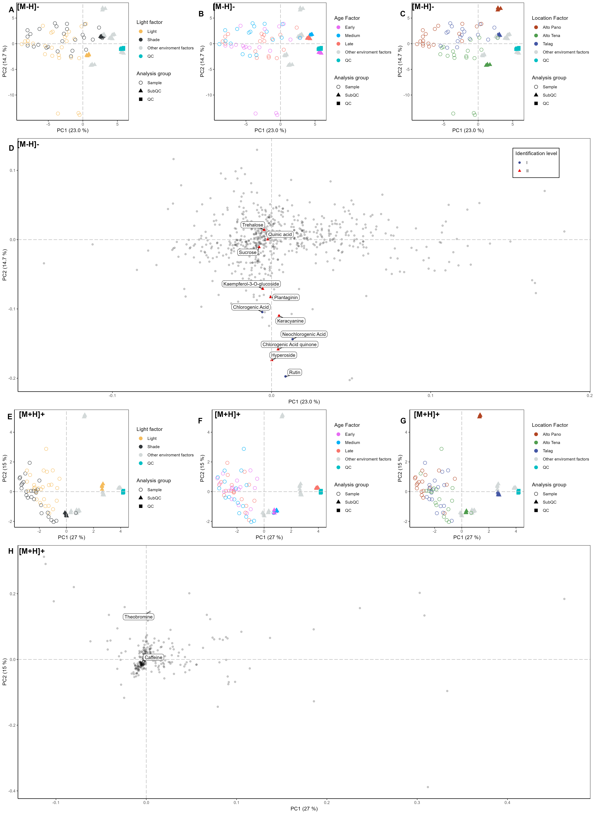

# About this repository

This repository contains metabolomic analyses focused on the quantification and characterization of caffeoylquinic acid isomers in the leaves of *Ilex guayusa*, an Amazonian plant recognized for its medicinal and energetic properties. Samples were collected from different chakras in the Amazon region of Ecuador, specifically in the city of Tena, Napo province. The influence of factors such as leaf age and sunlight exposure on the concentration of these bioactive compounds was evaluated.

# Analysis Notebooks

Initially we performed the analysis for the control cards of the verification of the method for the analysis and quantification of the isomers of caffeoylquinic acid.

- [Verification of the method](https://github.com/IKIAM-NPLab/I_guayusa_chlorogenic_acids/blob/main/Notebooks/Control_letter_validation_method.ipynb)

Statistical Analysis: Statistical analyses based on a factorial design were applied to better interpret the significant differences in 5-CQA quantification.

- [Analysis of 5-CQA quantification](https://github.com/IKIAM-NPLab/I_guayusa_chlorogenic_acids/blob/main/Notebooks/Statistical_factory_design.md)

Multivariate Statistical Analysis: Multivariate statistical analyses were performed on the LC-MS data from the samples.

- [[Statistical analysis Negative [M-H]-]](https://github.com/IKIAM-NPLab/I_guayusa_chlorogenic_acids/blob/main/Notebooks/Statistical_Analysis_neg.md)
- [[Statistical analysis Possitive [M+H]+]](https://github.com/IKIAM-NPLab/I_guayusa_chlorogenic_acids/blob/main/Notebooks/Statistical_Analysis_pos.md)

In addition, we complete the information on data acquisition and techniques developed in the article of this repository.
- [Supplementary](https://github.com/IKIAM-NPLab/I_guayusa_chlorogenic_acids/tree/main/Supplementary_files)

# Useful results

## Factorial statistics

- Statistical analysis

## PCA analysis

- PCA in negative and positive

## HCA and volcano analysis

- HCA in negative and positive

